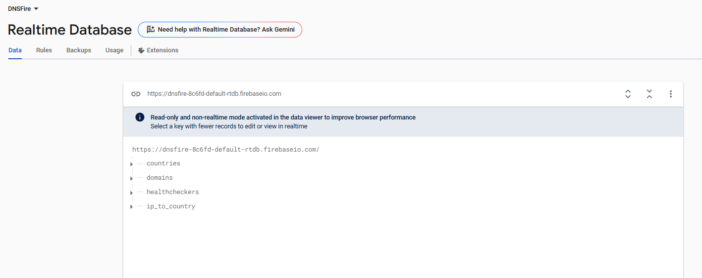
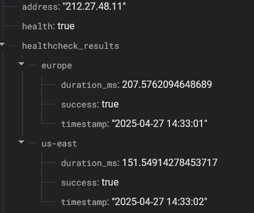
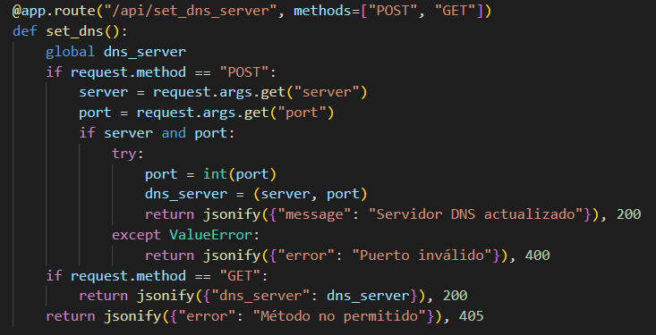
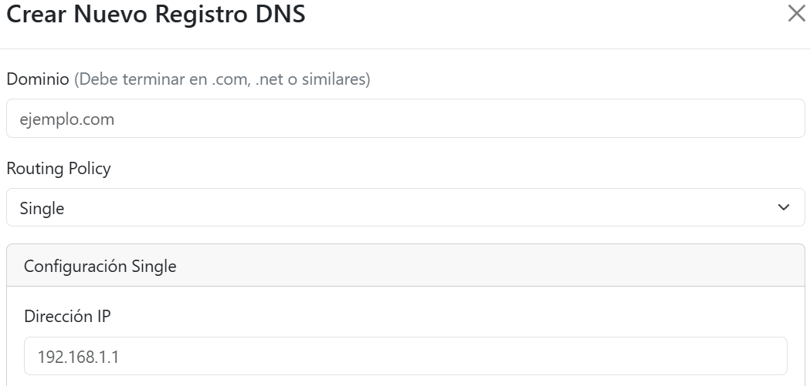
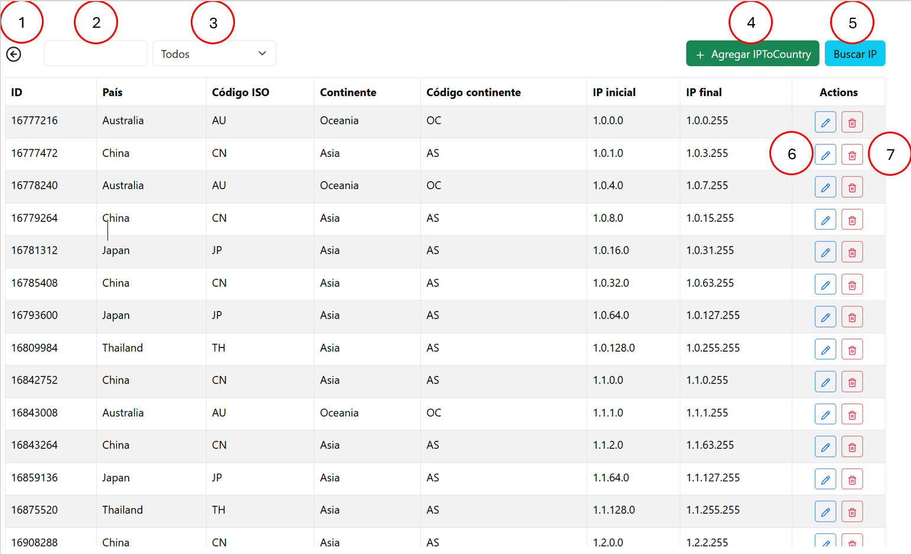

Instituto Tecnológico de Costa Rica

Campus Tecnológico Central Cartago

Escuela de Ingeniería en Computación

Proyecto 1 de Redes

Redes - Grupo 2  
Prof. Gerardo Nereo Campos Araya

Daniel Granados Retana, carné 2022104692  
Diego Manuel Granados Retana, carné 2022158363  
David Fernández Salas, carné 2022045079  
Diego Mora Montes, carné 2022104866  
Eduardo Gutierrez Conejo, carné 2019073558

09 de Mayo del 2025
IS 2025

# Introducción

Este proyecto consiste en la construcción de una arquitectura automatizada para la resolución de nombres de dominio (DNS). Dicha arquitectura tiene varios componentes que interactúan entre sí con el fin de ofrecer funcionalidades avanzadas de resolución de DNS, similar a lo que ofrece el servicio de Route 53 de AWS. Para crear la arquitectura se necesitan varios componentes donde el primero es un interceptor DNS implementado en C, el cual actúa como punto de entrada para las peticiones DNS a través del protocolo UDP. Este componente es el responsable de recibir, analizar y procesar los paquetes DNS entrantes, donde toma decisiones de cómo resolver cada consulta.

En segundo lugar se utiliza un API REST en Python, para la gestión de registros DNS almacenados en Firebase. Esta API expondrá métodos para la consulta, creación, modificación y eliminación de estos facilitando la interacción entre los componentes. Para monitorear los estados y disponibilidad de los recursos se implementa un servicio de health checks en Python y C. Este componentes permiten marcar a los servicios como saludables o no saludables según los resultados de las pruebas. Finalmente se desarrolla una interfaz de usuario en React para la administración de los registros DNS y los respectivos controles de salud a realizar.

Un aspecto fundamental de este proyecto es la automatización integral del despliegue donde se utilizan las herramientas de `docker` y `terraform` para asegurar portabilidad y escalabilidad. Mediante la utilización de herramientas líderes en la industria como Docker y Terraform, se busca garantizar la portabilidad y escalabilidad de toda la arquitectura. Al hacer esto, se permite que la solución pueda ser fácilmente desplegada y gestionada en diversos entornos, desde un entorno de desarrollo local utilizando Docker Compose, hasta máquinas virtuales aprovisionadas en diferentes proveedores de la nube, permitiendo una mejor gestión y escalamiento.

# Instalación y configuración

Este proyecto cuenta con varios directorios que trabajan por separado para realizar tareas distintas. Los folders que tienen toda la información son DNS_API, DNS_Interceptor, frontend, health checker y terraform. En general se va a describir cuál sería la instalación correcta y configuración de dichos archivos.

## 2.1. Instalación de herramientas

Para correr el proyecto, se deben instalar las siguientes herramientas:

1. [Windows Subsystem for Linux](https://learn.microsoft.com/en-us/windows/wsl/install)
2. [Docker](https://www.docker.com/products/docker-desktop/)
3. [Git Bash](https://git-scm.com/downloads)
4. [Terraform](https://developer.hashicorp.com/terraform/tutorials/aws-get-started/install-cli)
5. [NodeJS](https://nodejs.org/en/download)
6. [dig y nslookup](https://www.tecmint.com/install-dig-and-nslookup-in-linux/): son herramientas de Linux para hacer solicitudes a servicios DNS.

## 2.2. Ejecución local

A continuación, se describe cómo instalar el sistema localmente en la computadora. Se utilizó un script de Python que corriera los health checkers con base en un JSON y que levantara los componentes del interceptor, el API y la interfaz gráfica con un archivo `docker-compose.yml`.  
En la carpeta `/local_installation`, se ejecuta el comando `python [install.py](http://install.py)`. Para desinstalar el sistema, se ejecuta el script de `[uninstall.py](http://uninstall.py)`.  
Los health checkers a instalar se configuran en el archivo de `checkers.json`.

## 2.3. Instalación en AWS

A continuación, se describe cómo instalar el proyecto en AWS con Terraform.

1. Es necesario configurar el proyecto en Terraform.
   1. Se deben obtener las credenciales de AWS, específicamente el AWS_ACCESS_KEY_ID y el AWS_SECRET_ACCESS_KEY. Estos se pueden obtener siguiendo la guía de AWS de cómo [obtener las llaves de acceso](https://aws.amazon.com/blogs/security/how-to-find-update-access-keys-password-mfa-aws-management-console/).
   2. Si se desea almacenar el estado de Terraform en un repositorio compartido, se puede realizar esto con [HCP Terraform. Se puede seguir la guía para configurar el ambiente](https://aws.amazon.com/blogs/security/how-to-find-update-access-keys-password-mfa-aws-management-console/).
   3. Si se desea almacenar el [estado localmente, se puede seguir esta guía](https://developer.hashicorp.com/terraform/tutorials/aws-get-started/aws-build). En ella, se muestra cómo configurar las variables de entorno de AWS para configurar el ambiente.
2. Hay que inicializar el proyecto de terraform con el comando: `terraform init`.
3. Para desplegar la infraestructura, se ejecuta el comando: `terraform apply`. Se van a desplegar una serie de cambios. Se escribe la palabra “yes” para confirmar los cambios. Alternativamente, se puede usar el comando `terraform apply -auto-approve`.
4. Al final, esto imprime una lista de IPs. Estos IPs son los de cada una de las instancias EC2 que se describen en la sección 3.


Para configurar la instalación, se deben modificar los valores en el archivo de `terraform.tfvars`. Este archivo establece configuraciones de los componentes, como los puertos que usan para la comunicación, cuántos health checkers instalar, etc. Para consultar la lista de las variables que se pueden configurar, se debe consultar el archivo `terraform/[variables.tf](http://variables.tf)`:  
**- aws_ami**: AMI ID para la instancia DNS. Tipo: `string`  
**- api_host**: Nombre de host de la API que usará la instancia. Tipo: `string`  
**- api_port**: Puerto de la API que usará la instancia. Tipo: `number`  
**- checkers**: Lista de configuraciones para of health checker configs. Tipo: `list(object({ id = string, lat = string, lon = string, country = string, continent = string }))`  
**- dns_server**: Dirección del servidor DNS que usará el DNS API para resolver nombres desconocidos. Tipo: `object({ host = string, port = number })`  
El archivo configurado por defecto es:

```yaml
aws_ami = "ami-0f9de6e2d2f067fca"
api_port = 443
checkers = [
{
id = "us-east"
lat = "40.7128"
lon = "-74.0060"
country = "USA"
continent = "North America"
},
{
id = "europe"
lat = "48.8566"
lon = "2.3522"
country = "France"
continent = "Europe"
},
{
id = "central-america"
lat = "9.9281"
lon = "-84.0907"
country = "Costa Rica"
continent = "Central America"
}
]
dns_server = {
host = "8.8.8.8"
port = 53
}
```

## 2.3. Inicialización del sistema

El componente del API utiliza un certificado SSL auto firmado para permitir el uso del protocolo HTTPS. Este, al no ser emitido por una autoridad reconocida de certificados, es desconfiado por los navegadores de Internet. Por lo tanto, si no se reconoce, la interfaz no va a poder conectarse correctamente con el API y no va a funcionar. Por consiguiente, el primer paso es acceder al IP del DNS API por medio del URL https://<dns_api_ip> e ignorar las advertencias del navegador para poder ingresar correctamente. Una vez realizado esto, podemos ingresar a la página por defecto del API que muestra un mensaje como se aprecia en la siguiente imagen:  

Ya con eso, podemos acceder a la página de la interfaz con el URL http://<ui_ip> y la información va a cargar correctamente.  


# 3. Arquitectura del sistema

En esta sección, se plantea la arquitectura del sistema.


Hay una instancia EC2 que contiene los contenedores del DNS Interceptor y el DNS API. El DNS Interceptor va a analizar las solicitudes que entran por el puerto 53 de un cliente DNS y dependiendo del tipo de solicitud, hace una consulta al DNS API por HTTPS al puerto 443.
La instancia EC2 que contiene el contenedor del DNS UI expone el acceso a la misma por medio del puerto 80 y por HTTP.
Por último, hay una instancia que corre los contenedores de los health checkers. Puede correr varios health checkers, los cuales se configuran en las variables de instalación del sistema.

# 4. Firebase

En Firebase, utilizamos un Realtime Database. Esta tiene cuatro nodos principales, o “bases de datos”:


Estos son:

1.  Dominios
2.  IP To Country
3.  Healthcheckers
4.  Countries

## 4.1. Dominios

En esta base de datos se almacenan los dominios propiamente. Cada dominio tiene su propia información, incluso si son el mismo o muy similares. Por ejemplo: los dominios google.com y [www.google.com](http://www.google.com) se tratan como separados, aunque [www.google.com](http://www.google.com) esté almacenado en el mismo nodo que la información de google.com.


Los dominios se almacenan al revés. Primero, hay un registro del top-level domain, como .com y .net. Luego, va el subdomain, como google. Posteriormente, pueden ir las partes adicionales que se deseen para el dominio. Esto se hizo así para facilitar las búsquedas. Con esta implementación, se pueden agrupar todos los dominios que terminan en .com en un solo nodo y hacerles las búsquedas más eficientes y claras.

### 4.1.1. Routing Policy

Al igual que Amazon Route 53, los dominios en nuestro proyecto tienen un _routing policy_, o política de enrutamiento. Esta indica cómo se escoge el IP que se va a servir al usuario. Los IPs pueden estar saludables o no, dependiendo del resultado que haya obtenido el health checker al realizar la prueba.

#### 4.1.1.1. Single

En esta política solo hay un solo IP para el dominio. Si el IP no está saludable, el dominio no se puede acceder. Este tiene la siguiente configuración:


#### 4.1.1.2. Multi

    En esta política, el dominio tiene múltiples IP que se van rotando. Hay un contador que se utiliza para hacer un round robin en los IPs. Si el IP que se escogió está *unhealthy* (o health es `false`), se escoge el siguiente hasta encontrar uno que sí sirva. Tiene la siguiente configuración:


#### 4.1.1.3. Weight

    En esta política, hay múltiples IPs y cada uno tiene un porcentaje de requests que atiende. La suma de los porcentajes debe sumar 1. Tiene la siguiente configuración:


En este caso, un IP atiende el 80% de los casos mientras que el otro atiende solo el 20%.

#### 4.1.1.4. Geo

En esta _routing policy_, se escoge el IP que esté más cerca al usuario con base en su IP. Cada país tiene su propio IP. Si el país del usuario no tiene un IP o está _unhealthy_, se escoge otro aleatoriamente. Tiene la siguiente configuración:


#### 4.1.1.5. Round-trip

    En está política de enrutamiento, se busca brindar el IP con menos latencia, dependiendo de la ubicación del usuario y la de los health checkers. Con la latitud y longitud del health checker y el IP del usuario, se obtiene el health checker más cercano. Luego, se busca cuál IP tiene menos latencia con ese health checker. Se asume que ese debe ser el que está más cerca al usuario, entonces ese escoge. Tiene la siguiente configuración:


Se utiliza la duración de lo que tardó el request del health checker en ser devuelto. Esto se almacena en los healthcheck results, por health checker.

### 4.1.2. Health Checks

Para cada uno de los IPs dentro de la base de datos se configuran health checks que permiten de forma periódica verificar el estado del servidor al que está asociado el IP. La función principal es identificar si un IP se encuentra saludable o no, pero también al realizar la prueba se obtiene la información de la duración del round-trip (tiempo que dura en obtener una respuesta del servidor), la cual facilita realizar la implementación del registro round-trip que necesita de esta información para elegir a qué IP enviar la solicitud.

#### 4.1.2.1. Health Check Settings

Las configuraciones del health check se definen para cada uno de los IPs dentro de la base de datos, a continuación se muestra un ejemplo de esto:


El valor type hace referencia al tipo de prueba que se realizará, en el caso de esta implementación, existen dos tipos, pruebas de TCP y pruebas de HTTP. En el caso de acceptable_codes, esto hace referencia a los códigos que se aceptarán como válidos cuando se realiza una solicitud HTTP (no siempre devuelve un código 200 ya que al realizar una prueba HTTP, muchos servicios utilizan HTTPS, lo que retorna un código 301 que indica que la dirección se movió, es decir no se utiliza HTTP sino HTTPS, en este caso no indica que el servicio no funciona, si no, indica que se debe ingresar por el método correcto, por lo que se toma el servicio como healthy, para esto es importante identificar el código que podría retornar la prueba HTTP). El siguiente valor corresponde al crontab. Esto hace referencia a la forma en que se define cada cuánto se debe de ejecutar el healthcheck. La forma en que se maneja es mediante un cronjob (una tarea definida en un tiempo específico), el cual posee un crontab que es la definición del tiempo en que se va a ejecutar, por ejemplo en la imagen mostrada significa que se ejecutará la función de chequeo cada minuto. Después tenemos lo que es el port y el path, en el caso del port si se conoce se puede ingresar para aprobar un puerto específico del servidor o si se deja vacío se ejecuta con el puerto 80 por default, por otra parte el path corresponde a la solicitud HTTP que entonces identifica qué camino específico se desea verificar. Finalmente se tiene los valores de max_retries que define la cantidad de reintentos de las pruebas, y el timeout que es la duración máxima de la prueba antes de que se marque como fallida. Estos datos son definidos por el usuario y es el trabajo del componente HealthChecker obtener esta información de la base de datos y realizar las pruebas correspondientes a los IPs.

#### 4.1.2.2. Health Check Results

En esta sección de la base de datos es donde se guardan los resultados de las pruebas realizadas por los health checkers en base a la configuración del IP que se va a probar, a continuación se muestra un ejemplo de un resultado:



Primero se puede observar un campo de health, donde, en caso de que alguna de las pruebas de alguno de los healthcheckers indique que el servidor funcione, este se marca como verdadero.  
Por otra parte en los healthcheck_results se puede observar que se tienen dos resultados, uno que indica europe, y otro que indica us-east, esto se refiere al ID (identificador) del healthchecker y a los resultados que obtuvo dicho checker. Dentro de los resultados de los checkers se puede observar un duration_ms que indica la duración round-trip de la ejecución de la prueba, un timestamp que nos ayuda a identificar cuando se realizó la prueba y finalmente si la prueba fue exitosa o no en el campo success.

## 4.2. IP To Country

Esta base de datos almacena toda la información geográfica de rangos de direcciones IP para obtener de qué país o continente es un IP.


El ID de cada registro es el `start_ip` convertido a un número. Este número se obtiene al multiplicar el primer número, de izquierda a derecha, por 224. Los siguientes, se multiplican por 216, 28 y 20, respectivamente. Por ejemplo, para la dirección IP “1.0.1.0”, el número se obtiene de la siguiente manera:

1. 1 x 224 = 16 777 216
2. 0 x 216 = 0
3. 1 x 28 = 256
4. 0 x 20 = 0

16 777 216 + 256 = 16 777 472

De esta forma, se puede comparar fácilmente un IP para encontrar de qué país es.

## 4.3. Countries

Esta base de datos se utiliza para validar si el código de país que un usuario está ingresando en un registro en la UI existe. Un registro tiene el siguiente formato:


Es simplemente un mapa que relaciona códigos ISO de un país con su nombre.

## 4.4. Health Checkers

Este es un campo exterior de los IPs. En este, se guarda la información de la localización (simulada) del health checker. A continuación se muestra un ejemplo:


Se destaca que el ID de los health checkers es igual en esta sección como en los resultados de las pruebas, esto para poder asociarlas a la hora de manejar un registro round-trip en conjunto con los datos de continente, país, latitud y longitud para realizar la selección del IP más cercano y con menor duración de round-trip.

# 5. DNS Interceptor

El interceptor DNS es el punto de contacto principal del sistema desde el punto de vista de la funcionalidad. Es una aplicación escrita en C que, por medio de un socket, recibe datagramas del protocolo UDP por el puerto 53. Un cliente DNS envía solicitudes a este puerto y el interceptor responde con respuestas DNS, las cuales contienen la dirección IP extraída de la base de datos a través del REST API o más bien fueron resueltas por el cliente UDP del DNS API.

Para interactuar con el programa, se pueden utilizar herramientas como `dig` y `nslookup`.  
Suponga que el público de la instancia en AWS que corre el interceptor es 44.204.113.56. Para hacer consultas al servidor con `dig` desde una terminal Linux, se haría lo siguiente:

- `dig @<DNS instance IP> <domain>`
- `dig @44.204.113.56 [www.google.com](http://www.google.com)`

Con nslookup, se realizaría lo siguiente:

- `nslookup <domain> <DNS instance IP>`
- `nslookup [www.google.com](http://www.google.com) 44.204.113.56`

## 5.1. Implementación

En esta sección, se describe la implementación del DNS Interceptor.  
En primer lugar, las bibliotecas que se utilizaron para la programación del interceptor son las siguientes:

- [libcurl](https://curl.se/libcurl/): Esta biblioteca se utiliza para enviar las solicitudes HTTPS al DNS API.
- [libb64](https://github.com/libb64/libb64): Esta biblioteca se utiliza para codificar y decodificar las solicitudes DNS a base 64.
- [pthreads](http://man7.org/linux/man-pages/man7/pthreads.7.html): Es una biblioteca para trabajar con hilos en C.

Adicionalmente, se incluyen headers para poder trabajar con sockets y con los datos en formato de red:

- <sys/socket.h>
- <arpa/inet.h>
- <netinet/in.h>

A continuación, se adjunta un diagrama de flujo que representa cómo funciona el DNS interceptor.


El DNS interceptor procesa las solicitudes con base en la documentación de los RFCs. Más específicamente, toma como referencia los siguientes:

- [RFC-1035](https://datatracker.ietf.org/doc/html/rfc1035)
- [RFC-2535](https://datatracker.ietf.org/doc/html/rfc2535)

Con base en estos documentos, se realizó el parsing del header y del dominio que viene dentro de la solicitud. Para la respuesta, se construyó el header a partir de lo que vino originalmente el request. Además, se aprovecha el hecho de que el “resource record” va a tener el mismo nombre de dominio que la pregunta para usar el mecanismo de compresión que establece la sección 4.1.4 del RFC-1035. Esta establece que si un nombre de dominio se repite, se puede usar un puntero hacia la primera aparición del mismo y así evitar incluirlo dos veces en el paquete.

# 6. DNS API

## 6.1. Exists

La función `exists` corresponde al endpoint llamado `/api/exists`, el cual permite determinar si un dominio específico está registrado y obtener la dirección IP asociada, basada en una política de ruteo que se define en la base de datos. Recibe un parámetro de domain y opcionalmente un IP, donde decide qué IP retornar con base en la lógica del enrutamiento configurada. Este endpoint usualmente retorna un string con un número, el cual es una dirección IP codificada en un entero, para el cual se utilizó el método que se expuso en la sección 4.2. Si el IP no existe o está “unhealthy”, retorna un código de error 404.

### 6.1.1. Single

Esta política está diseñada para dominios que solo tienen una dirección IP. Básicamente verifica si es saludable y devuelve su dirección IP.

Tiene el siguiente código:

```python
if ip_data["ip"]["health"]:
    ip_response = ip_data["ip"]["address"]
else:
    ip_response = "Unhealthy"
```

Simplemente se revisa la dirección IP si el campo de `health` es verdadero y si es, retorna ese IP. Si no, retorna “unhealthy”.

### 6.1.2. Multi

Esta política está diseñada para dominios que tienen varias IPs rotando entre ellas con un contador circular. El código es:

```python
retries = 0
while retries < len(ip_data["ips"]):
    index = ip_data["counter"] % len(ip_data["ips"])
    ip = ip_data["ips"][index]
    if ip["health"]:
        ref.update({"counter": ip_data["counter"] + 1})
        ip_response = ip["address"]
        break
    else:
        ip_data["counter"] += 1
        retries += 1
        ip_response = "Unhealthy"
        time.sleep(0.5)
```

Funciona tomando el IP en la posición actual del contador. Si el IP es saludable se retorna y se incrementa el contador. Si no, sigue iterando hasta encontrar uno saludable. Cada intento se espera un estimado de 0.5 segundos si el IP no estaba saludable.

### 6.1.3. Weight

Esta política está diseñada para seleccionar un IP de forma probabilística según el peso asignado. El código es:

```python
weights = [ip["weight"] for ip in ip_data["ips"]]
indices = list(range(len(weights)))
retries = 0
while retries < 5:
    index = random.choices(indices, weights=weights, k=1)[0]
    ip = ip_data["ips"][index]
    if ip["health"]:
        ip_response = ip["address"]
        break
    else:
        retries += 1
        ip_response = "Unhealthy"
        time.sleep(0.5)
```

Se crea una lista de pesos que tienen que sumar 1 y con random choices se escoge un peso con base en los porcentajes. Se intenta hasta 5 veces para encontrar una IP saludable, si no se retorna enfermo.

### 6.1.4. Geo

Esta política está diseñada para dominios que tienen el IP basado en la geolocalización del IP del cliente. El código es:

```python
ip_num = ip_to_int(ip_address)
snapshot = (
    ip_to_country_ref.order_by_key()
    .end_at(str(ip_num))
    .limit_to_last(1)
    .get()
)

if snapshot:
    for key, ip_record in snapshot.items():
    end_ip_num = ip_to_int(ip_record["end_ip"])
    if end_ip_num >= ip_num >= int(key):
    country_code = ip_record["country_iso_code"]
    break
else:
    return "No se encontró el país", 500

try:
    ip = ip_data["ips"][country_code]
        if ip["health"]:
        ip_response = ip["address"]
    else:
        raise Exception("IP Unhealthy")
except Exception:
    retries = 0
    while retries < 5:
        ip = random.choice(list(ip_data["ips"].values()))
            if ip["health"]:
            ip_response = ip["address"]
            break
        else:
            retries += 1
            ip_response = "Unhealthy"
            time.sleep(0.5)
```

Primero convierte el IP de entrada a un número entero. Luego, utiliza la función de order_by_key para ordenar la base de datos con base en los IP de una forma ascendente. Esta sirve para poder limitar la búsqueda a solo incluir el último elemento con la función de limit_to_last. La función de end_at() para la búsqueda en la dirección IP del usuario, por lo que las direcciones IP mayores no se consideran y se obtiene la mayor IP más cercana a la dirección del usuario. Con ese registro, se extrae la información del país y si dicho país tiene un IP asociado en el dominio y está saludable, se retorna. Si no, se intenta 5 veces escoger un IP aleatorio hasta encontrar uno saludable.

### 6.1.5. Round-trip

Esta política está diseñada con el fin de tener la latencia más baja desde el punto geográfico más cercano al cliente. El código es:

```python
geo_request = requests.get(
    f"http://ip-api.com/json/{ip_address}"
)
location = geo_request.json()

lat = location.get("lat")
lon = location.get("lon")
ip_location = (lat, lon)
closest_hc = None
closest_distance = float("inf")
try:
    healthcheckers = healthcheckers_ref.get()
    for health_checker, checker_info in healthcheckers.items():
        distance = geodesic(
        ip_location,
        (
            checker_info["latitude"],
            checker_info["longitude"],
        ),
        ).km
        if distance < closest_distance:
            closest_distance = distance
            closest_hc = health_checker
```

Se consulta la latitud y longitud del IP del cliente con la API [IP-API.com - Geolocation API](https://ip-api.com/). Luego, se calcula cuál healthcheck es geográficamente más cercano por medio de la función geodesic de la biblioteca [Geopy](https://www.geeksforgeeks.org/python-calculate-distance-between-two-places-using-geopy/). Esto es porque posiblemente el IP que tiene la menor latencia al health checker más cercano al usuario es el que debería tener menor latencia para el usuario. Se ordenan los IPs saludables por duración reportada por el healthchecker. Se retorna el primer IP saludable en la lista ordenada y se retorna un error después de 3 intentos recorriendo la lista.

## 6.2. DNS Resolver

Este endpoint (`/api/dns_resolver`) permite realizar una resolución de DNS personalizada enviando directamente una consulta DNS codificada en base 64 a un servidor utilizando el protocolo UDP. De esta forma se permite encapsular el proceso de resolución DNS dentro de un servidor, simulando cómo se comporta un cliente DNS sin herramientas externas. El código es:

```python
data = request.get_data(as_text=True)
# Código obtenido de https://www.geeksforgeeks.org/base64-b64decode-in-python/
dns_query = base64.b64decode(data)
logger.debug(dns_query)

# Crea un socket UDP para enviar la consulta DNS
# Código obtenido de https://wiki.python.org/moin/UdpCommunicatione
with socket.socket(socket.AF_INET, socket.SOCK_DGRAM) as s:
    s.sendto(dns_query, dns_server)
    data, _ = s.recvfrom(512) # Tamaño máximo especificado por el RFC 1035
    logger.debug("Recibida la respuesta DNS:", data)
codified_data = base64.b64encode(data).decode("utf-8")
return codified_data

```

Para codificar y descodificar mensajes, se usa la biblioteca [base64](https://www.geeksforgeeks.org/base64-b64decode-in-python/). Para el socket, se utiliza la biblioteca [socket](https://docs.python.org/3/library/socket.html). Se envía la solicitud al servidor DNS configurado. El predeterminado es el 8.8.8.8 por el puerto 53, que es el DNS de Google. De la respuesta se leen 512 bytes porque es el máximo especificado para mensajes UDP por el [RFC 1035](https://datatracker.ietf.org/doc/html/rfc1035#section-4.2.1). Este servidor DNS se configura como una variable en el archivo `terraform.tfvars`. También, se puede cambiar usando el endpoint `set_dns_server`. Hay que mandar la variable `server` y `port` como query parameters y enviar un request de POST. A continuacion se muestra el endpoint ‘set_dns_server’:



## 6.3. All-domains

Este endpoint permite tomar todos los dominios del Firebase donde muestra toda la información respectiva. Dentro de esta información está el tipo, direcciones, configuración de health checks, entre otras. Además, se encarga de estructurar y parsear la información de una forma más comprensible para futuro análisis y uso.

## 6.4. Domains

Este endpoint se encarga de crear, editar y eliminar los dominios de la base de datos. Simplemente recibe el dominio y permite realizar todas las modificaciones necesarias.

# 7. Frontend en React

Toda la interfaz del proyecto fue creada con React y Javascript utilizando librerías como bootstrap para componentes visuales. Inicialmente se cuenta solo con 2 interfaces una llamada “Dashboard” y otra llamada “IPToCountryDashboard”. Además, el frontend cuenta con un API Fetch que utiliza “axios” para un mejor funcionamiento. Finalmente, tiene una configuración con Docker para automatizar el programa y evitar problemas de dependencias entre dispositivos.  
A continuación se va a describir las interfaces del frontend y su funcionamiento.

## 7.1. Dashboard

Esta clase se encarga de controlar y mostrar visualmente todos los dominios de la base de datos y el estado de la base de datos y del API. Permite crear, editar, eliminar cada parte del dominio y su configuración respectiva. Dashboard incluye todas las siguentes clases que se van a explicar a continuación:  


## 7.2. SystemStatusCard

Este componente muestra el estado de la base de datos y de la API del backend. Su objetivo es verificar que ambos servicios estén activos para garantizar el correcto funcionamiento del resto de la aplicación.


## 7.3. DNSRecordsTable

Este componente genera la tabla que contiene todos los dominios registrados en el sistema. Desde esta tabla es posible editar, revisar el estado de salud (health) y eliminar dominios. Además, muestra el estado actual y la dirección IP asociada a cada dominio.

**Tabla de Dominios:**


**Estado del Dominio:**


## 7.4. DNSRegisterCard

Este componente permite registrar nuevos dominios en el sistema. La interfaz varía según el tipo de registro, por lo que se diseñaron componentes específicos para cada tipo, con el fin de simplificar y hacer más claro el proceso. También se encarga de realizar todas las validaciones necesarias antes de crear un dominio, previniendo errores e inconsistencias.

Por parte de los cronjobs se están utilizando como parte de la configuración de healthcheck para los registros DNS donde la configuración se puede visualizar de la siguiente manera


Este crontab se utiliza para programar los health checks para los registros DNS. Cada vez que se ejecuta el cronjob, el sistema realiza una verificación de salud según los otros tipos de parámetros configurados. El formato de los [crontabs](https://www.hostinger.com/es/tutoriales/sintaxis-crontab) es de la siguiente forma: \*/1 \* \* \* \* donde hay 5 campos. El primero \*/1 significa cada minuto, el primer \* es cualquier hora, el segundo \* es cualquier día del mes, el tercer \* es cualquier mes y finalmente el último es cualquier día de la semana. Esto permite para un dominio establecer intervalos para realizar peticiones al health checker para verificar la salud de cada servidor DNS.


## 7.5. EditRecordModal

Este componente permite editar los dominios existentes desde la tabla y actualizar la información en la base de datos. Antes de guardar los cambios, se realizan las validaciones correspondientes para asegurar que los datos sean consistentes.


## 7.6. DeleteConfirmationModal

Este componente despliega una confirmación visual antes de eliminar un dominio, ayudando a prevenir eliminaciones accidentales.


## 7.7 IPToCountryDashboard

Esta clase se encarga de todo el manejo y visualización de la base de datos IPToCountry, utilizada para asociar rangos de direcciones IP públicas con información geográfica como el país y el continente. Se implementa como una página de React que muestra una tabla con todos los registros almacenados en la base de datos. Desde esta tabla, los usuarios pueden:

- **Filtrar** registros utilizando una barra de búsqueda, la cual realiza una comparación por similitud sobre la columna seleccionada en un menú desplegable.
- **Buscar** una dirección IP específica, verificando si se encuentra dentro del rango de algún registro existente.
- **Agregar** nuevos registros, completando un formulario con validaciones.
- **Editar** registros existentes mediante una interfaz modal.
- **Eliminar** registros de forma controlada, con confirmación visual.

**Tabla de registros IPToCountry:**  


**Confirmación para eliminar registro:**  


## 7.8 LookupIPModal

Módulo utilizado en la página IPToCountryDashboard para realizar búsquedas del rango en el cual se encuentre una IP específica, este componente verifica si existe un registro dentro de la base de datos que contenga dentro de su rango (start_ip a end_ip). En caso de identificar el rango correspondiente al IP, se muestra la información del registro encontrado.  


## 7.9 IPToCountryFormModal

Módulo utilizado para crear o editar registros de la base de datos IPToCountry. Este formulario valida todos los datos ingresados, comprobando que tanto el start_ip como end_ip sean direcciones IP válidas y que el rango entre ellas no entre en conflicto con ningún otro registro, asegurando de esta manera la integridad y validez de los datos. En caso de haber conflictos, se muestra un mensaje de error y se indica cuál es el registro con el cual hay choques entre sus rangos.  


## 7.10. API Fetch del frontend

Este módulo fue desarrollado en JavaScript utilizando la librería Axios para gestionar de manera eficiente las solicitudes HTTP hacia el backend. Se creó una instancia personalizada de Axios que define la URL base de la API, así como los encabezados necesarios para las peticiones.

Además, todas las funciones implementadas incluyen manejo de errores para garantizar una respuesta controlada ante fallos de conexión o problemas en las solicitudes. Según el entorno de despliegue (local o contenedores Docker), se configura dinámicamente la URL de acceso a la API.

# 8. Health Checkers

La idea detrás del health checker es tener contenedores independientes alrededor del mundo los cuales ejecutan pruebas en los IPs registrados y guardan información de los resultados obtenidos, sin embargo por una limitación de presupuesto y de implementación, el aspecto de que los health checkers estén alrededor del mundo será simulado.

## 8.1. Implementación

Para los health checkers, se tienen 3 archivos que contienen la lógica de la ejecución del programa y un archivo de pruebas unitarias.  
El primer archivo es un programa en C llamado health_checker.c que es el encargado de realizar las pruebas TCP y HTTP de los checkers, este archivo fue basado en implementaciones similares recuperadas de [GeeksForGeeks](https://www.geeksforgeeks.org/tcp-server-client-implementation-in-c/) y [Medium](https://freedium.cfd/https://medium.com/@trish07/simple-steps-to-build-an-http-client-in-c-8e225b5c718c). Algunas de las bibliotecas relevantes utilizadas fueron:

- `#include <fcntl.h>`: Control de archivos, banderas como O_RDONLY, O_WRONLY, open con opciones avanzadas.
- `#include <errno.h>`: Manejo de errores, permite acceder a errno y a los códigos de error del sistema.
- `#include <ctype.h>`: Funciones para verificar caracteres isalpha, isdigit, tolower.
- `#include <stdarg.h>`: Manejo de argumentos variables en funciones va_list, va_start, va_arg.
- `#include <netdb.h>`: Traducción de nombres de host y servicios (gethostbyname, getaddrinfo).
- `#include <arpa/inet.h>`: Conversiones entre representaciones de direcciones IP (inet_ntoa, inet_pton).

Para saber más sobre estas librerías se puede ingresar a esta base de datos de IBM donde se tiene una explicación de cada una de ellas: [LINK](https://www.ibm.com/docs/en/i/7.5.0?topic=files-errnoh)

A continuación se explicara a detalle las dos funciones relevantes de este programa:

**Pruebas TCP** (tcp_check)  
Para que el health checker realice un prueba de tipo `tcp` son necesarios los siguiente parámetros:  
Hostname: Esto se refiere al ip del servidor al que se desea conectar.  
Port: Hace referencia al puerto del servidor al que se desea conectar.  
Timeout: Se refiere a la cantidad de segundos a esperar durante cada uno de los intentos de conexión.  
Retries: Esto se refiere a la cantidad máxima de reintentos que se van a realizar para comprobar el funcionamiento del servidor.

Pasos de la prueba:

1. Crear estructuras para manejar la información sobre la dirección IP, socket, mediciones de tiempo y el resultado.
2. Obtener la estructura de la dirección IP. Esto se realiza mediante el uso de “getaddrinfo” pasándole por parámetro el IP del servidor que se desea verificar.
3. Seguidamente de obtener la estructura con la información de la dirección ip se procede con el ciclo de reintentos, dentro de él se empieza a cronometrar la duración de la prueba.
4. Seguidamente dentro del ciclo se crea un socket con la información de la dirección ip actual, se inicia una estructura timeval la cual especifica el timeout. En el socket se define SO_SNDTIMEO y SO_RCVTIMEO para que se maneje el enviar o recibir timeouts.
5. Si se logra abrir el socket se guarda la información importante en la estructura de resultado, se libera la información de la dirección ip, se cierra el socket y finalmente se retorna el resultado.
6. En caso de que falle, se intenta de nuevo hasta cumplir con el máximo de reintentos que se definió.

**Pruebas HTTP** (http_check)  
Para realizar las pruebas HTTP son necesarios los siguiente parámetros:  
Hostname: nombre del host o dirección IP del servidor a probar.  
Port: Puerto del servidor que se desea probar, al ser HTTP normalmente es el 80  
Path: La ruta del servidor que se desea verificar.  
Timeout: El tiempo máximo en segundos para esperar una respuesta.  
Retries: Cantidad máxima de reintentos a realizar.  
Acceptable Status Codes: Son los códigos HTTP que se consideran como exitosos (no siempre se obtiene como respuesta un código 200).  
Host Header: Nombre del Host completo, esto para colocarlo en la petición HTTP.

Pasos de la prueba:

1. Inicializar y crear la estructura para guardar los resultados, medir el tiempo y los reintentos.
2. Se inicia el ciclo de reintentos y se comienza a medir el tiempo y configurar la estructura para obtener la información de la dirección ip.
3. Mediante el uso de “getaddrinfo” se obtienen los datos de la dirección ip que se está probando.
4. Se crea un socket con la información obtenida de la dirección ip, de igual forma se define el SO_SNDTIMEO y SO_RCVTIMEO para enviar y recibir datos.
5. Después de esto se verifica si se logró establecer la conexión TCP con el servidor.
6. Seguidamente con el socket abierto y funcionando se prepara el mensaje HTTP GET con el path definido y con el host del ip a probar.
7. Una vez se envía correctamente el request, se espera la respuesta. En este caso, se recibe la respuesta en un buffer. Después se liberan las estructuras de addrinfo y se cierra el socket. En este momento se detiene el cronómetro. En caso de que no se obtenga respuesta, se prueba de nuevo.
8. Finalmente, se procede a realizar un análisis de la respuesta obtenida, se extrae y verifica si el código de estado cae dentro de los aceptados, en caso de que sea correcto se retorna el resultado y la duración, en el caso contrario se define como fallido y se prueba de nuevo.

Mediante el uso de estas dos funciones el health checker puede probar tanto abrir una conexión TCP como HTTP en un servicio.

El siguiente archivo importante dentro del health checker es el `firebase_update.py`. Este es un archivo en Python que se encarga de extraer la configuración de las pruebas que se desean realizar y posteriormente ingresar los resultados de estas. A continuación se mencionan las funciones más relevantes de este programa:

- run_health_check: ejecuta el programa en C que realiza la verificación de la salud del servicio especificado en un IP.
- initialize_firebase: inicializa una instancia de la base de datos en Firebase para poder ser utilizada tanto para lectura como escritura.
- update_ip_health_status: una vez se realiza la prueba y se obtienen los resultados, se utiliza esta función para actualizar los campos dentro de firebase. Es en este punto donde se agrega el random de la simulación de round-trip para diferentes ubicaciones.
- scan_and_update_crontab: Escanea el crontab de la máquina para verificar los cronjobs que están definidos y verificar si es necesario crear nuevos o modificarlos. Para la verificación de sí un cronjob nuevo se ha creado o no o si alguno se ha modificado se siguen los pasos a continuación:

1. Se crea un CronTab con el usuario actual, de acá se obtienen los trabajos existentes para dicho usuario.
2. Se filtran a los que tienen el comentario que los identifica como health_check,
3. Se extrae el comando que ejecuta el CronJob y los parámetros que utiliza
4. Se contruye un ID combinando la ruta del domain, el indice del ip, y la dirección ip, este ID en conjunto con con el job se guarda en el diccionario de trabajos existentes.
5. Se define un conjunto donde se van a guardar los trabajos requeridos que se encuentren en firebase.
6. Para cada uno de los ips en firebase se crea de igual forma un ID y se guarda en el conjunto de trabajos requeridos.
7. Con el ID que se creo en base al firebase, se verifica si este se encuentra en el diccionario de trabajos existentes, si ya existe de mantiene en trabajo original, en caso de no existir se crea el nuevo trabajo.
8. Finalmente se revisa si de los trabajos existentes, ya alguno no esta en firebase (conjunto de requeridos), en caso de que no estén, se elimina, de esta forma se mantiene el curso de los otros trabajos y se agregan o eliminar los que sean necesario.

- execute_single_check: ejecuta un check único para un ip, esta es la función que utilizan los cronjobs del sistema para ejecutar cada una de las pruebas.

Originalmente, a la hora de crear los cronjobs y realizar pruebas, los health checkers ejecutaban un programa de Python para cada llamada. Uno de los problemas que se identificó es que esto consume mucho CPU, por lo que se ideó una nueva solución. Esta solución se puede observar en el archivo `flask_app.py`, que maneja una sola ruta donde se ejecuta el single check para el ip que se envía por parámetro. Esto implica que la lógica de la creación de cronjobs es diferente. En vez de crear un job que ejecuta un python, se crea un job que ejecuta un curl a la ruta de Flask y entonces ejecuta el single check. El Rest API es servidor por un servidor Gunicorn con cuatro procesos trabajadores. Mediante esta solución, se logró reducir la cantidad de recursos que utiliza el health checker dentro de la instancia EC2.

# 9. Pruebas

## 9.1 Pruebas del backend DNS API

Para el caso de las pruebas del Backend en el directorio llamado DNS_API donde el archivo de prueba se llama test.py. Dichas pruebas fueron creadas en Python con la librería de unittest y pytest para un mejor funcionamiento. Además para el caso de la base de datos en Firebase se creó un mock para no interferir con los valores originales. Esta es una imagen de las pruebas en funcionamiento.  


Esta es una descripción corta de qué se hace en cada prueba.

1. test_ip_to_int: Verifica la conversión de una dirección IP a su representación entera.
2. test_validate_domain: Prueba la validación de dominios, verificando tanto casos válidos como inválidos.
3. test_status_endpoint_success: Verifica que el endpoint de estado retorne la configuración DNS actual.
4. test_all_domains_empty: Comprueba que se reciba lista vacía cuando no hay dominios
5. test_all_domains_with_single_policy: Verifica que el endpoint retorna correctamente un dominio con política única.
6. test_exists_no_domain: Comprueba el error cuando se consulta la existencia de un dominio sin parámetro.
7. test_exists_domain_not_found: Verifica la respuesta cuando se busca un dominio que no existe.
8. test_exists_single_policy: Prueba la consulta de existencia de un dominio con política única.
9. test_create_Domain: Verifica la creación exitosa de un nuevo dominio.
10. test_set_dns_server: Comprueba la configuración del servidor DNS, incluyendo casos válidos e inválidos.
11. test_dns_resolver: Prueba la funcionalidad de resolución DNS con una consulta simulada.
12. test_get_country_from_ip: Verifica la obtención de información de país a partir de una IP.
13. test_make_conflict_obj: Comprueba la creación de un objeto de conflicto con los datos correctos.
14. test_get_previous_conflict: Prueba la obtención del conflicto anterior a una IP dada.
15. test_get_next_conflict: Verifica la obtención del siguiente conflicto después de una IP dada.
16. test_countries_exists: Comprueba la verificación de existencia de un código de país.
17. test_countries_not_exists: Prueba la verificación cuando un código de país no existe.
18. test_countries_no_country_code: Verifica el comportamiento cuando no se proporciona un código de país.
19. test_manage_domain_post: Comprueba la creación de un dominio a través del endpoint POST.
20. test_manage_domain_put: Prueba la actualización de un dominio existente.
21. test_manage_domain_delete: Verifica la eliminación de un dominio.
22. test_manage_domain_invalid_json: Comprueba el manejo de JSON inválido en las operaciones de dominio.
23. test_manage_domain_invalid_domain_format: Prueba el manejo de formatos de dominio inválidos.
24. test_get_country_from_ip_missing_ip: Verifica el manejo cuando falta la IP en la consulta.
25. test_get_country_from_ip_no_match: Comprueba el comportamiento cuando no hay coincidencia para una IP.
26. test_get_country_from_ip_match: Prueba la obtención exitosa de información de país para una IP.
27. test_delete_record_success: Verifica la eliminación exitosa de un registro de IP a país.
28. test_delete_record_not_found: Comprueba el manejo al intentar eliminar un registro inexistente.
29. test_delete_record_missing_id: Prueba el manejo cuando falta el ID al eliminar un registro.
30. test_post_record_success: Verifica la creación exitosa de un registro de IP a país.
31. test_post_record_missing_fields: Comprueba el manejo cuando faltan campos al crear un registro.
32. test_unsupported_method: Prueba el manejo de métodos HTTP no soportados.

## 9.2. Pruebas del DNS Interceptor

El archivo `test_interceptor.c` son las pruebas unitarias del DNS interceptor, del archivo `interceptor.c`. Para implementar las pruebas, se usó la biblioteca para C llamada [`check`](https://libcheck.github.io/check/). Dentro de las pruebas realizadas, se tienen:

- Probar el análisis correcto de los bytes del header de la solicitud DNS.
- Probar la extracción correcta del dominio en la sección de preguntas de la solicitud DNS.
- Probar que la biblioteca `libb64` esté codificando correctamente las cadenas de caracteres en base 64.
- Probar que la biblioteca `libb64` esté decodificando correctamente las cadenas de caracteres en base 64.
- Probar que la URL del API a donde se envía la solicitud se construye correctamente.
- Probar que el objeto de tipo dns_request se construye correctamente.


Adicionalmente, se probó con la herramienta [valgrind](https://valgrind.org/docs/manual/quick-start.html), la cual se utiliza para ver si el programa tiene problemas de “memory leaks”.


Se realizaron pruebas con dominios que existen en Firebase:


También, con los que no existen en Firebase y son resueltos con otro servidor DNS:


Se usó el VPN [Windscribe](https://windscribe.com/features/chrome/) para hacer las pruebas para el registro de tipo geo. Por ejemplo, para un IP de Alemania, devolvió correctamente el IP configurado en Firebase. En la prueba anterior, se había realizado desde un IP en Canadá:


## 9.3. Pruebas de los Health Checkers

El archivo `test_health_checker.c` son las pruebas unitarias del health checker. Para implementar las pruebas, se usó la biblioteca para C llamada [`check`](https://libcheck.github.io/check/). Dentro de las pruebas realizadas se tienen:

- Verificación de la función is_acceptable_status que revisa si una respuesta HTTP tiene o no uno de los códigos de estado que el usuario indica pueden ser tomados como correctos.
- Verificación de la función extract_status_code, la cual se encarga de extraer el código de estado de la respuesta HTTP.
- Verificación de una prueba TCP, está con el nombre de health_checker_integration ya que abarca todas las funciones necesarias para realizar este tipo de prueba.
- Finalmente la verificación de la prueba HTTP que al igual que la prueba TCP verifica el funcionamiento de todas las funciones requeridas para completar esta prueba.

Estas pruebas se ejecutan cada vez que se crea una instancia del Health Checker, por lo que si alguna prueba falla, no se genera la imágen. Los resultados se pueden encontrar en el archivo /test-logs/health_checker_unittest.log del contenedor de docker.


# 10. Manual de Usuario UI

Inicialmente, al ingresar al sistema gráfico, se puede visualizar el dashboard como la parte central de la interfaz donde permite controlar y monitorear las partes más importantes del sistema. Seguidamente, se va a mostrar la interfaz 1 donde se pueden realizar las siguientes opciones:

1. Visualizar los estados del sistema
2. Añadir registros DNS
3. Acceder a la base de datos de los países
4. Visualizar tabla de dominios
5. Visualizar los health checks
6. Editar un dominio
7. Eliminar un dominio

Interfaz 1

1.1 Los registros del sistema se cargan automáticamente donde verifican la conexión con la base de datos y la conexión con el API del backend. Si la conexión es correcta muestra el ícono verde, de lo contrario muestra un símbolo de x de color rojo.

1.2 La interfaz de añadir registro cuenta con dos partes importantes, la creación del dominio y la configuración del healthcheck. Primeramente, la configuración del dominio puede variar dependiendo del tipo de dominio que se quiera crear donde existen 5 tipos por lo cual existen 5 versiones diferentes que se pueden visualizar en las interfaces 2.1 - 2.5. Por el lado de la configuración de los health checks, dicha configuración es igual para todos los tipos de dominio donde se puede visualizar el la interfaz 3. Cabe destacar que hay validaciones tanto para crear dominios como en la configuración de los health checks donde la interfaz muestra errores, ofrece correcciones y valida la consistencia de los datos.


Interfaz 2.1 (Single domain)


Interfaz 2.2 (Multi domain)


Interfaz 2.3 (Weight domain)


Interfaz 2.4 (Geolocation domain)


Interfaz 2.5 (Round-Trip domain)


Interfaz 3

1.3 Esta interfaz se encarga de mostrar todos los datos de los países y sus direcciones IP. Esta tiene varias acciones como regresar al dashboard, realizar un filtro por palabra o por columna, agregar una nueva dirección a un país, buscar un IP editar el país o eliminarlo. Cabe destacar que esta interfaz tiene una gran cantidad de registros por lo cual toma un poco más en cargar que las otras. En la imagen de interfaz 4 se van a mostrar todos los componentes que esta tiene y se van a explicar con detalle.


Interfaz 4

1.3.1 Permite regresar a la interfaz del dashboard.

1.3.2 Permite realizar un filtro con alguna palabra clave en toda la tabla

1.3.3 Permite ajustar el filtro a solo una columna

1.3.4 Permite agregar un nuevo rango de IP a un país, en la imagen de interfaz 5 se puede visualizar los componentes necesarios. Cabe destacar que esta interfaz igual tiene las respectivas validaciones para su uso donde indica al usuario la forma correcta del uso de datos.


Interfaz 5

1.3.5 Permite buscar una dirección IP donde muestra el país al que pertenece como se muestra en la interfaz 6. Dentro de esta también existen validaciones que guían al usuario.


Interfaz 6

1.3.6 Permite editar los datos de un país como se muestra en la interfaz 7.


Interfaz 7

1.3.7 Permite eliminar algún field de IP de la base de datos.

1.4 Se muestra una tabla con todos los registros DNS correspondientes donde muestra el nombre del dominio, tipo, dirección, health checks y acciones de editar o eliminar.

1.5 Se muestra el estado de los health checks para un dominio en base a todas sus direcciones IP como se visualiza en la interfaz 8. Dentro de acá no se puede realizar ninguna acción debido a que solo permite monitorear los estados. Con el checker se puede visualizar el tiempo del recorrido con sus respectivos tiempos, además se puede visualizar el continente de donde surgieron.


Interfaz 8

1.6 Esta interfaz es igual a la discutida del punto 1.2 cómo se puede visualizar en la imagen de interfaz 9. Permite hacer las mismas funcionalidades y contienen las mismas validaciones.


Interfaz 9

1.7 Esta funcionalidad permite eliminar un dominio de la base de datos. Además de esto contiene una confirmación visual para evitar errores como se visualiza en la interfaz 10.


Interfaz 10

# 11. Recomendaciones

1. Es importante considerar las limitaciones de recursos de las máquinas virtuales que se utilizarán al momento de desarrollar un servicio. Una implementación que funcione adecuadamente en un entorno con mayores capacidades podría no ser viable en un sistema con recursos limitados, por lo que podría ser necesario adaptar el servicio para que este funcione.
2. Se recomienda utilizar logging hacia archivos para verificar el funcionamiento de subprocesos, ya que estos pueden generar diferentes salidas que no siempre son accesibles directamente, y al tener un archivo donde se escribe la información facilita las tareas de debugging, detectar errores y verificar el correcto funcionamiento del sistema.
3. Cuando se trabaje con máquinas virtuales con recursos limitados, es importante evitar lo más posible crear procesos pesados que consuman mucho CPU y memoria. Hay que buscar cómo optimizarlos para que no sean necesarios o se reduzca sustancialmente el costo computacional. Esto se refiere a considerar estrategias de control de concurrencia, como semáforos, o a usar hilos en lugar de procesos completos.
4. Antes de implementar un componente o herramienta que vaya a ser utilizado con protocolos estándar de la industria, es fundamental consultar la documentación oficial, primero, para entender el funcionamiento del sistema como un todo, y, segundo, para entender los detalles técnicos que hay que cuidar para el desarrollo. En este proyecto, fue fundamental leer varios RFCs, como el RFC-1034, RFC-1035, RFC-2929, RFC-2535 y RFC-6895, para entender cómo se implementa el protocolo DNS y cómo es que nuestra aplicación debe comunicarse con los clientes DNS.
5. Cuando en un sistema se tengan que implementar componentes que se van a comunicar entre sí, puede ser que estos vayan a ser desarrollados por miembros distintos del equipo. Por lo tanto, es importantísimo llegar a un acuerdo en cuanto al protocolo de comunicación y al formato que utilizan los mensajes desde un inicio para que cada miembro pueda trabajar de manera independiente.
6. Cuando se trabaja con lenguajes de “bajo nivel”, como C, en los cuales tenemos la responsabilidad del buen manejo de memoria, es fundamental tener mucho cuidado con el uso de la memoria dinámica. Esto es importante porque si no se cuida muy bien el uso de `malloc` y `free`, podría ser que quede partes de la memoria reservadas y sin usar. Esto es lo que se conoce como un “memory leak”, lo cual se considera como la debilidad [CWE-401](https://cwe.mitre.org/data/definitions/401.html).
7. Cuando se trabaja con Terraform, se recomienda trabajar con módulos. Estos permiten encapsular las configuraciones de los recursos para un componente en su propia unidad lógica. Por ejemplo, en este proyecto, se utilizó un módulo para cada instancia y para la parte de las redes. Esto permite que este código sea reutilizable en otros proyectos.
8. Para usar HTTPS con Flask, es posible utilizar una funcionalidad propia de la biblioteca, pero lo apropiado es obtener un certificado. Este podría ser _self-signed_, entonces con la herramienta [mkcert](https://github.com/FiloSottile/mkcert) se puede obtener un certificado fácilmente. Para obtener un certificado reconocido por los browsers, se recomienda usar la página [LetsEncrypt](https://letsencrypt.org/). No obstante, para esto último, se necesita un dominio.
9. Si se usa un certificado self-signed, el cliente HTTP Axios en el front-end en React puede dar problemas porque no es un certificado “confiable”. Para resolver esto, es necesario entrar a la dirección del API en el browser y confiar en el certificado. Luego de eso, el front-end de React con Axios ya debería servir.
10. Cuando se trabaja con direcciones IP que se necesitan comparar, un método efectivo puede ser convertir las direcciones a números, para que la comparación sea mucho más eficiente.
11. Para conectarse a las máquinas virtuales en AWS, es más efectivo configurar el acceso por el Session Manager. Esto hace que la conexión sea segura y mucho más rápida. Tampoco es necesario abrir otros métodos como el puerto 22 para conexiones por ssh o tener un IP público.

# 12. Conclusiones

1.  El uso de health checkers para probar servicios desde diferentes ubicaciones (aunque sea de forma simulada) permite obtener una visión más precisa y completa del estado de los servicios. Esta estrategia es útil para identificar problemas de conectividad en ciertas regiones o de forma intermitente que se podrían pasar por alto si se realiza el monitoreo desde un único punto.
2.  Al obtener y utilizar el tiempo round-trip de diferentes IPs del servicio desde distintas localizaciones, es posible comparar el rendimiento de red en diversos contextos geográficos. Esta información permite dirigir el tráfico hacia las instancias más saludables o con menor latencia, lo cual mejora la disponibilidad del sistema y optimiza la experiencia del usuario.
3.  El uso de protocolos estándar y abiertos es fundamental para la consolidación de la Internet y su expansión masiva. Gracias a la documentación formal elaborada por la comunidad, como los RFCs, el Internet pudo expandirse bajo el principio de la arquitectura abierta y descentralizada siempre y cuando los participantes cumplan los protocolos. Así, el protocolo DNS establece un contrato que los desarrolladores deben seguir para que puedan trabajar con la red. Esto es importante también a lo interno de un proyecto. Establecer el protocolo de comunicación entre los componentes del sistema facilitó el desarrollo.
4.  A pesar de que puede ser más complejo programar en lenguajes como C, su capacidad de tener una perspectiva más a bajo nivel permite tener un mayor control del programa. Con esto, se refiere específicamente a tener control sobre la memoria, a manejar estructuras en las cuales se pueden direccionar bits, como con el `struct` de header, a abrir sockets, etc. No obstante, esto también complica hacer tareas que son simples en otros lenguajes. Por ejemplo, enviar una solicitud HTTP es más complejo e implica escribir en memoria dinámica la respuesta. El uso de bibliotecas externas también es más complicado al no tener una herramienta de manejo de paquetes como `pip` o `npm`. Adicionalmente, el manejo de memoria no es automático, por lo que los programas son susceptibles a fugas, lo cual nos ocurrió con el DNS Interceptor.
5.  La optimización de los recursos computacionales se convierte en fundamental cuando se trabaja con Cloud Providers. En nuestras computadoras, estamos acostumbrados a trabajar con procesadores rápidos y con 16GB de RAM en promedio. En máquinas virtuales, utilizar especificaciones altas implica un mayor costo, por lo que se suele trabajar con instancias menos poderosas. Así, siempre es importante tomar en cuenta que las aplicaciones van a correr en un ambiente con recursos limitados, por lo que programar las aplicaciones de una manera más optimizada se vuelve esencial.
6.  La organización de los dominios en Firebase refleja la organización actual de los servidores DNS. En el DNS tiene un sistema [jerárquico](https://www.fortinet.com/resources/cyberglossary/what-is-dns#:~:text=DNS%20acts%20like%20a%20phonebook,to%20access%20the%20site's%20data.), donde los servidores root solo conoce la información de top level domain nameservers (Fortinet, s.f.). Por su parte, los top level domain name servers mantienen una lista de servidores autoritativos, los cuales son los que realmente saben la dirección IP de los dominios. En nuestra base de datos, se sigue una jerarquía similar. El nodo de “.com” solo conoce los second-level domains, no tiene las direcciones IP. Esto podría hacer la resolución de un dominio más eficiente, ya que no siempre se tiene que iterar por una lista interminables de IP’s para devolver una respuesta. Se realiza una búsqueda más eficiente.
7.  La implementación del interceptor DNS permitió comprender con mayor profundidad el funcionamiento de los sistemas de resolución de nombres. A través del análisis de paquetes y respuestas DNS, fue posible detectar comportamientos inesperados y problemas como una latencia elevada. Esto resulta valioso para el monitoreo y diagnóstico de la red, ya que permite evaluar el estado de salud de los dominios de forma más precisa.
8.  La amplia cantidad de configuraciones disponibles en los health checks, como los códigos de respuesta aceptables, la frecuencia de ejecución, los intentos máximos, el puerto, el tipo y el path monitoreado permite adaptar mucho las pruebas de salud. Dichas pruebas de salud pueden ser específicas para cada servicio lo cual resulta realmente importante para detectar fallos reales sin generar falsos positivos. Esta personalización es importante porque permite un monitoreo más preciso y eficaz en entornos complejos. Es posible una configuración más adecuada dependiendo del contexto.
9.  El uso de las capacidades de la Firebase Realtime Database nos permitió un flujo de visualización de datos ininterrumpido de forma que se mantiene el estado actual de los datos de manera constante, lo que redujo la complejidad de sincronización y mejoró la experiencia del usuario al reflejar instantáneamente cambios en la interfaz.
10. El uso de los métodos de búsqueda por rangos que ofrece Firebase Realtime Database nos permitió localizar de manera eficiente el intervalo en el que se ubica una IP específica: al convertirla a su forma entera y hacer “match” con la clave más cercana, agilizamos y simplificamos las consultas geográficas sobre la base IP-to-Country. Esto es facilitado por el hecho de que Firebase ordena las llaves de los objetos de manera automática, lo cual hace que la búsqueda sea más eficiente.

# 13. Referencias

En esta sección, se adjuntan las referencias consultadas para implementar el proyecto:

- What is Domain Name System (DNS)? | Fortinet. (s. f.). Fortinet. [https://www.fortinet.com/resources/cyberglossary/what-is-dns#:~:text=DNS%20acts%20like%20a%20phonebook,to%20access%20the%20site's%20data](https://www.fortinet.com/resources/cyberglossary/what-is-dns#:~:text=DNS%20acts%20like%20a%20phonebook,to%20access%20the%20site's%20data).

Referencias para el API:

- https://www.freecodecamp.org/news/how-to-get-started-with-firebase-using-python/
- https://www.geeksforgeeks.org/base64-b64decode-in-python/
- https://wiki.python.org/moin/UdpCommunicatione
- https://www.geeksforgeeks.org/python-calculate-distance-between-two-places-using-geopy/
- https://blog.miguelgrinberg.com/post/running-your-flask-application-over-https
- https://db-ip.com/db/format/ip-to-country-lite/mmdb.html

Referencias para el DNS Interceptor

- https://www.cs.cmu.edu/afs/cs/academic/class/15492-f07/www/pthreads.html
- https://gist.github.com/fffaraz/9d9170b57791c28ccda9255b48315168
- https://www.ibm.com/docs/en/zos/2.4.0?topic=lf-ntohs-translate-unsigned-short-integer-into-host-byte-order
- [https://datatracker.ietf.org/doc/html/rfc1035](https://datatracker.ietf.org/doc/html/rfc1035)
- [https://datatracker.ietf.org/doc/html/rfc2535](https://datatracker.ietf.org/doc/html/rfc2535)
- https://curl.se/libcurl/c/getinmemory.html
- https://curl.se/libcurl/c/http-post.html
- https://curl.se/libcurl/c/https.html
- https://curl.se/libcurl/c/http-post.html
- https://curl.se/libcurl/c/https.html
- https://www.geeksforgeeks.org/udp-client-server-using-connect-c-implementation/
- https://www.youtube.com/watch?v=5PPfy-nUWIM
- [https://www.gnu.org/software/libc/manual/html_node/Environment-Access.html#:~:text=The%20value%20of%20an%20environment,accidentally%20use%20untrusted%20environment%20variables](https://www.gnu.org/software/libc/manual/html_node/Environment-Access.html#:~:text=The%20value%20of%20an%20environment,accidentally%20use%20untrusted%20environment%20variables).
- https://libcheck.github.io/check/doc/check_html/check_3.html
- [https://developertesting.rocks/tools/check/](https://developertesting.rocks/tools/check/)

Referencias para Health Checkers:

- https://www.geeksforgeeks.org/tcp-server-client-implementation-in-c/
- https://medium.com/@trish07/simple-steps-to-build-an-http-client-in-c-8e225b5c718c
- https://firebase.google.com/docs/reference/admin/python
- https://cronitor.io/guides/python-cron-jobs
- https://docs.python.org/3/library/subprocess.html

Referencias para health checkers

- https://developer.hashicorp.com/terraform/tutorials/aws-get-started/aws-build
- https://developer.hashicorp.com/terraform/tutorials/aws-get-started/aws-remote
- https://dev.to/pwd9000/terraform-complex-variable-types-173e
- https://registry.terraform.io/providers/hashicorp/aws/latest/docs/resources/security_group
- https://cloud-images.ubuntu.com/locator/ec2/
- https://registry.terraform.io/providers/hashicorp/aws/latest/docs/resources/security_group
- https://cloud-images.ubuntu.com/locator/ec2/
- https://registry.terraform.io/providers/hashicorp/aws/latest/docs/resources/vpc
- https://registry.terraform.io/providers/hashicorp/aws/latest/docs/resources/subnet
- https://registry.terraform.io/providers/hashicorp/aws/latest/docs/resources/internet_gateway
- https://registry.terraform.io/providers/hashicorp/aws/latest/docs/resources/route_table
- https://registry.terraform.io/providers/hashicorp/aws/latest/docs/resources/security_group
- https://cloud-images.ubuntu.com/locator/ec2/
- https://developer.hashicorp.com/terraform/language/functions/templatefile
