Instituto Tecnológico de Costa Rica

Campus Tecnológico Central Cartago

Escuela de Ingeniería en Computación

Proyecto 2 de Redes

Redes \- Grupo 2  
Prof. Gerardo Nereo Campos Araya

Daniel Granados Retana, carné 2022104692  
Diego Manuel Granados Retana, carné 2022158363  
Jose David Fernández Salas, carné 2022045079  
Diego Mora Montes, carné 2022104866

6 de junio del 2025  
IS 2025

[**1\. Introducción 3**](#1.-introducción)

[**2\. Instalación y configuración 4**](#2.-instalación-y-configuración)

[2.1. Instalación de herramientas 4](#2.1.-instalación-de-herramientas)

[2.2. Instalación en AWS 4](#2.2.-instalación-en-aws)

[**3\. Arquitectura del sistema 6**](#3.-arquitectura-del-sistema)

[**4\. Firestore 6**](#4.-firestore)

[4.1 Sessions 7](#4.1-sessions)

[4.2. Subdomains 7](#4.2.-subdomains)

[4.3. Users 8](#4.3.-users)

[4.4. Wildcards 9](#4.4.-wildcards)

[4.5. Zonal_Caches 9](#4.5.-zonal_caches)

[**5\. Frontend 10**](#5.-frontend)

[**6\. Zonal Cache 20**](#6.-zonal-cache)

[6.1. Requests HTTP 20](#6.1.-requests-http)

[6.2. Configuración 22](#6.2.-configuración)

[6.3. Manejo del almacenamiento 23](#6.3.-manejo-del-almacenamiento)

[6.4. Políticas de reemplazo 27](#6.4.-políticas-de-reemplazo)

[6.5. Expiración de la caché 27](#6.5.-expiración-de-la-caché)

[6.6. Subdominios 27](#6.6.-subdominios)

[6.7. Wildcards 29](#6.7.-wildcards)

[6.8. Autenticación 30](#6.8.-autenticación)

[6.8.1. None 30](#6.8.1.-none)

[6.8.2. User/Password 30](#6.8.2.-user/password)

[6.8.3. API keys 32](#6.8.3.-api-keys)

[6.9. SSL Termination 32](#6.9.-ssl-termination)

[**7\. Rest API Python 33**](#7.-rest-api-python)

[**8\. Apache Server 35**](#8.-apache-server)

[**9\. Node API 36**](#9.-node-api)

[9.1 Controllers 37](#9.1-controllers)

[auth.controller.ts 37](#auth.controller.ts)

[domain.controller.ts 47](#domain.controller.ts)

[subdomain.controller.ts 48](#subdomain.controller.ts)

[**9.2. Routes 51**](#9.2.-routes)

[auth.routes.ts 51](#auth.routes.ts)

[domain.routes.ts 52](#domain.routes.ts)

[subdomain.routes.ts 52](#subdomain.routes.ts)

[9.3. Autenticación con el API 52](#9.3.-autenticación-con-el-api)

[**10\. DNS Interceptor 53**](#10.-dns-interceptor)

[10.1. Implementación 53](#10.1.-implementación)

[10.2. API 55](#10.2.-api)

[DNS Resolver 55](#dns-resolver)

[Exists 55](#exists)

[Status 55](#status)

[Get Firebase Status 55](#get-firebase-status)

[Update expired sessions 55](#update-expired-sessions)

[Update Zonal Caches 55](#update-zonal-caches)

[Update Wildcard Cache 55](#update-wildcard-cache)

[Check Wildcard Cache 55](#check-wildcard-cache)

[Get Zonal Cache 55](#get-zonal-cache)

[**11\. Pruebas 56**](#11.-pruebas)

[11.1. Zonal Cache 56](#11.1.-zonal-cache)

[Políticas de reemplazo 56](#políticas-de-reemplazo)

[LRU 56](#lru)

[LFU 56](#lfu)

[FIFO 56](#fifo)

[MRU 57](#mru)

[Random 57](#random)

[Unit tests 57](#unit-tests)

[11.2. Backend 58](#11.2.-backend)

[Authcontroller 58](#authcontroller)

[Subdomain controller 59](#subdomain-controller)

[Domain Controller 60](#domain-controller)

[Zonal cache controller 61](#zonal-cache-controller)

[**12\. Recomendaciones 61**](#12.-recomendaciones)

[**13\. Conclusiones 63**](#13.-conclusiones)

[**14\. Referencias 66**](#14.-referencias)

#

# 1\. Introducción

Este proyecto en general busca desarrollar un sistema proxy/cache con geolocalización, que permite interceptar y redirigir peticiones DNS hacia caches zonales. Esto permite optimizar el acceso a recursos web de acuerdo con la ubicación geográfica del usuario. Esta decisión se basa en la base de datos IP-to-Country, la cual permite identificar la región del origen de la solicitud. Para la solución integra las siguientes herramientas como Interceptor DNS, autenticación y autorización, REST API, servidor de Apache e interfaz web.  
Todo el sistema es desplegado utilizando tecnologías modernas como Kubernetes, Docker Compose, Helm Charts y/o Terraform, y se apoya en servicios de nube como Vercel para desplegar automáticamente la interfaz web y las APIs desde GitHub. Este documento presenta la descripción de la arquitectura, la implementación de cada uno de los componentes, las instrucciones para ejecutar el proyecto, las pruebas realizadas, así como las recomendaciones y conclusiones derivadas del desarrollo.

# 2\. Instalación y configuración

## 2.1. Instalación de herramientas

Para correr el proyecto, se deben instalar las siguientes herramientas:

1. \[Windows Subsystem for Linux\](https://learn.microsoft.com/en-us/windows/wsl/install)
2. \[Docker\](https://www.docker.com/products/docker-desktop/)
3. \[Git Bash\](https://git-scm.com/downloads)
4. \[Terraform\](https://developer.hashicorp.com/terraform/tutorials/aws-get-started/install-cli)
5. \[NodeJS\](https://nodejs.org/en/download)
6. \[dig y nslookup\](https://www.tecmint.com/install-dig-and-nslookup-in-linux/): son herramientas de Linux para hacer solicitudes a servicios DNS.

## 2.2. Instalación en AWS

A continuación, se describe cómo instalar el proyecto en AWS con Terraform.

1. Es necesario configurar el proyecto en Terraform.
   1. Se deben obtener las credenciales de AWS, específicamente el AWS_ACCESS_KEY_ID y el AWS_SECRET_ACCESS_KEY. Estos se pueden obtener siguiendo la guía de AWS de cómo \[obtener las llaves de acceso\](https://aws.amazon.com/blogs/security/how-to-find-update-access-keys-password-mfa-aws-management-console/).
   2. Si se desea almacenar el estado de Terraform en un repositorio compartido, se puede realizar esto con \[HCP Terraform. Se puede seguir la guía para configurar el ambiente\](https://aws.amazon.com/blogs/security/how-to-find-update-access-keys-password-mfa-aws-management-console/).
   3. Si se desea almacenar el \[estado localmente, se puede seguir esta guía\](https://developer.hashicorp.com/terraform/tutorials/aws-get-started/aws-build). En ella, se muestra cómo configurar las variables de entorno de AWS para configurar el ambiente.
2. Hay que inicializar el proyecto de terraform con el comando: \`terraform init\`.
3. Hay que crear un archivo `secrets.tfvars` en el folder de “/terraform”. Este archivo debe contener el \[token para la cuenta de Vercel\](https://vercel.com/guides/how-do-i-use-a-vercel-api-access-token) donde están deployed el UI y el API. El contenido de este archivo es una línea con:
   1. `vercel_token = {token}`
4. Para desplegar la infraestructura, se ejecuta el comando: \`terraform apply \-var-file="secrets.tfvars"\`. Se van a desplegar una serie de cambios. Se escribe la palabra “yes” para confirmar los cambios. Alternativamente, se puede usar el comando \`terraform apply \-var-file="secrets.tfvars" \-auto-approve\`.
5. Al final, esto imprime una lista de IPs. Estos IPs son los de cada una de las instancias EC2 que se describen en la sección 3\.

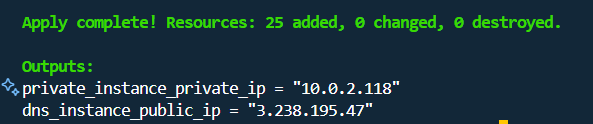
Para configurar la instalación, se deben modificar los valores en el archivo de \`terraform.tfvars\`. Este archivo establece configuraciones de los componentes, como los puertos que usan para la comunicación, cuántos zonal caches, etc. Para consultar la lista de las variables que se pueden configurar, se debe consultar el archivo \`terraform/[variables.tf](http://variables.tf)\`:

- **aws_ami**: AMI ID para la instancia DNS.
- **dns_api_port**: Puerto del DNS API que usará la instancia.
- **dns_server**: Dirección del servidor DNS que usará el DNS API para resolver nombres desconocidos.
- **api_port**: Puerto de la API que usará la instancia.
- **apache_port**: Puerto del apache que usará la instancia.
- **countries**: Lista de códigos de países para los que se creará una instancia de caché zonal.  
  **vercel_ui**: Dirección de la interfaz de usuario de Vercel.
- **vercel_api**: Dirección de la API de Vercel.
- **fetch_interval**: Intervalo de tiempo en el que la caché zonal actualiza la información.
- **vercel_token**: Token de acceso para la API de Vercel.
- **vercel_edge_config_id**: ID del Edge Config de Vercel.

El archivo por defecto es:  
\`\`\`  
aws_ami \= "ami-0f9de6e2d2f067fca"  
dns_api_port \= 443  
dns_server \= {  
 host \= "8.8.8.8"  
 port \= 53  
}  
api_port \= 5000  
apache_port \= 80  
countries \= \[  
 "US",  
 "CR"  
\]  
vercel_ui \= "https://vercelui-eight.vercel.app"  
vercel_api \= "2025-01-2019073558-ic-7602.vercel.app"  
vercel_edge_config_id \= "ecfg_ywndfxposwmc2jpmd6jv47mgjwji"  
fetch_interval \= 2  
\`\`\`  
Para desinstalar la infraestructura, se ejecuta el comando:

- `terraform destroy -var-file="secrets.tfvars"`

# 3\. Arquitectura del sistema

En nuestra arquitectura se definieron dos subredes: una pública y una privada. En la pública se encuentran instancias para el DNS Interceptor, DNS API y cada uno de los caches zonales, que responden a solicitudes de los usuarios, redirigiendo el tráfico con base en la geolocalización utilizando la base de datos IP-To-Country. En la red privada, tenemos una instancia EC2, conectada a un NAT Gateway, que permite que se comunique con Internet desde adentro. En la instancia privada, habitan los servicios internos del sistema: Apache Server y el Rest API en Python. La subred pública se conecta al exterior mediante un Internet Gateway permitiendo tener comunicación con la web. Por otro lado el UI y el Node API, implementados en React y Node.js respectivamente, están desplegados mediante Vercel, con un despliegue automático desde el repositorio del proyecto en Github. Estos componentes se comunican con la base de datos de Firestore y Firebase Realtime Database, donde se almacenan las configuraciones, dominios, sesiones, usuarios y credenciales de autenticación. El Node API actúa como intermediario entre la base de datos, la interfaz y las caches zonales, permitiendo la administración de subdominios, la validación de usuarios, y la aplicación de políticas de autenticación seguras.
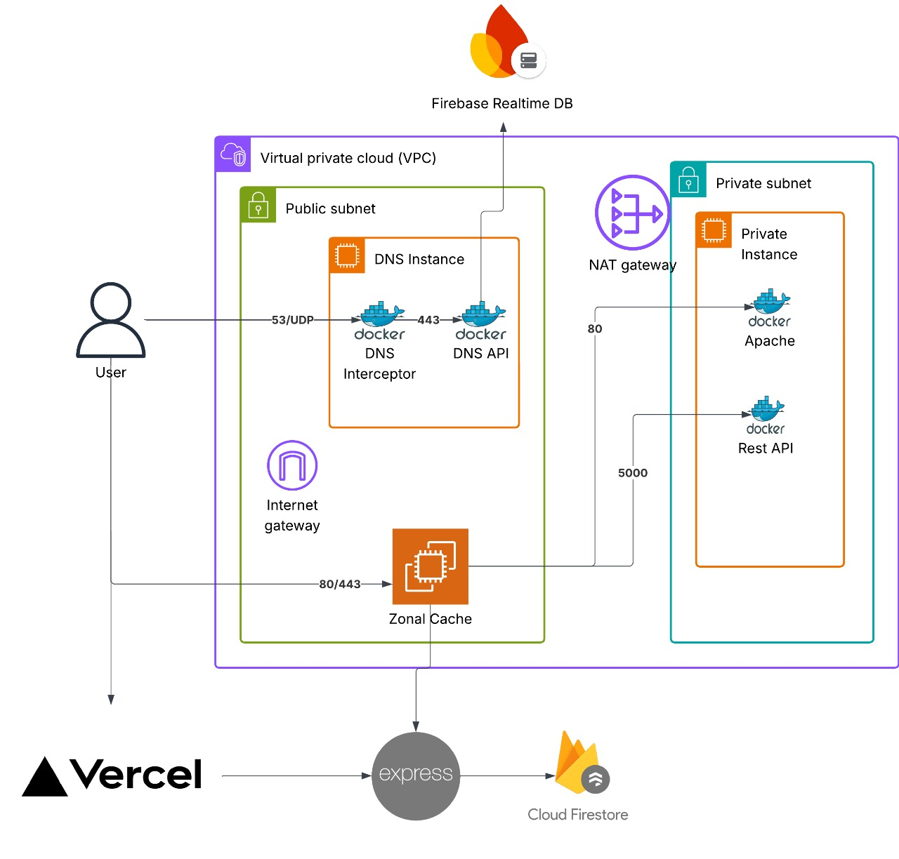

# 4\. Firestore

Se utilizó Cloud Firestore, la base de datos más reciente de Firebase, con el objetivo de lograr un manejo más eficiente y rápido de los datos. El sistema está estructurado en seis colecciones, siendo las siguientes:

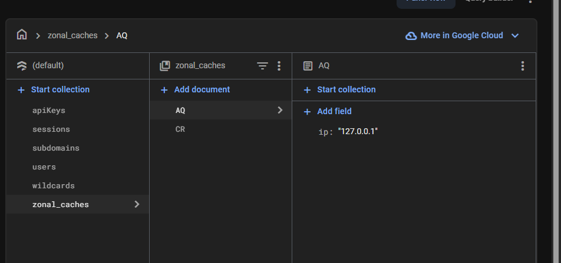

## 4.1 Sessions

El sistema tiene dos tipos de sesiones: uno por usuarios y otro por medio de las API Keys. Las sesiones se crean cuando un usuario se registra por medio del UI o cuando se utiliza una API key como medio de autenticación. Lo que se guarda por session ID del usuario son los siguientes fields:

- createdAt: La fecha de creación
- Domain: El dominio de la sesión
- expiresAt: El timestamp del time to live
- User: El usuario de la sesión.

Cuando es session id por un API Key se guarda lo siguiente:

- apiKey: El API key
- createdAt: La fecha de creación
- Domain: El dominio
- expiresAt: El time to live

Las sesiones por API Key actualmente no se utilizan. No obstante, se podría extender el sistema para que un usuario pueda acceder a una página desde el navegador ingresando una API key en el formulario de ingreso. Actualmente, el método de acceso por API Key se define por medio del header `x-api-key`.

## 4.2. Subdomains

La configuración de subdominios permite definir cómo debe comportarse un servidor proxy con caché cuando atiende solicitudes dirigidas a un dominio específico. Con las reglas específicas permite ser intermediario para varios destinos donde cada subdominio puede tener una configuración separada y personalizada. Las ventajas de esto es que cada subdominio puede tener sus propias reglas, enrutamiento y seguridad. La jerarquía del firestore es la siguiente:  
\`\`\`json  
{  
 "subdomains": {  
 "cat.com": {  
{  
 "apiKeys": {},  
 "authMethod": "user-password",  
 "cacheSize": 3000000,  
 "destination": "www.seaofthieves.com",  
 "fileTypes": \[  
 "text/html",  
 "text/css",  
 "application/js",  
 "application/json",  
 \],  
 "https": true,  
 "replacementPolicy": "LFU",  
 "ttl": 300000,  
 "users": {  
 "daniel": "$2b$10$kTBddpIAUtSTpSh1fo5dF.EUADvBvE9/F7dMNnAybX/b.wRI9I4Q"  
 }  
}  
}  
\`\`\`  
Los usuarios que están registrados en el subdominio son parejas clave-valor en el objeto de users de la siguiente forma:  
\`\`\`json  
{“\<username\>”: “\<hashedPassword\>”}  
\`\`\`  
Las contraseñas están encriptadas con la biblioteca bcryptjs.  
Si el método de autenticación es por API keys, el objeto API queda de la siguiente forma:  
\`\`\`json  
{“\<hashedApiKey\>”: “\<nickname\>”}  
\`\`\`  
El API key se encripta con el algoritmo SHA256. El nickname es un nombre que se configura en la interfaz para identificar la API key.

## 4.3. Users

Esta estructura permite almacenar usuarios registrados y asignarles uno o varios dominios, con sus respectivos subdominios. La jerarquía de los datos se comporta de la siguiente manera:  
\`\`\`  
User {  
 username: string,  
 password: string,  
 domains: {  
 \[domainName\]: {  
 subdomains: {  
 \[subdomainName\]: {}  
 }  
 }  
 }  
}  
\`\`\`

## 4.4. Wildcards

Las wildcards son muy parecidas a la configuración de los subdominios. La diferencia es que permite definir reglas o configuraciones generales que coinciden con múltiples dominios o subdominios. Permite revisar si el subdominio está correcto y encaja de forma correcta, esta es su jerarquía:  
\`\`\`  
{  
 "domains": {  
 "test.com": {  
 "authMethod": "user-password",  
 "cacheSize": 1000000,  
 "destination": "www.hola.com",  
 "fileTypes": \[  
 "application/js",  
 "application/json"  
 \],  
 "https": true,  
 "replacementPolicy": "FIFO",  
 "ttl": 300000  
 },  
 "users": {  
"daniel": "$2b$10$kTBddpIAUtSTpSh1fo5dF.EUADvBvE9/F7dMNnAybX/b.wRI9I4Q"  
 }  
}  
\`\`\`

## 4.5. Zonal_Caches

Las zonal caches son mecanismos de almacenamiento temporal de datos distribuidos por zonas geográficas. Su propósito es reducir la latencia, mejorar el rendimiento y reducir el uso de ancho de banda global. Lo que se guarda en la base de datos es simplemente el país y su IP. Este es un ejemplo de la jerarquía:  
\`\`\`  
{  
CR:  
{ IP: 127.0.0.1 }  
}  
\`\`\`  
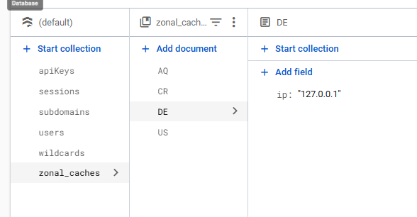

# 5\. Frontend

Toda la interfaz del proyecto fue creada con React y Javascript con la ayuda de Vite para compilarlo. Además de esto, se implementó Tailwind con el propósito de hacer el código más liviano y facilitar la programación del CSS. Se contó con la ayuda de la inteligencia artificial, en este caso fue con el modelo “Claude Sonnet 3.5”, el cual fue accedido mediante “Claude” en la página [https://claude.ai/new](https://claude.ai/new). Este modelo permite realizar una cantidad limitada de consultas de forma gratuita.

Adicionalmente, se utilizó la extensión de GitHub Copilot del editor VSCode para hacer preguntas del código. En este caso, se usó el modelo GPT 4o.

Este fue el prompt para establecer el contexto de la conversación: “”Ayúdame a crear solo visualmente un Formulario de Registro de Usuario, Login / Autenticación que tenga Iniciar sesión, Validar credenciales, Guardar sesión, cerrar sesión  
El primer prompt fue el siguiente “Dame la guía paso a paso de crear en un proyecto en vite, react y tailwind para crear un login y un registro”. Básicamente mostró cómo crear el proyecto, las dependencias y librerías a instalar y dio código de como crear el login y el registro.

Y creó lo siguiente:  
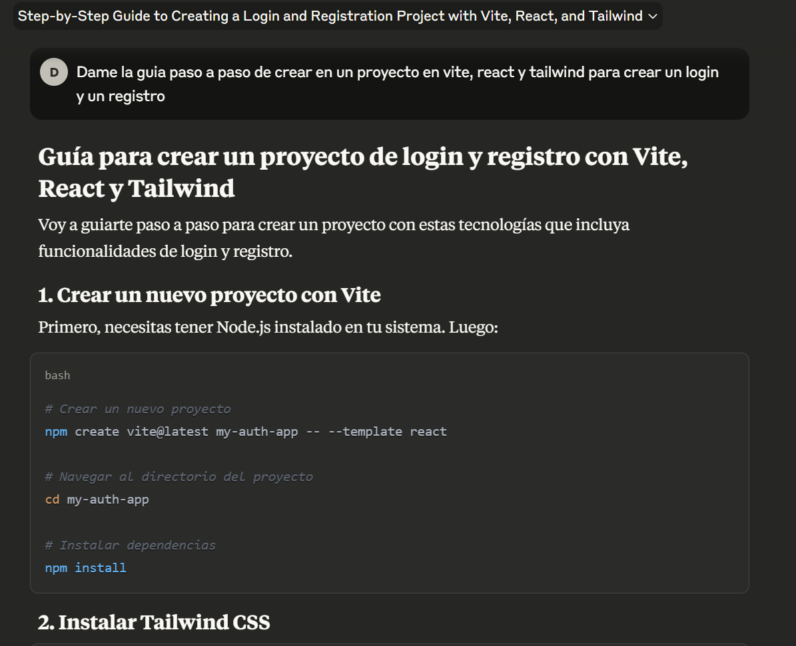

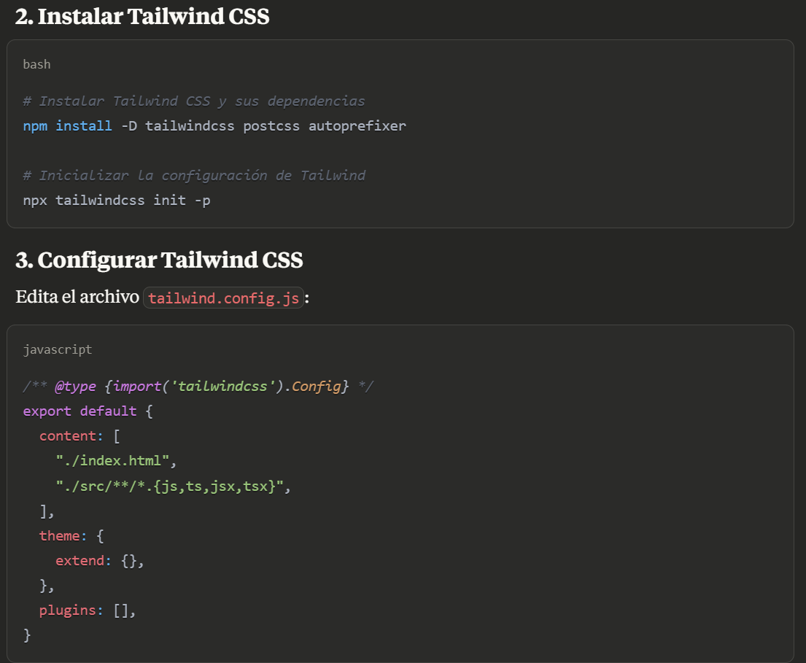  
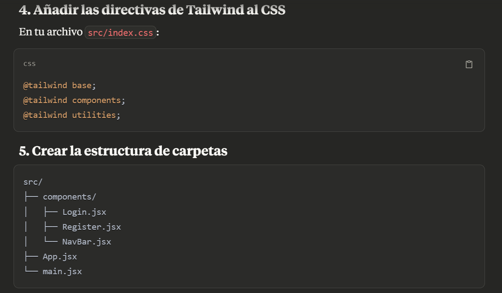
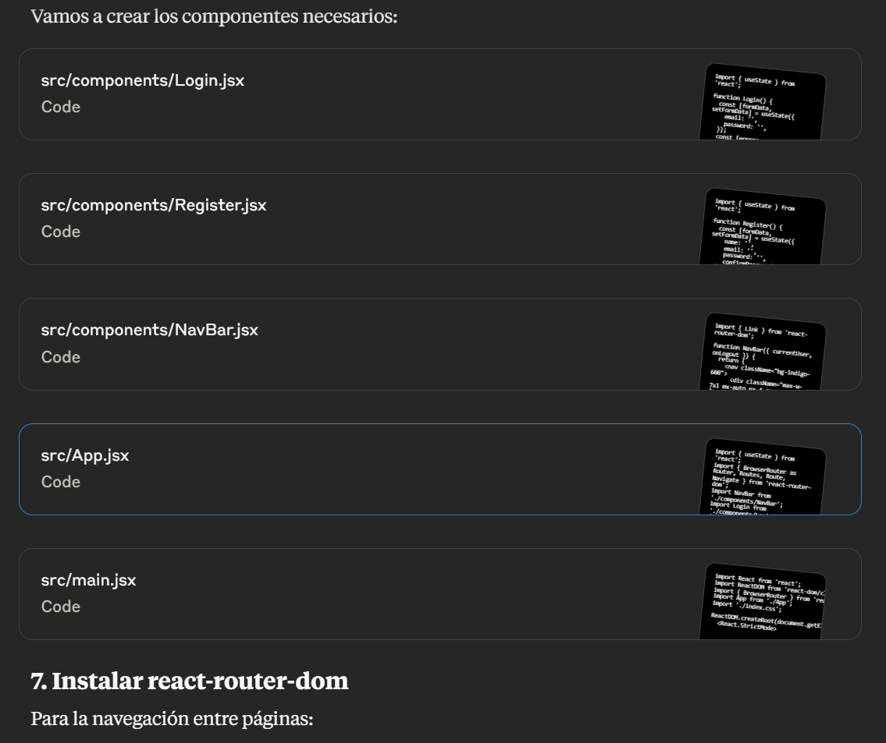  
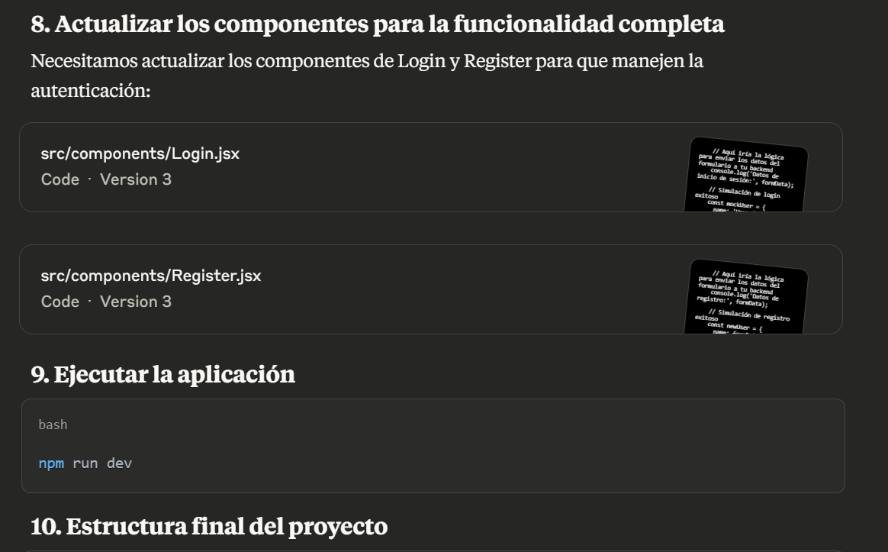  
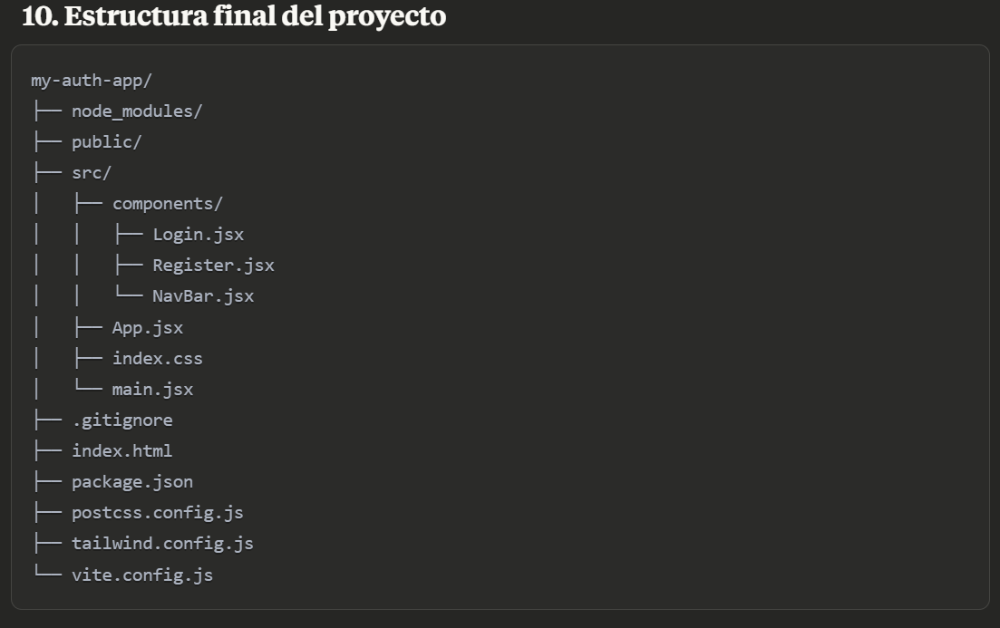

Los próximos prompts fueron con Chat GPT, “Ayúdame a traducir esto con react hook y validación con zod y Tailwind” y nos dio el siguiente código que me permitió crear la tabla de dominios:

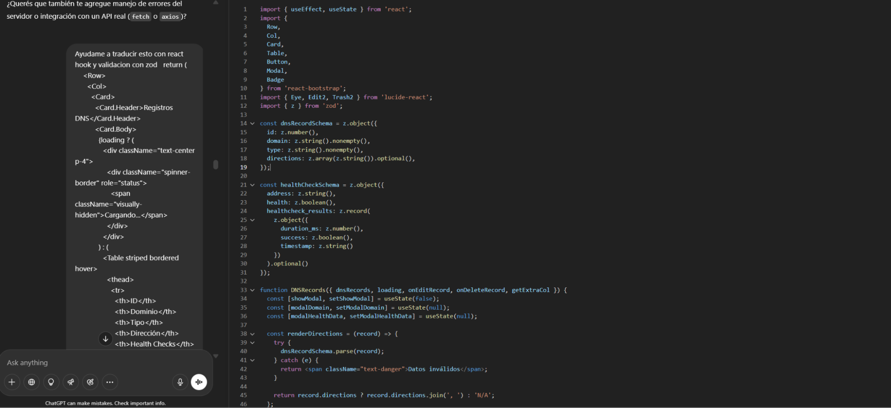  
A continuación, se empezó a utilizar el agente de VSCode para apoyar la programación:  
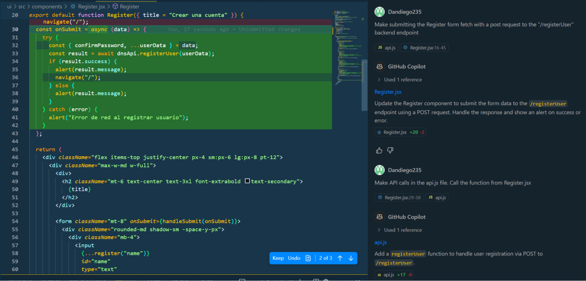  
Modificó el método de onSubmit para llamar a la función registerUser del archivo del API.  
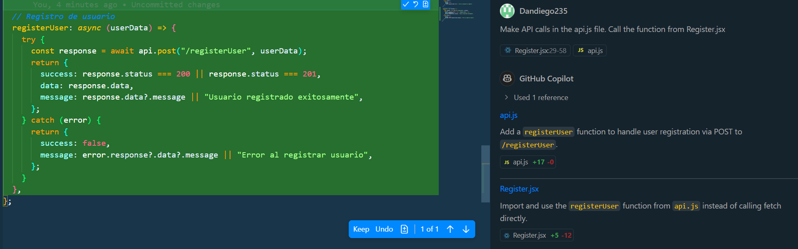  
En el API, creó el método registerUser. Debemos modificarlo para que sea realmente compatible con el API programado en el Rest API [Node.js](http://Node.js).  
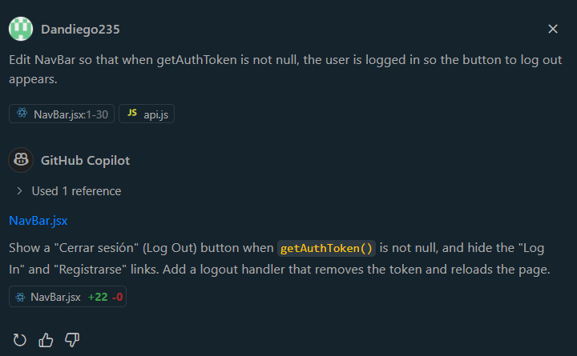  
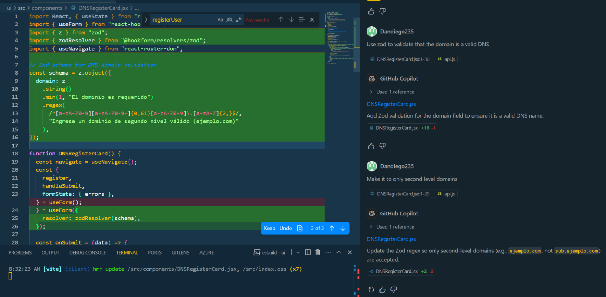  
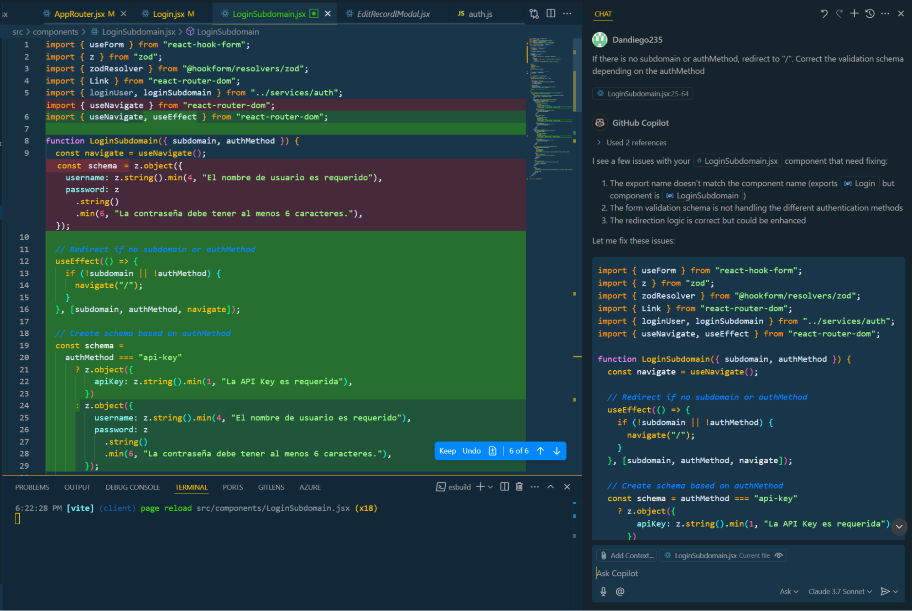  
En este prompt, la primera edición tenía un error. `useEffect` no es parte de la biblioteca “react-router-dom”. Es parte de “react”.

Con la inteligencia artificial de Copilot con el modelo Claude 3.5 Sonnet se ingresó el siguiente prompt “Creame un componente muy parecido a registro pero para cambio de contraseña”  
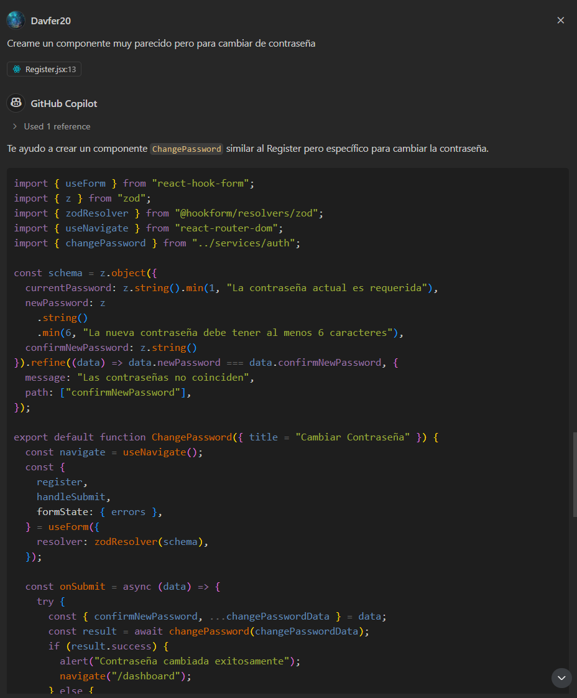

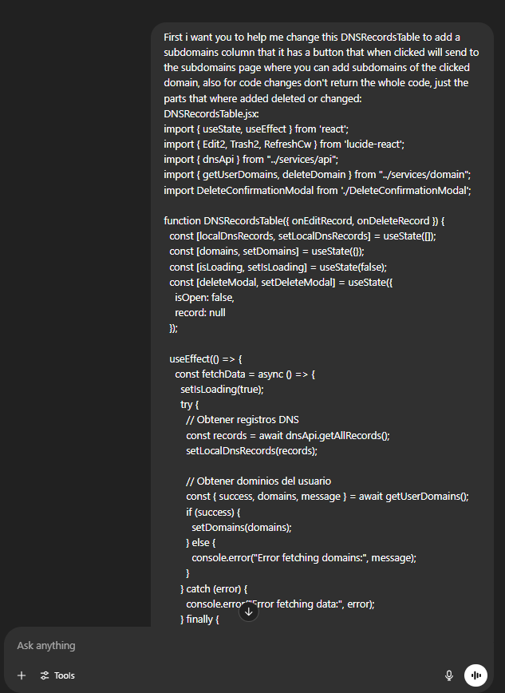

Este prompt con ChatGPT: “Agrega una columna Subdominios en DNSRecordsTable.jsx con botón para ir a gestión de subdominios”. Me proporcionó el fragmento de código modificado.

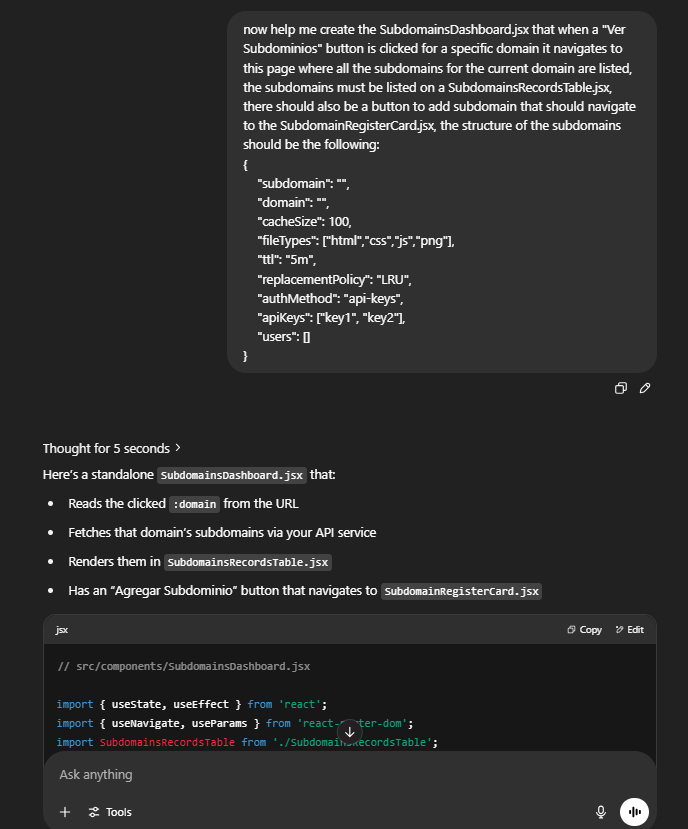  
Este prompt con ChatGPT: “Crea SubdomainsDashboard.jsx: lee :domain, muestra spinner, lista subdominios en tabla y botón para agregar” y obtuve el componente completo.

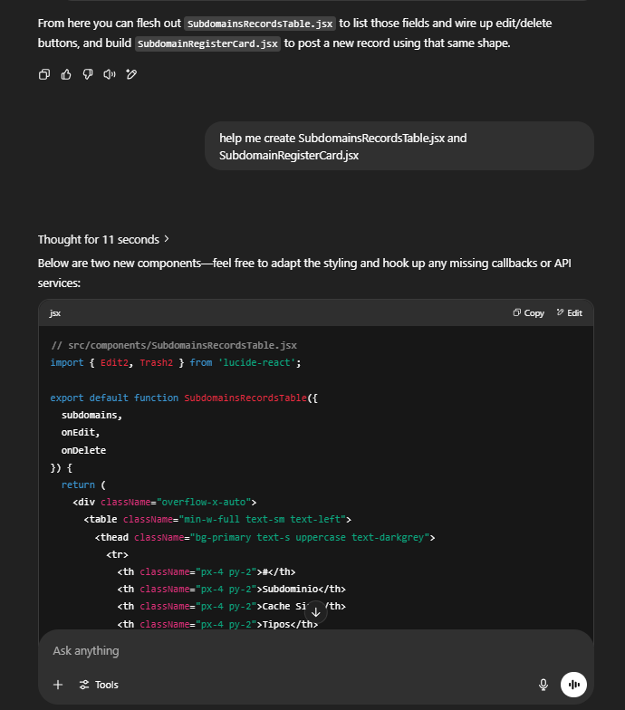  
Este prompt con ChatGPT “Crea SubdomainsRecordsTable.jsx (tabla con editar/eliminar y modal de llaves/usuarios) y SubdomainRegisterCard.jsx (formulario para registrar subdominio)” y me dio ambos archivos.

## 5.1. Conclusión sobre el uso de IAs

Uno de los puntos principales de este proyecto era realizar un UI totalmente con la asistencia de inteligencia artificial, como GitHub Copilot, Claude y ChatGPT, y documentar el proceso. Es increíble y aterrorizante lo buenas que son estas herramientas programando. En el grupo, muy pocos habían tenido experiencia programando con Tailwind y Vite, pero con estas herramientas la programación salió sumamente rápido. Prácticamente en una tarde teníamos un gran avance de la interfaz. No obstante, notamos que en ocasiones lo que genera tiene errores. Muchas veces no incluye bibliotecas y algunos botones que incluye quedan inservibles. También, para unos integrantes del grupo, la página aparecía blanca, pero para otros, se veía más como beige o gris. La autenticación del usuario muchas veces cuesta que agarre, por alguna razón a veces da un error de que se reinicia la conexión. Notamos que la inteligencia artificial ayuda mucho con respecto a los estilos. No obstante, podría considerarse que, por lo menos en nuestra página, la interfaz que realizó es sumamente sencilla y genérica, pero para los efectos del proyecto, es funcional. Además, la velocidad en la que lo hizo es simplemente extraordinaria. Por lo tanto, concluimos que el poder de las inteligencias artificiales es evidente y desde un punto de vista de costo, posiblemente más rentable para las grandes corporaciones codiciosas que contratar programadores. Sin embargo, lo que generan puede llegar a arrastrar errores y las interfaces pueden resultar aburridas, por lo que sigue siendo necesario un desarrollador que entienda el código y cómo funciona y artistas que le sepan dar color a los gráficos. Esperamos que en lugar de tomar nuestros trabajos, podamos trabajar en conjunto con las inteligencias artificiales y mejorar nuestra productividad.

# 6\. Zonal Cache

    Este componente implementa un servicio de caché en disco. La aplicación está escrita en GNU C++. Tiene distintas funcionalidades. Estas se explican a continuación.

## 6.1. Requests HTTP

    Para simplificar el manejo de los requests HTTP, se utilizó la biblioteca [httpparser](https://github.com/nekipelov/httpparser) de Alex Nekipelov y [Libcurl](https://curl.se/libcurl/c/). Para desacoplar el manejo de requests HTTP del zonal cache en sí, se hicieron archivos llamados \`http\_client.h\` y \`http\_client.cpp\`. El header tiene la definición de los siguientes structs:

\`\`\`  
struct memory_struct {  
 char\* memory;  
 size_t size;  
 long status_code;  
 unordered_map\<string, string\> headers;  
 string status_line;

    // Constructor
    memory\_struct()
        : memory(nullptr), size(0), status\_code(0), headers(), status\_line("") {}

    // Destructor
    \~memory\_struct() {
        if (memory) {
            free(memory);
            memory \= nullptr;
        }
    }

};

struct header_info {  
 string status_line;  
 bool captured \= false;  
};

struct HttpRequest {  
 unordered_map\<string, string\> headers;  
 Request request;  
};

struct HttpResponse {  
 unordered_map\<string, string\> headers;  
 Response response;  
};

\`\`\`

- Memory struct: Es donde se guarda la respuesta HTTP. Tiene el buffer de la memoria donde se almacena el contenido. También puede guardar los headers, el tamaño, el mensaje de estado y el código de estado.
- header_info: Se usa para capturar el header de la respuesta. Más específicamente, se usa para extraer la primera línea de la respuesta HTTP, la cual contiene la versión, el código de estatus y el “reason phrase”. Esta no se puede extraer con alguna opción directa de libcurl, por lo que hay que utilizar la opción de CURLOPT_HEADERFUNCTION para capturar esta línea en una función callback.
- HTTPRequest y HTTPResponse: Se usa en conjunto con la biblioteca \`httpparser\` para poder manejar más fácilmente los headers y el contenido del request en el zonal cache.

  El archivo \`http_client.cpp\` procesa requests y respuestas HTTP y envía los requests.

## 6.2. Configuración

    La configuración del zonal cache se almacena en Firestore, por medio de los registros explicados en esa sección. Estos enlazan el país de la caché con un IP. Para obtener la configuración de los subdominios, hay un hilo que cada cierto tiempo envía un request al Rest API en NodeJS, el cual le devuelve la información. Si la respuesta es válida, cambia todo el objeto JSON que contiene la información a uno que tiene la más nueva. Esto lo hace por medio de la función Swap() de RapidJSON. Para obtener los wildcards realiza el mismo proceso. Los wildcards se manejan por separado porque el manejo de los mismos es diferente.
    La imagen que se utiliza dentro de las instancias EC2 en Terraform se levanta con el siguiente script de inicio:

\`\`\`bash  
\# Generar API key de autenticación con el API de Vercel  
API_KEY=$(openssl rand \-hex 16\)  
export API_KEY  
echo "Generated API_KEY: $API_KEY"

\# Cuerpo del request para la API de Vercel Edge Config  
REQUEST_BODY=$(cat \<\<EOF  
{  
  "items": \[  
    {  
      "operation": "upsert",  
      "key": "${APP_ID}",  
 "value": "${API_KEY}"  
 }  
 \]  
}  
EOF  
)

\# URL para la API de Vercel Edge Config  
URL="https://api.vercel.com/v1/edge-config/${VERCEL\_EDGE\_CONFIG\_ID}/items"

echo "Updating Edge Config with API key for APP_ID: ${APP\_ID}"  
\# Realizar el request PATCH a la API de Vercel Edge Config para actualizar el API key  
curl \--retry 10 \-f \--retry-all-errors \--retry-delay  5 \-s \-o /dev/null \\  
     \-X PATCH "$URL" \\  
 \-H "Authorization: Bearer $VERCEL\_TOKEN" \\  
     \-H "Content-Type: application/json" \\  
     \-d "$REQUEST_BODY"

sleep 10

PUBLIC_IP=$(curl \-s http://169.254.169.254/latest/meta-data/public-ipv4)  
export PUBLIC_IP

echo "Public IP of the instance: $PUBLIC_IP"

echo "Registering zonal cache with REST API at ${REST\_API}"  
curl \--retry 10 \-kfsS \--retry-all-errors \--retry-delay 5 \\  
     \-X POST "https://${REST_API}/cache/register" \\  
 \-H "x-api-key: ${API\_KEY}" \\  
     \-H "x-app-id: ${APP\_ID}" \\  
     \-H "Content-Type: application/json" \\  
     \-d "{\\"country\\":\\"${COUNTRY}\\", \\"ip\\":\\"${PUBLIC_IP}\\"}"

sleep 5

echo "Executing zonal cache with APP_ID: ${APP_ID}, REST_API: ${REST_API}, COUNTRY: ${COUNTRY}"  
\# Se levanta el zonal cache  
exec ./zonal_cache  
\`\`\`  
Este script de inicio se encarga de configurar la autenticación de la caché zonal y su configuración en Firestore, para que así el DNS API pueda redirigir las peticiones DNS con base en el IP de origen. Realiza las siguientes operaciones:

1. Genera el API Key que usará para autenticar con el Rest API.
2. Inserta su información del API Key en Vercel Edge Config para que el Rest API la pueda autenticar. Realiza una operación de upsert para actualizar el valor si ya existe o insertarlo si no.
3. Averigua su IP pública por medio de una solicitud al endpoint de “/public-ipv4” en el [Instance Metadata Service](https://docs.aws.amazon.com/AWSEC2/latest/UserGuide/instancedata-data-retrieval.html), el cual se usa para obtener información acerca de la instancia EC2.
4. Envía una solicitud POST al endpoint de “/cache/register” del Rest API para que este inserte su IP pública en Firestore.
5. Ejecuta el programa escrito en C++ de la zonal cache.

## 6.3. Manejo del almacenamiento

    El objetivo de una caché es evitar tener que enviar una petición en repetidas ocasiones si se realiza múltiples veces. Para lograr esto, creamos un objeto de una caché. Este tiene la siguiente estructura:

\`\`\`json  
{  
 “cache”: {  
 “destino”: {  
 “requests”: {  
 “request” :{  
 “received”: fecha y hora recibida,  
 “most_recent_use”: fecha y hora de la última vez que se usó,  
 “times_used”: cantidad de usos,  
 “time_to_live”: fecha y hora a la que expira el registro,  
 “filename”: nombre del archivo con su información,  
 “size”: tamaño del archivo.

    		}

},  
“size”: tamaño de la cache que tiene el dominio.  
}  
}  
}  
\`\`\`  
Un ejemplo de esta estructura es:  
\`\`\`json  
{  
 “cache”: {  
 “pokemon.mooo.com”: {  
 “requests”: {  
 “[GET-pokemon.mooo.com/getPokemon/001](http://GET-pokemon.moo.com/getPokemon/001)” :{  
 “received”: “Tue Jun 3 02:37:49”,  
 “most_recent_use”: “Tue Jun 3 05:40:20”,  
 “times_used”: 3,  
 “time_to_live”: “Tue Jun 3 06:00:00”,  
 “filename”: bulbasour.ksh,  
 “size”: 500

    		}

},  
“size”: 500  
}  
}  
}  
\`\`\`  
 Como C++ no tiene soporte nativo para objetos JSON, por lo que usamos la biblioteca [RapidJSON](https://rapidjson.org/). Esta biblioteca simplificó mucho el desarrollo al tener una forma fácil de obtener los objetos con base en la llave. El siguiente [diagrama](https://www.mermaidchart.com/app/projects/5849e424-fa63-48bc-a804-13f2ca3b7dd7/diagrams/96b9d9ba-b12c-41df-9c4b-c477af41341f/version/v0.1/edit) explica el proceso de administrar la caché.

## 6.4. Políticas de reemplazo

    Cuando se quiere agregar un request a la caché, pero no hay espacio suficiente para este, es necesario eliminar uno que ya existe. Para este fin, hay cinco políticas de reemplazo:

- Last Recently Used (LRU): En esta política, se busca cuál es el registro que no se ha usado en la mayor cantidad de tiempo. Para esto, se revisa el campo de \`most_recent_use’ y buscar cuál tiene el menor timestamp.
- Last Frequently Used (LFU): En esta política, se busca cuál es el registro que se usa con menos frecuencia. Para esto, se revisa el campo de \`times_used\` y se elimina el que tenga la menor cifra.
- First In, First Out (FIFO): En esta política, se elimina el registro más antiguo, el primero en entrar a la caché. Esto se obtiene por medio del campo \`received\`.
- Most Recently Used: En esta política, se elimina el registro que se ha usado más recientemente. Este se obtiene con el campo de \`most_recent_use\`, igual que con LRU.
- Random: Esta política elimina un registro aleatoriamente.

## 6.5. Expiración de la caché

    Cada registro en la caché tiene un time to live (TTL), o tiempo para vivir. Este se calcula al sumar el TTL configurado para el registro al tiempo en el que se recibió el request. Para imponer esta restricción, hay un hilo que periódicamente revisa los registros de la caché y si el timestamp del TTL es menor al tiempo actual, ese registro se elimina. En la implementación, se obtiene un lock compartido para leer la caché. Se lee el campo de \`time\_to\_live\` de cada registro y se compara con el tiempo actual. Si es menor, se obtiene un lock de escritora único para poder modificar el objeto compartido de la caché de una manera segura. Luego, se libera ese lock y se vuelve a adquirir un lock compartido de lectura. Si luego de eliminar el registro, el objeto del destino se queda sin registros, se elimina ese objeto también. Se vuelve a adquirir un lock único de escritura y se realiza la modificación.

## 6.6. Subdominios

La caché tiene un hilo que ejecuta la función `fetch_subdomains`, la cual hace un fetch al endpoint de `/subdomains/all` del Rest API para extraer la información de todos los subdominios. Una vez actualizada la información, se queda esperando lo que establezca la variable de entorno de `$FETCH_INTERVAL`, la cual establece el tiempo de espera en minutos. Guarda la información en un objeto Document llamado `subdomains`. Este objeto es una estructura de datos para representar objetos JSON de la biblioteca RapidJSON. Adicionalmente, el objeto de subdominios y la caché se protegen con un objeto [shared_mutex](https://en.cppreference.com/w/cpp/thread/shared_mutex.html) para prevenir condiciones de carrera. Este permite varios lectores a la vez y solo 1 escritor.

En este objeto de subdomains, los subdominios tienen la siguiente estructura:  
\`\`\`json  
{  
 "amazon.chickenkiller.com": {  
 "cacheSize": 10000000,  
 "fileTypes": \[  
 "text/html",  
 "text/css",  
 "application/js",  
 "application/json",  
 "image/png",  
 "image/jpeg",  
 "image/svg+xml",  
 "application/xml",  
 "text/plain",  
 "application/pdf"  
 \],  
 "ttl": 300000,  
 "replacementPolicy": "FIFO",  
 "authMethod": "none",  
 "https": true,  
 "destination": "www.amazon.com"  
 },  
 "apache.mooo.com": {  
 "cacheSize": 1000000,  
 "fileTypes": \[  
 "text/html",  
 "text/css",  
 "application/js"  
 \],  
 "ttl": 300000,  
 "replacementPolicy": "LRU",  
 "authMethod": "user-password",  
 "https": false,  
 "destination": "10.0.2.118"  
 }  
}  
\`\`\`  
Una vez que se procesan, se guardan en un objeto de la estructura subdomain*info, la cual tiene los siguientes campos:  
\`\`\`c++  
struct \_subdomain_info* {  
 _string_ auth*method;  
 \_string* destination;  
 bool https;  
 vector\<_string_\> file*types;  
 \_uint64_t* cache*size;  
 int ttl;  
 \_string* replacement*policy;  
 \_string* wildcard;  
}  
\`\`\`

## 6.7. Wildcards

Los wildcards se insertan en su propia colección en Firestore. Así, en la función de fetch_subdomains en la que se actualizan los subdominios, se actualizan los wildcards. Se hace una petición al endpoint de “/subdomain/wildcards” del Rest API para leer la información. Se guarda en el objeto `wildcards` en el zonal cache. Igualmente, se usa un shared mutex para proteger el acceso.  
La función que se usa para validar si un subdominio está cubierto por un wildcard es la siguiente:  
\`\`\`c++  
string check_wildcard(const string \&subdomain) {  
 size_t length \= 0;  
 string response;  
 // Iterar sobre los wildcards  
 for (auto wildcard_itr \= wildcards.MemberBegin(); wildcard_itr \!= wildcards.MemberEnd(); \++wildcard_itr) {  
 const string wildcard_str \= wildcard_itr-\>name.GetString();  
 // Verificar si el subdominio termina con el wildcard  
 if (subdomain.ends_with("." \+ wildcard_str)) {  
 // Si el wildcard es más largo que el actual, actualizar la longitud  
 if (wildcard_str.length() \> length) {  
 length \= wildcard_str.length();  
 response \= wildcard_str;  
 }  
 // Retornar el wildcard encontrado  
 return wildcard_str;  
 }  
 }  
 return "";  
}  
\`\`\`  
Esta función lo que hace es iterar por los wildcards registrados y terminar si el dominio que se está revisando termina con el wildcard. En el caso en que haya varias coincidencias, se queda con el wildcard que sea más largo. Después de haber obtenido esto, se puede extraer la información del objeto del objeto `wildcards` y crear un objeto `subdomain_info`, con el wildcard encontrado guardado en el campo de `wildcard`. Esto se realiza porque la autenticación se maneja levemente diferente cuando es un wildcard.

## 6.8. Autenticación

    Cada vez que se recibe una solicitud, se intenta autenticar. La autenticación está definida por el campo de `authMethod` en los documentos de Firestore. Las opciones son: “none”, “user-password” o “api-keys”. La caché zonal recibe una solicitud, extrae el host y lo busca en el objeto de subdomains para obtener el request. Todo el manejo de la autenticación se hace en la función `authenticate_request`. Esta función retorna un booleano que representa si la autenticación fue exitosa (true) o no (false). Hay varios flujos dependiendo del método de autenticación. El flujo inicial de la solicitud se muestra a continuación.

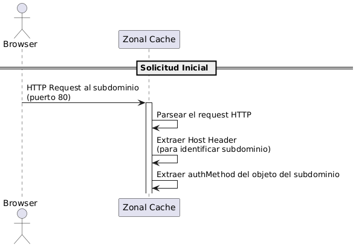

### 6.8.1. None

Si se encuentra que el subdominio no tiene un método de autenticación configurado, se deja pasar.

### 6.8.2. User/Password

    A continuación se muestra el flujo de autenticación con usuario y password:

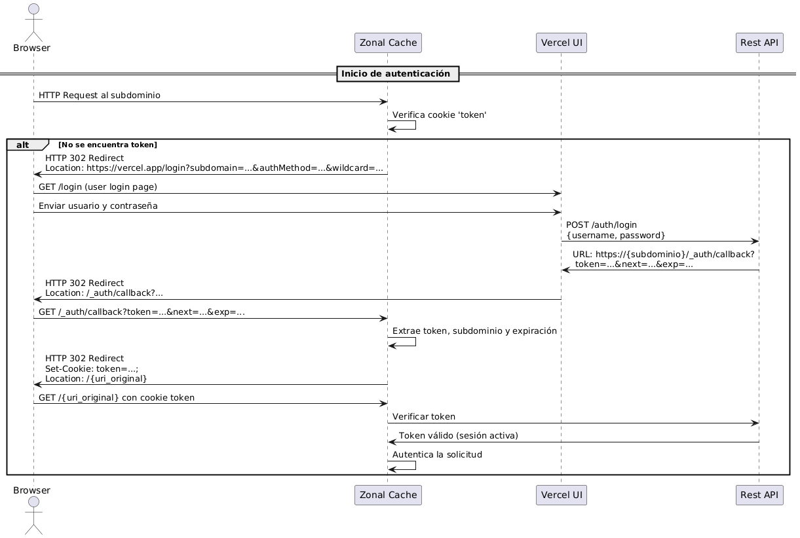  
Los pasos son los siguientes:  
1\. Cache revisa si recibe el Cookie de Token y no lo encuentra.  
2\. Redirige al Browser por medio de una respuesta HTTP 302 a la página del UI en Vercel en el path "/login", con los siguientes query parameters: subdomain \= url_encode(scheme \+ host \+ request.uri), authMethod \= authMethod. Si tiene wildcard, el wildcard también se agrega como query parameter.  
3\. El browser envía al Vercel UI el usuario y contraseña.  
4\. El Vercel UI envía una solicitud de autenticación al Rest API.  
5\. El Rest API autentica y devuelve un URL con la siguiente estructura: host_original/\_auth/callback?token={JWT de autenticación}\&next={subdominio+uri_original}\&exp={segundos de expiración de la sesión}.  
6\. El Vercel UI recibe el URL y genera una redirección al URL.  
7\. El browser regresa el URL con el subdominio original y envía un HTTP request con el URI /\_auth/callback.  
8\. El zonal cache verifica que se haya llamado a la ruta del callback y extrae el token, el subdominio y la expiración. Devuelve una respuesta HTTP 302 con el header de Set-Cookie: token={token} y redirige al subdominio con el URI original.  
9\. El Browser va al subdominio con el URI original.  
10\. El zonal cache encuentra el cookie token. Envía el cookie al Rest API.  
11\. El Rest API valida el token devuelve una respuesta de si el token es una sesión válida.  
12\. El zonal cache recibe la respuesta afirmativa y autentica la solicitud.

Cuando ya se estableció el cookie de Token, la autenticación solo se realiza a partir del paso 10\.

### 6.8.3. API keys

El siguiente diagrama muestra cómo se autentican los API keys en el zonal cache, específicamente por medio del Header `x-api-key`

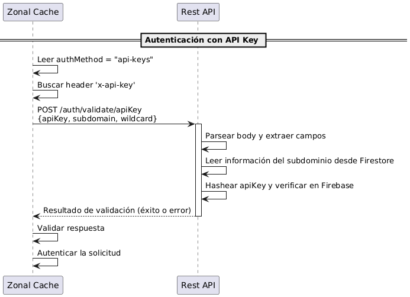

## 6.9. SSL Termination

Los zonal cache soportan conexión por HTTP y HTTPS. Así, tienen dos sockets abiertos: el puerto 80 y el puerto 443\. Las conexiones por el puerto 80 se asumen que son HTTP, por lo que se usan las primitivas de socket normales, de `recv` y `send`. Para las conexiones por el puerto 443, se asumen que son HTTPS. Se utiliza la biblioteca de `OpenSSL` para el manejo del handshake TLS y los certificados. Para los certificados, se usa un self signed certificate generado por el siguiente comando ([Referencia](https://www.ibm.com/docs/en/api-connect/10.0.x_cd?topic=profile-using-openssl-generate-format-certificates)) :  
\`\`\`  
openssl req \\  
 \-newkey rsa:2048 \\  
 \-nodes \\  
 \-keyout key.pem \\  
 \-x509 \\  
 \-days 365 \\  
 \-out cert.pem \\  
 \-subj "/C=US/ST=Florida/L=Miami/O=Twins/OU=Software/CN=redesproject"  
\`\`\`  
Esto genera un self signed certificate. Como las cachés zonales no tienen un dominio fijo ya que el IP asignado depende de lo que les asigne AWS, no se puede asignar un certificado respaldado por un Certificate Authority autorizado. Por lo tanto, el acceso por HTTPS va a dar los errores de certificados inválidos, pero cuando se continúa con la opción de acceder al sitio, sí se puede acceder exitosamente.

# 7\. Rest API Python

    Este componente es un programa simple escrito en Python con la biblioteca Flask. Es un REST API que simplemente funciona como un diccionario de Pokémones. Tiene endpoints para realizar requests de GET, POST, PUT y DELETE. Ejemplos de requests son:

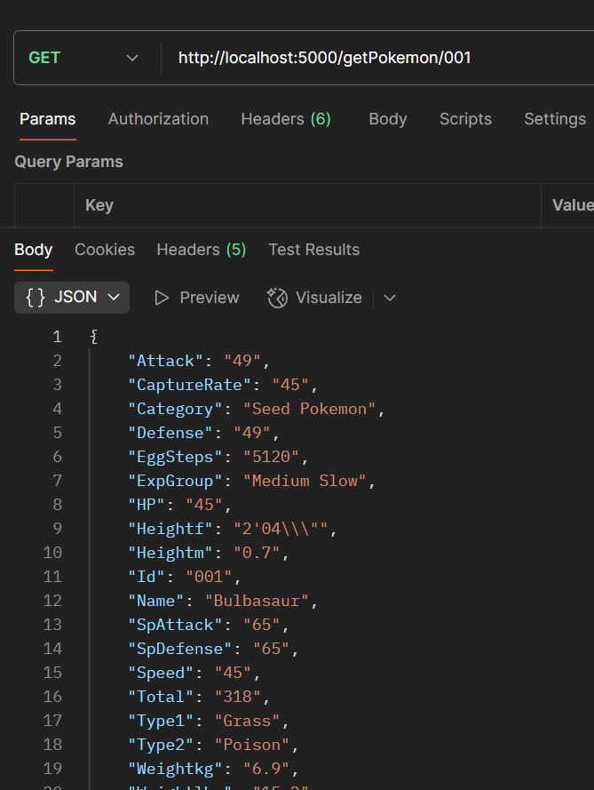  
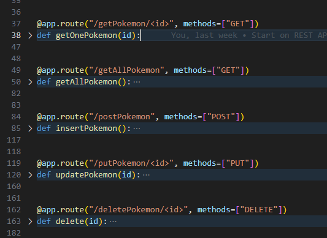

# 8\. Apache Server

    Similar al Rest API en Python, este es un componente sumamente simple. Es una página web que es una calculadora muy rudimentaria. Tiene simplemente tres archivos:

- \`index.html\`: Tiene la estructura de la calculadora.
- \`style.css\`: Tiene la customización de la página para hacerla más atractiva visualmente.
- \`[calculator.js](http://calculator.js)\`: Tiene el código de Javascript que corre la calculadora.

Esta página se ve así:  
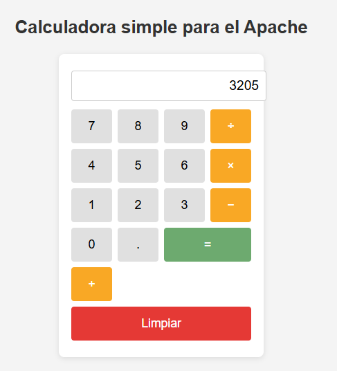

# 9\. Node API

Este es un REST server hecho con Node.js y Express que expone endpoints usados por la UI y por las caches zonales. Funciona como la capa de aplicación que gestiona usuarios, dominios y subdominios en Firebase/Firestore. Ofrece rutas para los métodos GET, POST, PUT y DELETE, y se asegura la seguridad con JWT y middlewares.

## 9.1 Controllers

### auth.controller.ts }

**createSessionUser**

Esta función crea una sesión de usuario almacenando en Firestore un documento con los campos:

- **user**: identificador del usuario.
- **domain**: dominio asociado a la sesión.
- **createdAt**: fecha de creación en ISO.
- **expiresAt**: fecha de expiración calculada sumando el tiempo de vida (**expiration**) a la hora actual.

Luego genera un JWT que incluye **{ user, domain, sessionId, type: "user" }** y expira según el mismo valor **expiration**. Si ocurre algún error al parsear la duración o al crear el documento, devuelve una cadena vacía.

\`\`\`javascript  
_const_ createSessionUser \= _async_ (  
 user: string,  
 domain: string,  
 expiration: ms.StringValue  
) \=\> {  
 try {  
 _const_ expirationMs \= ms(expiration);  
 if (isNaN(expirationMs)) {  
 _return_ "";  
 }

    *const* now \= new Date(Date.now());
    *const* expirationDate \= new Date(now.getTime() \+ expirationMs);
    *const* sessionData \= {
      user,
      domain,
      createdAt: now.toISOString(),
      expiresAt: expirationDate.toISOString(),
    };
    *const* sessionsRef \= *await* firestore.collection("sessions").add(sessionData);
    *const* sessionId \= sessionsRef.id;
    if (\!sessionId) {
      *return* "";
    }
    *const* token \= jwt.sign(
      { user, domain, sessionId, type: "user" },
      process.env.JWT\_SECRET || "defaultsecret",
      { expiresIn: expiration }
    );

    *return* token;

} catch (error) {  
 console.error("Error creating session:", error);  
 _return_ "";  
 }  
};  
\`\`\`  
**createSessionApiKey**

Esta función crea una sesión basada en API Key almacenando en Firestore un documento con:

- **apiKey**: clave de autenticación.
- **domain**: dominio asociado.
- **createdAt**: fecha de creación.
- **expiresAt**: fecha de expiración calculada a partir de expiration.

Luego genera un JWT que incluye **{ apiKey, domain, sessionId, type: "api-key" }** y expira según **expiration**. Si ocurre cualquier error (duración inválida o fallo al guardar), retorna una cadena vacía.

**registerUser**

Esta función registra un nuevo usuario verificando que no exista un documento con ese **username** en **firestore.collection("users")**. Si no existe, genera un hash con bcrypt para la contraseña y guarda **{ username, password: hashedPassword }** en Firestore. Luego crea una sesión JWT con **createSessionUser** (válida 1 hora), envía el token como cookie segura y responde confirmando el registro junto con el token.

\`\`\`

export _const_ registerUser \= _async_ (  
 req: Request,  
 res: Response  
): Promise\<void\> \=\> {  
 try {  
 _const_ { username, password } \= req.body;  
 _const_ docRef \= firestore.collection("users").doc(username);  
 _const_ doc \= _await_ docRef.get();  
 if (doc.exists) {  
 res.status(400).json({ message: "El usuario ya existe." });  
 _return_;  
 }

    *const* salt \= bcrypt.genSaltSync(10);
    *const* hashedPassword \= bcrypt.hashSync(password, salt);

    *await* docRef.set({
      username,
      password: hashedPassword,
    });

    *const* expiration \= "1h";
    *const* token \= *await* createSessionUser(username, "domain\_ui", expiration);
    if (\!token) {
      res.status(500).json({ message: "Error al crear la sesión" });
      *return*;
    }
    res.cookie("token", token, {
      maxAge: ms(expiration),
      sameSite: "none",
      secure: true,
    });
    res.status(201).json({ message: "Usuario registrado exitosamente", token });

} catch (error) {  
 console.error("Error al registrar el usuario:", error);  
 res.status(500).json({ message: "Internal server error" });  
 }  
};

**\`\`\`**

**loginUser**

Esta función recibe **username** y **password** en el cuerpo, busca el documento correspondiente en **firestore.collection("users")** y, si existe, compara la contraseña con el hash almacenado usando bcrypt. Si las credenciales coinciden, crea una nueva sesión JWT (válida 1 hora) con **createSessionUser**, envía el token como cookie segura y responde con el token en JSON. Si el usuario no existe o la contraseña es incorrecta, devuelve “Unauthorized”; ante cualquier error interno, retorna un error genérico.

\`\`\`

export _const_ loginUser \= _async_ (req: Request, res: Response): Promise\<void\> \=\> {  
 try {  
 _const_ { username, password } \= req.body;  
 _const_ docRef \= firestore.collection("users").doc(username);  
 _const_ doc \= _await_ docRef.get();  
 if (\!doc.exists) {  
 res.status(401).json({ message: "Unauthorized" });  
 _return_;  
 }

    *const* userData \= doc.data();
    if (\!userData) {
      res.status(500).json({ message: "Internal server error" });
      *return*;
    }

    *const* isPasswordValid \= bcrypt.compareSync(password, userData.password);
    if (\!isPasswordValid) {
      res.status(401).json({ message: "Unauthorized" });
      *return*;
    }
    *const* expiration \= "1h";
    *const* token \= *await* createSessionUser(username, "domain\_ui", expiration);
    if (\!token) {
      res.status(500).json({ message: "Error al crear sesión" });
      *return*;
    }
    res.cookie("token", token, {
      maxAge: ms(expiration),
      sameSite: "none",
      secure: true,
    });
    res.status(200).json({ token });

} catch (error) {  
 console.error("Error logging in user:", error);  
 res.status(500).json({ message: "Internal server error" });  
 }  
};  
**\`\`\`**

**loginSubdomainUser**

Verifica que **subdomain** sea una URL válida y, según si es wildcard o no, busca el documento en la colección **subdomains** o en **wildcards**. Luego confirma que el método de auth sea **"user-password"** y que exista el usuario con contraseña hasheada. Si la contraseña coincide, crea una sesión JWT para ese usuario y subdominio, genera una URL de callback con el token y la envía al cliente. En caso de cualquier fallo (URL inválida, documento no existe, método de auth incorrecto, credenciales erróneas o error interno), devuelve un error apropiado.

\`\`\`

export _const_ loginSubdomainUser \= _async_ (  
 req: Request,  
 res: Response  
): Promise\<void\> \=\> {  
 try {  
 _const_ { username, password, subdomain, wildcard } \= req.body;  
 console.log(username, password, subdomain);  
 _let_ subdomainURL: URL;  
 try {  
 subdomainURL \= new URL(subdomain);  
 } catch (error) {  
 console.error("Invalid subdomain URL:", error);  
 res.status(400).json({ message: "URL del subdominio inválido" });  
 _return_;  
 }  
 _let_ docRef;  
 if (\!wildcard) {  
 docRef \= firestore.collection("subdomains").doc(subdomainURL.hostname);  
 } else {  
 docRef \= firestore.collection("wildcards").doc(wildcard);  
 }

    *const* doc \= *await* docRef.get();
    if (\!doc.exists) {
      res.status(401).json({ message: "Unauthorized. No domain." });
      *return*;
    }

    *const* subdomainData \= doc.data();
    if (\!subdomainData) {
      res.status(500).json({ message: "Internal server error" });
      *return*;
    }

    if (subdomainData.authMethod \!= "user-password") {
      res.status(401).json({
        message:
          "Unauthorized, subdominio requiere autenticación con usuario y contraseña",
      });
      *return*;
    }

    console.log("Subdomain data:", subdomainData);
    *const* userPassword \= subdomainData.users?.\[username\];
    if (\!userPassword) {
      res.status(401).json({ message: "Unauthorized" });
      *return*;
    }
    *const* isPasswordValid \= bcrypt.compareSync(password, userPassword);
    if (\!isPasswordValid) {
      res.status(401).json({ message: "Unauthorized" });
      *return*;
    }

    *const* expiration \= "1h";
    *const* token \= *await* createSessionUser(username, subdomain, expiration);
    if (\!token) {
      res.status(500).json({ message: "Error al crear sesión" });
      *return*;
    }
    *const* redirectURL \= new URL("/\_auth/callback", subdomainURL.origin);
    redirectURL.searchParams.set("token", token);
    redirectURL.searchParams.set("next", subdomain);
    redirectURL.searchParams.set("exp", (ms(expiration) / 1000).toString());
    res.status(200).json({ url: redirectURL.toString() });

} catch (error) {  
 console.error("Error logging in user:", error);  
 res.status(500).json({ message: "Internal server error" });  
 }  
};  
**\`\`\`**

**loginSubdomainApiKey**

Valida que **subdomain** sea una URL válida y recupera el documento correspondiente de **subdomains** o **wildcards**. Verifica que **authMethod** sea **"api-keys"** y que la apiKey exista en los datos del subdominio. Si es correcta, genera una sesión JWT con **createSessionApiKey**, construye una URL de callback que incluya el token y la retorna. En caso de fallo (URL inválida, documento no existe, método de autenticación incorrecto, clave no encontrada o error interno), responde con el error adecuado.

**logoutUser**

Esta función busca el JWT en la cookie **token**, decodifica para obtener **sessionId** y elimina el documento de sesión correspondiente en Firestore (**sessions/{sessionId}**). Luego borra la cookie y responde confirmando que la sesión fue removida.

**\`\`\`**  
export _const_ logoutUser \= _async_ (  
 req: Request,  
 res: Response  
): Promise\<void\> \=\> {  
 _const_ token \= req.cookies.token;  
 if (\!token) {  
 console.error("No token found");  
 res.status(401).json({ message: "Unauthorized" });  
 _return_;  
 }  
 _const_ decoded: any \= jwtDecode(token);  
 _const_ { sessionId } \= decoded;  
 _const_ sessionRef \= firestore.collection("sessions").doc(sessionId);  
 _await_ sessionRef.delete();

res.clearCookie("token", {  
 sameSite: "none",  
 secure: true,  
 });  
 res.status(200).json({ message: "Session removed" });  
};  
**\`\`\`**  
**hashApiKey**

Esta función genera un hash HMAC-SHA256 de la **apiKey** usando un secret (**API_KEY_SECRET**) y devuelve el resultado en hexadecimal para almacenar de forma segura las claves.

\`\`\`

export _const_ hashApiKey \= (apiKey: string): string \=\> {  
 _return_ crypto  
 .createHmac("sha256", process.env.API_KEY_SECRET || "default")  
 .update(apiKey)  
 .digest("hex");  
};  
**\`\`\`**

**validateSubdomainApiKey**

Verifica que exista el documento de subdominio (o wildcard) en Firestore. A continuación:

1. Comprueba que **authMethod** sea **"api-keys"**.
2. Hashea la **apiKey** recibida con **hashApiKey**.
3. Verifica si el hash coincide con alguna clave almacenada en **subdomainData.apiKeys**.

Si todo es correcto, responde con “OK”; en caso contrario, retorna “Forbidden”. Si no existe el dominio o ocurre un error inesperado, responde con el error adecuado.

\`\`\`

export _const_ validateSubdomainApiKey \= _async_ (req: Request, res: Response) \=\> {  
 try {  
 _const_ { apiKey, subdomain, wildcard } \= req.body;

    *let* docRef;
    if (\!wildcard) {
      docRef \= firestore.collection("subdomains").doc(subdomain);
    } else {
      docRef \= firestore.collection("wildcards").doc(wildcard);
    }
    *const* doc \= *await* docRef.get();
    if (\!doc.exists) {
      res.status(401).json({ message: "Unauthorized. No domain." });
      *return*;
    }

    *const* subdomainData \= doc.data();
    if (\!subdomainData) {
      res.status(500).json({ message: "Internal server error" });
      *return*;
    }

    if (subdomainData.authMethod \!= "api-keys") {
      res.status(403).json({
        message: "Forbidden, subdominio requiere autenticación con API keys",
      });
      *return*;
    }

    *const* hashedKey \= hashApiKey(apiKey);
    *const* isApiKeyValid \= subdomainData.apiKeys?.\[hashedKey\];
    if (\!isApiKeyValid) {
      res.status(403).json({ message: "Forbidden" });
      *return*;
    }

    res.status(200).send("OK");
    *return*;

} catch (error) {  
 console.error("Error creating session:", error);  
 res.status(401).send("Forbidden");  
 _return_;  
 }  
};  
**\`\`\`**  
**changePassword**

Esta función recibe **username** y **newPassword**, busca el documento del usuario en Firestore, y si existe genera un nuevo hash con bcrypt para la contraseña proporcionada. Luego actualiza el campo **password** en Firestore y responde confirmando el cambio.

\`\`\`

export _const_ changePassword \= _async_ (  
 req: Request,  
 res: Response  
): Promise\<void\> \=\> {  
 try {  
 _const_ { username, newPassword } \= req.body;

    *const* docRef \= firestore.collection("users").doc(username);
    *const* doc \= *await* docRef.get();

    if (\!doc.exists) {
      res.status(404).json({ message: "Usuario no encontrado" });
      *return*;
    }

    *const* salt \= bcrypt.genSaltSync(10);
    *const* hashedNewPassword \= bcrypt.hashSync(newPassword, salt);

    *await* docRef.update({
      password: hashedNewPassword,
    });

    res.status(200).json({ message: "Contraseña actualizada exitosamente" });

} catch (error) {  
 console.error("Error al cambiar la contraseña:", error);  
 res.status(500).json({ message: "Error interno del servidor" });  
 }  
};  
\`\`\`

### domain.controller.ts

**registerDomain**

Esta función valida que el parámetro **domain** esté presente y tenga formato FQDN. Verifica que el usuario esté autenticado, luego construye una clave invertida para Realtime Database y comprueba que el dominio no exista ya. Genera un subdominio único y un token de validación, marca el dominio como registrado en Realtime Database y almacena en Firestore, dentro de **users/{uid}/domains/{domain}**, un objeto con **{ user, createdAt, validation, validated: false }**. Retorna los datos de validación para que el cliente confirme la propiedad del dominio.

**getUserDomains**

Esta función verifica que el usuario esté autenticado, luego lee todos los documentos en Firestore bajo **users/{uid}/domains**. Si no hay dominios, responde con un objeto vacío, de lo contrario, construye un objeto cuyas claves son los nombres de dominio y los valores sus datos, y lo devuelve.

**deleteDomain**

Esta función comprueba que el usuario esté autenticado y que se reciba el parámetro **domain**. Luego verifica en Firestore si el dominio existe bajo **users/{uid}/domains/{domain}**, si no, devuelve un error. Si existe, construye la clave invertida para Realtime Database **(domains/{flipped_domain})** y la elimina, luego borra el documento correspondiente en Firestore. Finalmente retorna un mensaje de éxito indicando que el dominio fue eliminado.

**verifyDomainOwnership**

Esta función verifica los dominios pendientes de validación para el usuario autenticado. Lee todos los documentos en **users/{uid}/domains** donde **validated** es **false**. Para cada dominio:

- Obtiene **subdomain** y **token** desde **data.validation**.
- Construye **fullDomain \= subdomain \+ "." \+ domain** y realiza una consulta DNS TXT para ese nombre.
- Si no hay registros TXT, marca **{ verified: false, error: "No se encontró el registro TXT" }**.
- Si el primer registro TXT no coincide con token, marca **{ verified: false, error: "Token no coincide" }**.
- Si coincide, actualiza en Firestore el campo **validated: true** y marca **{ verified: true, message: "Dominio verificado correctamente" }**.

Devuelve un objeto con el estado de cada dominio y un mensaje general de “Proceso de verificación completado”. En caso de error en Firestore o DNS, captura la excepción y devuelve un error genérico.

### [subdomain.controller.t](http://subdomain.controller.ts)[s](http://subdomain.controller.ts)

**getAllSubdomains**  
Este endpoint recupera los documentos de la colección \`subdomain\` en Firestore, en caso de no haber subdominios retorna un error, de no ser así construye un objeto cuyas claves son los IDs de cada subdominio y los valores son los datos almacenados, y los retorna.

**getWildcardSubdomains**  
Este endpoint consulta todos los documentos de la colección wildcards en Firestore. Si existen entradas, construye un objeto donde cada clave es el ID de un wildcard y el valor es su información asociada

**registerSubdomain**

Primero verifica que el usuario tenga sesión activa. Luego extrae del cuerpo estos campos y valida:

- **domain:** debe ser un string no vacío y FQDN válido.
- **destination:** debe ser un dominio o IP válidos.
- **subdomain:** puede ser cadena vacía, FQDN parcial o wildcard (\*/\*.\<nombre\>).
- **cacheSize:** número (MB convertidos a bytes).
- **ttl:** número de milisegundos positivo.
- **https:** booleano.
- **replacementPolicy:** uno de LRU, LFU, FIFO, MRU, Random.
- **authMethod:** "api-keys", "user-password" o "none".
  - **"api-keys":** valida que exista un arreglo newApiKeys; genera y hashea cada llave.
  - **"user-password":** valida que users sea un objeto con registros de la forma: { username: password,... } y hashea cada contraseña.
  - **"none":** exige apiKeys y users vacíos.

Después determina si es un wildcard (guarda en wildcards/{docId}) o subdominio normal (guarda en subdomains/{docId}). También crea o actualiza en la subcolección del usuario:

Firestore:

- wildcards/{subId} o subdomains/{subId} → datos del subdominio (cacheSize, fileTypes, ttl, replacementPolicy, authMethod, apiKeys o users, https, destination).
- users/{uid}/domains/{domain}/subdomains/{subdomainId} → { enabled: true }.

Realtime Database:

- domains/{flipped_domain}/\_enabled \= true.
- Finalmente retorna un mensaje de éxito y, si se generaron API keys, las incluye en la respuesta.

**updateSubdomain**

Este método comprueba que el usuario esté autenticado y extrae del cuerpo los campos del subdominio. Luego valida:

- **domain:** string no vacío y FQDN válido.
- **destination:** FQDN o IP válidos.
- **subdomain:** cadena vacía, FQDN parcial o wildcard (\*/\*.\<nombre\>).
- **cacheSize:** número válido.
- ttl: número de milisegundos positivo.
- **https:** booleano.
- **replacementPolicy:** LRU, LFU, FIFO, MRU o Random.
- **authMethod:**
  - **"api-keys":** acepta mapas apiKeys existentes o newApiKeys para generar y hashear nuevas llaves.
  - **"user-password":** acepta mapas users o newUsers para hashear contraseñas nuevas.
  - **"none":** exige apiKeys y users vacíos.

Luego determina si es wildcard o subdominio normal y construye el ID (wildcards/{docId} o subdomains/{docId}). Guarda en Firestore:

- Colección principal (wildcards o subdomains):
  - { cacheSize, fileTypes, ttl, replacementPolicy, authMethod, apiKeys (hasheadas), users (hasheados), https, destination }.

Finalmente responde con un mensaje de éxito y, si hubo nuevas API keys, las devuelve sin almacenarlas en texto plano.

**deleteSubdomain**

Primero verifica que el usuario esté autenticado. Luego extrae de los parámetros domain y subdomain y valida que existan. Con base en si el subdominio es wildcard (\*) o raíz (igual al dominio):

1. Determina la colección principal:
   1. “wildcards" si contiene "\*".
   2. "subdomains" en caso contrario.
2. Construye el ID del documento en Firestore ({cleanedSub}.{domain} o simplemente domain para subdominio vacío).
3. Identifica también la referencia en la subcolección del usuario:
   1. users/{uid}/domains/{domain}/subdomains/{subdomainId}, usando "\_root\_" si es subdominio raíz.
4. En un batch de Firestore:
   1. Elimina primaryColl/{docId}.
   2. Elimina users/{uid}/domains/{domain}/subdomains/{subdomainId}.
5. En Realtime Database, borra la clave invertida domains/{flippedDomain}/\_enabled.

Finalmente responde con un mensaje de éxito o, en caso de error, con un 500\.

**getSubdomainsByDomain**

Primero verifica que el usuario tenga sesión activa. Luego extrae domain de la query y valida que exista. A continuación recupera todos los documentos de subdomains y wildcards en Firestore, y filtra aquellos cuyo ID sea igual al dominio o termine en .\<domain\>. Para cada wildcard, construye la clave con prefijo \*. antes de agregarlo al resultado. Finalmente devuelve un objeto donde cada clave es el nombre completo del subdominio o wildcard y el valor es su configuración.

**getSubdomainByName**

Verifica que exista sesión de usuario y extrae domain y subdomainName de los parámetros. Luego:

- subdomainName: si es \_root\_, corresponde al dominio base; si contiene \*, se trata de un wildcard.
- cleaned: quita prefijo \*. si es wildcard, o deja el nombre tal cual.
- collectionName: elige "wildcards" si es wildcard, o "subdomains" en caso contrario.
- fullSubdomainId:
  - Si subdomainName es "\*" o root, usa domain.
  - Si no, concatena cleaned \+ "." \+ domain.

Consulta en Firestore collectionName/fullSubdomainId. Si no existe, retorna error, si existe, devuelve un objeto con id (con \*. prefijado para wildcards) y el resto de datos del documento.

## 9.2. Routes

A continuación se muestran los endpoints disponibles en el servidor Express. Cada archivo de routes exporta los paths y métodos HTTP usados por el frontend y las caches zonales para manejar autenticación, dominios y subdominios.

### [auth.routes.ts](http://auth.routes.ts)

\`\`\`  
router.post("/register", registerUser);  
router.post("/login", loginUser);  
router.post("/login/subdomain/user", loginSubdomainUser);  
router.post("/login/subdomain/apikey", loginSubdomainApiKey);  
router.get("/logout", logoutUser);  
router.get("/validate", authenticateJWT, validateSubdomainSession);  
router.post("/validate/apikey", validateSubdomainApiKey);  
router.post("/change-password", changePassword);  
\`\`\`

### [domain.routes.ts](http://domain.routes.ts)

\`\`\`  
router.post("/register", registerDomain);  
router.get("/all", getUserDomains);  
router.delete("/:domain", deleteDomain);  
router.get("/verify/", verifyDomainOwnership);  
\`\`\`

### [subdomain.routes.ts](http://subdomain.routes.ts)

\`\`\`  
router.get("/all", getAllSubdomains);  
router.get("/wildcards", getWildcardSubdomains);  
router.post("/register", authenticateJWT, registerSubdomain);  
router.get("/subdomains", authenticateJWT, getSubdomainsByDomain);  
router.delete("/:domain/:subdomain", authenticateJWT, deleteSubdomain);  
router.put("/:domain/:subdomain", authenticateJWT, updateSubdomain);  
router.get("/:domain/:subdomainName", authenticateJWT, getSubdomainByName);  
\`\`\`

## 9.3. Autenticación con el API

Es un método para controlar el acceso de una API. Cada cliente tiene una clave secreta que debe enviar en cada solicitud, donde se valida si la clave es valida para permitir el acceso. Se utiliza Vercel Edge Config y llaves del API para asegurar un acceso seguro.

[Vercel Edge Config](https://vercel.com/docs/edge-config) es un servicio de configuración distribuida de Vercel que ofrece almacenar claves API de forma segura y fuera del código. Esto evita incluir en el código fuente datos sensibles, y que los datos están globalmente disponibles. Adicionalmente, tiene la ventaja de tener una latencia muy baja con aplicaciones hosteadas en Vercel, de menos de 15ms. Usualmente es menor a esto. Esto es una buena alternativa a tener las API keys en la memoria, ya que esto no es posible en un ambiente de Serverless Functions.

Dicho proceso de autenticación sucede en el archivo llamado ‘auth.middleware’ el cual contiene dos middlewares importantes para la autenticación del API. Primeramente uno llamado authentication Server que verifica las peticiones a nivel de servidor usando Vercel Edge Config. En el encabezado de un HTTP el cliente debe incluir dos headers importantes. Primero el ‘x-api-key’ que contiene la clave de API para autenticación. Además de esto se usa ‘x-app-id’ que contiene el identificador de la aplicación. El proceso de la autenticación empieza verificando que existan ambos headers, que tengan buen formato y se compara las claves de Vercel con las recibidas.

El otro middleware se llama authenticate JWT el cual maneja la autenticación de usuarios utilizando JWT (JSON Web Tokens). Esto verifica tokens JWT en las cookies y valida sesiones contra Firestore. Además soporta dos tipos de autenticación donde está la de usuario y API. Además de esto se encarga de verificar la expiración de las sesiones, comprueba dominios y valida consistencia de datos entre token y base de datos. El flujo se resumen en lo siguiente: Las peticiones pasan por authenticateServer donde depende de la autenticación se procesa diferente, se valida que todas las validaciones sean exitosas y si es así la petición continua, de lo contrario se retorna error.

# 10\. DNS Interceptor

El interceptor DNS es el punto de contacto principal del sistema desde el punto de vista de la funcionalidad. Es una aplicación escrita en C que, por medio de un socket, recibe datagramas del protocolo UDP por el puerto 53\. Un cliente DNS envía solicitudes a este puerto y el interceptor responde con respuestas DNS, las cuales contienen la dirección IP extraída de la base de datos a través del REST API o más bien fueron resueltas por el cliente UDP del DNS API.  
Para interactuar con el programa, se pueden utilizar herramientas como \`dig\` y \`nslookup\`.  
 Suponga que el público de la instancia en AWS que corre el interceptor es 44.204.113.56. Para hacer consultas al servidor con \`dig\` desde una terminal Linux, se haría lo siguiente:

- \`dig @\<DNS instance IP\> \<domain\>\`
- \`dig @44.204.113.56 [www.google.com](http://www.google.com)\`

Con nslookup, se realizaría lo siguiente:

- \`nslookup \<domain\> \<DNS instance IP\>\`
- \`nslookup [www.google.com](http://www.google.com) 44.204.113.56\`

## 10.1. Implementación

En esta sección, se describe la implementación del DNS Interceptor.  
En primer lugar, las bibliotecas que se utilizaron para la programación del interceptor son las siguientes:

- \[libcurl\](https://curl.se/libcurl/): Esta biblioteca se utiliza para enviar las solicitudes HTTPS al DNS API.
- \[libb64\](https://github.com/libb64/libb64): Esta biblioteca se utiliza para codificar y decodificar las solicitudes DNS a base 64\.
- \[pthreads\](http://man7.org/linux/man-pages/man7/pthreads.7.html): Es una biblioteca para trabajar con hilos en C.

Adicionalmente, se incluyen headers para poder trabajar con sockets y con los datos en formato de red:

- \<sys/socket.h\>
- \<arpa/inet.h\>
- \<netinet/in.h\>

A continuación, se adjunta un diagrama de flujo que representa cómo funciona el DNS interceptor.  
  
 El DNS interceptor procesa las solicitudes con base en la documentación de los RFCs. Más específicamente, toma como referencia los siguientes:

- \[RFC-1035\](https://datatracker.ietf.org/doc/html/rfc1035)
- \[RFC-2535\](https://datatracker.ietf.org/doc/html/rfc2535)

Con base en estos documentos, se realizó el parsing del header y del dominio que viene dentro de la solicitud. Para la respuesta, se construyó el header a partir de lo que vino originalmente el request. Además, se aprovecha el hecho de que el “resource record” va a tener el mismo nombre de dominio que la pregunta para usar el mecanismo de compresión que establece la sección 4.1.4 del RFC-1035. Esta establece que si un nombre de dominio se repite, se puede usar un puntero hacia la primera aparición del mismo y así evitar incluirlo dos veces en el paquete.

## 10.2. API

Este componente es muy similar al del proyecto pasado, pero con un alcance reducido. Es una REST API en Python Flask que tiene el objetivo de conectar el Interceptor con Firebase y Firestore. Tiene varias funciones:

### DNS Resolve

Envía una consulta DNS a un servidor externo y retorna la respuesta.

### Exists

Verifica si existe un dominio. En esta versión, solo existen registros de tipo geolocalización. Si existe un zonal cache en el país del cual se envió el request, retorna el IP de esta en la respuesta. De lo contrario, se retorna uno aleatorio.

### Status

Verifica el estado del servidor DNS externo

### Get Firebase Status

Retorna el estado de Firebase y si se pudo conectar.

### Update expired sessions

Esta función es un hilo que cada 30 segundos hace un consulta a Firestore por las sesiones de usuario. Si hay alguna sesión expirada, elimina su registro.

### Update Zonal Caches

Es un hilo que cada 3 minutos intenta actualizar la información de las zonal caches en el API. Adquiere un lock de escritura a la hora de modificar la información.

### Update Wildcard Cache

Es un hilo que actualiza la información de las wildcards.

### Check Wildcard Cache

Verifica si un dominio es un wildcard al buscar si hay un wildcard que tenga el mismo final.

### Get Zonal Cache

Obtiene el IP de un zonal cache con base en el país que se manda.

# 11\. Pruebas

## 11.1. Zonal Cache

### Políticas de reemplazo

    A continuación se presentan los resultados de las pruebas de las políticas de reemplazo. También, para complementar estas pruebas, se realizó un cuaderno de Jupyter donde hay más pruebas con una lectura más fácil.

#### LRU

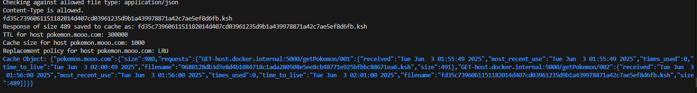  
En este ejemplo, el registro del pokemon 001 entró a las 1:55 y el del registro 002 entró a las 2:00.  
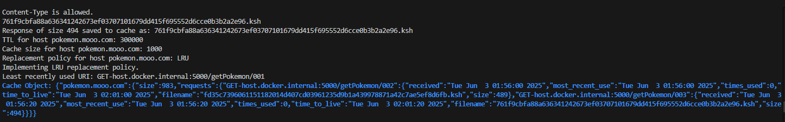  
Como podemos ver, se decidió eliminar el registro del pokemon 001 porque era el que se usó menos recientemente.

#### LFU

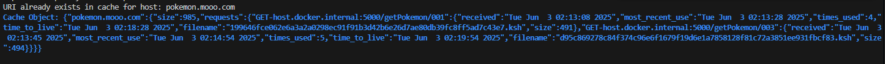  
En esta prueba, el registro 001 tiene 4 veces de uso y el registro 003 tiene 5 veces.  
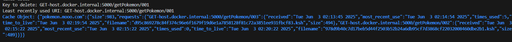  
Como podemos ver, se eliminó el registro 001 porque era el que tenía menos usos.

#### FIFO

En esta prueba, vemos que el registro 003 entró a las 2:19 y el 002 a las 2:20.  

Se eliminó correctamente el registro 003 porque entró antes.

#### MRU

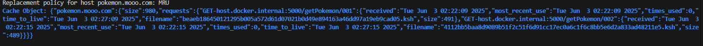
En esta prueba, el registro 001 se recibió a las 2:22:09 y el 002 entró a las 2:22:15.  
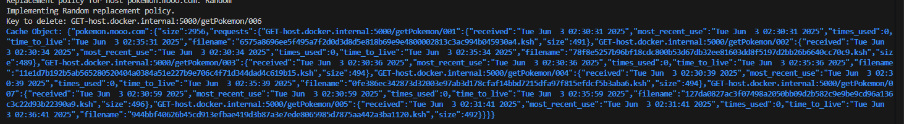  
Como podemos ver, se eliminó el registro 002 porque era el que se usó más recientemente.

#### Random

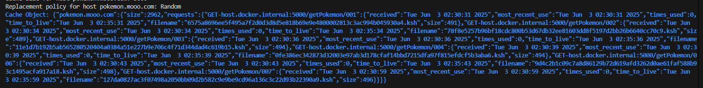
En este ejemplo, se tienen seis registros: 001, 002, 003, 004, 006 y 007\.  

Aquí, se escogió aleatoriamente el registro 006\.  
Esta otra prueba es otro caso similar. Hay 6 registros del 1 al 6:  
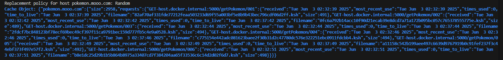
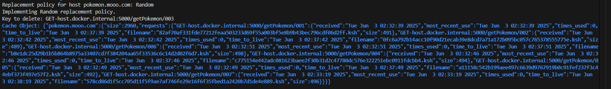
Aquí, se eliminó aleatoriamente el registro 3\.

### Unit tests

Se realizaron unit tests para las siguientes funciones:

- from_hex
- url_encode / url_decode
- get_token_from_cookies
- get_query_parameter
- hash_string
- extract_host
- check_wildcard

Para los unit tests, se utilizó la biblioteca [Catch2](https://github.com/catchorg/Catch2).  
Los resultados son los siguientes:  
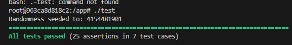

## 11.2. Backend

Los unit tests se implementaron con la biblioteca [Vitest](https://vitest.dev/). Para ejecutar los archivos de prueba individualmente se coloca dentro de la carpeta de ‘tests’ dentro de la carpeta ‘Node_API’. Un ejemplo del comando es el siguiente ‘npm test subdomain.controller.test’.

### Authcontroller

- registerUser
  - Retorna 400 si el usuario ya existe
  - Crea el usuario exitosamente y retorna 201 con token
- loginUser
  - Inicia sesión exitosamente con credenciales válidas y retorna 200 con token
- logoutUser
  - Cierra la sesión exitosamente y retorna 200 con mensaje 'Session removed'
- validateSubdomainSession
  - Retorna 401 si no existe una sesión válida
  - Válida la sesión correctamente y retorna 200 con 'OK'

Evidencia:  
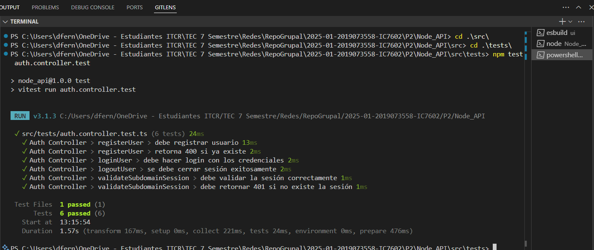

### Subdomain controller

- getAllSubdomains
  - Retorna 404 si no existen subdominios
  - Retorna 200 con los subdominios existentes
- registerSubdomain
  - Retorna 401 si no hay una sesión válida
- updateSubdomain
  - Retorna 401 si no hay una sesión válida
- getSubdomainsByDomain
  - Retorna 401 si no hay una sesión válida
  - Retorna 400 si falta el parámetro de dominio
  - Retorna 200 con subdominios regulares y comodín
- getSubdomainByName
  - Retorna 401 si no hay una sesión válida
  - Retorna 400 si faltan los parámetros de dominio o nombre de subdominio
  - Retorna 404 si el subdominio no existe
  - Retorna 200 con los datos del subdominio existente

Evidencia:  

### Domain Controller

- registerDomain
  - debe registrar un dominio exitosamente
  - debe fallar si el dominio ya está registrado
  - debe fallar si el dominio no es válido
- getUserDomains
  - debe obtener los dominios del usuario
  - debe manejar el caso cuando el usuario no tiene dominios
- deleteDomain
  - debe eliminar un dominio exitosamente
  - debe retornar 401 si no hay sesión
  - debe retornar 400 si no se proporciona dominio
  - debe retornar 404 si el dominio no existe
- verifyDomainOwnership
  - debe verificar la propiedad del dominio exitosamente
  - debe fallar cuando no hay registros TXT
  - debe fallar cuando el token no coincide

evidencia:  
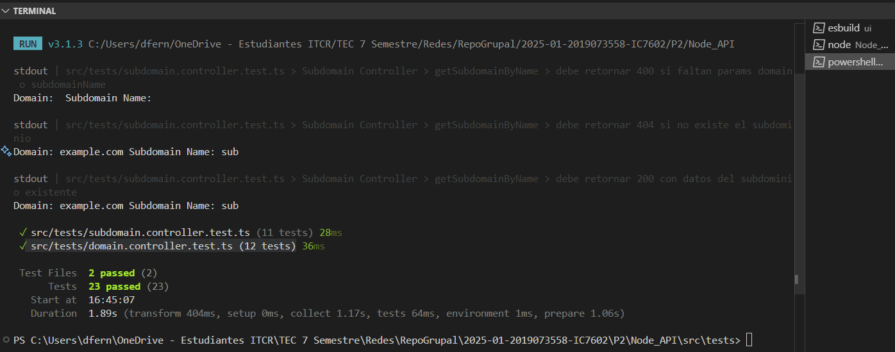

### Zonal cache controller

registerCache

- debe retornar 400 si faltan país o IP
  - debe retornar 400 si el código de país no es válido
  - debe retornar 400 si la IP no es válida
  - debe manejar errores del servidor

Evidencia:  
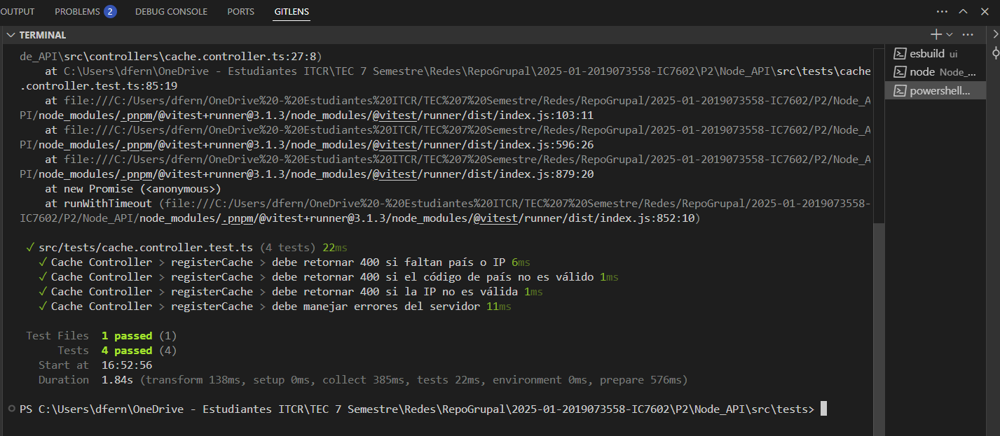

# 12\. Recomendaciones

Las siguientes son nuestras recomendaciones si tuviéramos que volver a realizar el proyecto:

1. Es importante definir las estructuras de datos antes de empezar a programar. A nosotros nos sirvió mucho plantear que queríamos manejar la caché como un JSON, entonces desde un principio buscamos una forma de hacerlo en C++. Se escogió C++ por la facilidad de usar estructuras de datos y simplificar el manejo de la memoria dinámica.
2. Cuando se trata con sistemas multihilo, es importante tomar en cuenta el uso de locks. Es importante tomar en cuenta dónde se pueden tener locks compartidos o únicos y de escritura o lectura. Así, nos evitamos condiciones de parada y si los locks están posicionados en lugares estratégicos, se podría tener un mejor rendimiento que simplemente bloquear todo y tener operaciones serializadas. En la implementación del zonal cache, es fundamental reducir al mínimo el uso de los locks para así reducir la probabilidad de problemas de sincronización como deadlocks.
3. Para este tipo de aplicaciones donde el uso de almacenamiento eficiente es sumamente importante y se necesitan múltiples hilos, posiblemente lo más recomendado es programarlo en un lenguaje de menor nivel, como C o hasta cierto punto, C++. No obstante, usar este lenguaje, a pesar de las posibles ventajas en rendimiento que podría tener el tener acceso directo a la memoria, dificultó mucho el desarrollo debido a la falta de soporte nativo de algunas estructuras de datos, como JSONs, y un administrador de dependencias o bibliotecas. Por lo tanto, consideramos que para los que no tienen mucha experiencia, un lenguaje más de alto nivel, como Go o Python, podrían hacer el desarrollo más veloz. Go a su vez se caracteriza por su fácil implementación de la concurrencia.
4. En nuestro proyecto, nosotros reutilizamos nuestra base de datos de Firebase que usamos para el proyecto pasado principalmente para poder reutilizar nuestra búsqueda de dominios. En esta, los dominios se almacenan del top level domain como el nodo padre y así se va bajando por la estructura. Consideramos que Firestore esto no era tan fácil porque no es una estructura de objetos. Es una base de datos con base en documentos. La alternativa sería tener un documento con la llave del top level domain que contiene un objeto con el second level domain, que contiene objetos para el tercer nivel, etc. Se volvería una estructura anidada que es más difícil de mantener. En Firestore sería más difícil acceder granularmente a cada sección porque el API no está diseñado para eso. Por lo tanto, si este es el caso de uso, se recomienda usar Firebase Realtime Database. No obstante, si se desea una base de datos con mayor soporte para índices, con consultas más complejas y un modelo de datos documental, se recomienda usar Firestore.
5. Para probar las políticas de reemplazo, recomendamos establecer un tamaño pequeño de caché y montar un REST API que devuelve una cantidad suficiente como para llenar la caché con pocos registros. De esta forma, se puede tener mayor control de cuáles registros hay y saber precisamente cuál debe ser eliminado y por lo tanto, verificar si se eliminaron correctamente.
6. El administrador de paquetes y dependencias predeterminado para NodeJS es NPM. No obstante, podría explorarse utilizar otros. En el caso del API en NodeJS, esta vez nos inclinamos por usar PNPM. Nos pareció que terminó siendo más rápido a la hora de instalar dependencias e iniciar el servidor.
7. Durante el desarrollo del backend con NodeJS y Express, una buena práctica fue mantener una arquitectura modular. Al separar claramente los controladores, routes, middlewares y utils, se facilita enormemente la lectura, prueba y mantenimiento del código. Además, esto permitió que la API pudiera integrarse de forma natural con Firestore y que la lógica de validación de subdominios, autenticación por JWT y encriptación de claves API estuviera claramente encapsulada.
8. El manejo seguro de las API keys para la autenticación de los subdominios debe ser sumamente seguro por lo que se recomienda implementar un sistema en el back-end de encriptado inmediato tras ser creada. Esto evita que las llaves se almacenen en texto plano, reduciendo el riesgo de ser filtradas si alguien consigue el acceso a la base de datos. De esta forma la llave se muestra una única vez a los usuarios mediante el payload de la respuesta HTTP del llamado POST o PUT correspondiente.
9. Si se van a usar Cookies para el manejo de sesiones, es importantísimo iniciar el desarrollo con el objetivo de que el servidor de la interfaz gráfica y el Rest API o backend usen el mismo dominio para que sea válido enviar cookies entre los servidores. Por razones de seguridad, no se pueden asignar cookies entre dominios. Nosotros no sabíamos esto cuando empezamos a desarrollar y montamos el API y la interfaz en proyectos de Vercel separados, por lo que tienen dominios distintos. Esto implica que el Cookie no era aceptado por el browser o se asociaba con el dominio del API, no de la interfaz. Para solucionar esto, tuvimos que cambiar la configuración del deployment de Vercel por medio del archivo de `vercel.json`, para que, por medio de las opciones de `rewrites`, las rutas se mostraran al cliente como si estuvieran en el dominio de la interfaz, pero por detrás se envían al otro dominio del Rest API.
10. A pesar de que lo siguiente parezca trivial, se recomienda utilizar colores para agrupar los logs de la aplicación de acuerdo con su función o propósito. Para la caché zonal, se usaron colores en los mensajes en la consola para que sea más fácil entender a qué se referían. Por ejemplo, el color azul se refería a los subdominios, el rosado a los wildcards, el rojo al hilo de garbage collection, el amarillo a inserciones en la caché, etc. Esto volvió mucho más fácil interpretar qué estaba haciendo el programa y resultó más fácil hacer debugging de posibles errores, ya que los mensajes eran más fáciles de identificar. Esto es especialmente útil en un entorno multihilo y orientado a eventos en el que el orden de ejecución no es necesariamente determinístico. A veces, ver un montón de logs puede ser abrumador y hace la depuración del sistema mucho más difícil.

# 13\. Conclusiones

Las conclusiones de este proyecto son las siguientes:

1. Las políticas de reemplazo son muy útiles para optimizar el uso de la caché dependiendo de las necesidades del sistema. De todas las políticas de reemplazo que tuvimos que implementar, realmente es complicado identificar cuál es la más lógica. Con LRU, se eliminan los registros que se han usado menos recientemente, lo que indica que tal vez ya no se necesitan en el caché. No obstante, justo puede haber pasado el tiempo suficiente para que ya se necesitará otra vez, por lo que en ese caso no fue la mejor elección. Con LFU, tiene sentido que se elimine el que menos se ha usado, pero al igual que con LRU, puede ser que ha pasado el tiempo suficiente como para que se necesite otra vez. El método de FIFO es tal vez el más sencillo y uno de los que peor podría funcionar, ya que puede ser que el primer registro que entró es sumamente utilizado, pero se elimina igualmente. Con MRU, tal vez tiene sentido porque si un registro se usó recientemente, significa que tal vez no se vaya a necesitar hasta dentro de un tiempo. Sin embargo, puede pasar que ese registro que se utilizó vaya a estar en alta demanda, por lo que si se elimina, se pierde la oportunidad de optimizar esas consultas. El método aleatorio nos parece que es el peor, ya que no tiene ningún criterio para reemplazar en la caché. Al final, nos inclinamos por los métodos LRU y LFU, ya que consideramos que los registros menos usados son los que tienen más probabilidad de no necesitar si se llegaran a eliminar. Para tomar una decisión definitiva, es necesario realizar un estudio de observabilidad y de métricas por medio de una prueba de carga para determinar cuál resulta más eficiente para un sistema específico.
2. El uso de caches zonales, seleccionados dinámicamente en función del país de origen del requisito DNS, aportó mucho valor al incorporar principios de optimización de redes y diseño distribuido. Uno de los aprendizajes más importantes es como la proximidad geográfica, determinada mediante IPs geolocalizadas, puede reducir considerablemente los tiempos de acceso. Las respuestas a peticiones HTTP fueron más rápidas si venían de una ubicación central demostrando que la latencia no depende solo del ancho de banda, sino que también de la proximidad geográfica de los datos. No obstante, la implementación de sistemas de caché distribuidos plantea desafíos, especialmente ante actualizaciones de recursos. En este contexto, aprendimos a valorar la importancia del tiempo de vida TTL como estrategia fundamental para gestionar la expiración de contenido entre zonas.
3. Se aprendió a implementar un mecanismo de verificación de propiedad de dominios usando registros DNS TXT, una técnica ampliamente utilizada en sistemas reales. Dicho proceso consiste en generar un subdominio y un token aleatorio que se registra como un valor TXT en un servidor DNS. Este método es muy elegante y seguro porque no se requiere de información sensible del servidor DNS del usuario. Sin embargo, una posible dificultad común en entornos reales es que la propagación del DNS puede tomar un tiempo considerable, lo cual complica las pruebas inmediatas. A pesar de esto, consideramos que fue una experiencia valiosa al acercarnos a prácticas profesionales de validación en servicios web. En nuestras pruebas, utilizamos el servicio de [freedns.afraid.org](http://freedns.afraid.org), el cual tenía un tiempo de propagación de alrededor de 10 minutos.
4. En el proyecto anterior utilizamos Firebase Realtime Database, que nos ayudó mucho al poder tener una estructura jerárquica con los dominios y subdominios que definimos, más en temas de eficiencia este es carente cuando se trata de consultas más complejas, por lo que al migrar a Firestore, nos ayudó a tener una mayor eficiencia respecto a las consultas indexadas y un filtrado más avanzado, en donde podemos buscar los subdominios por dominio padre, tipo de autenticación o TTL sin tener que descargar todo el árbol. De igual manera, Firestore nos facilitó tener separados los wildcards de los subdomains al estructurarlos en colecciones distintas, lo cual simplifica tanto la organización como el mantenimiento de los datos. También, Firestore permite escalar automáticamente con mejor rendimiento bajo alta concurrencia, y sus tiempos de respuesta más bajos, mejoraron notablemente la experiencia de usuario al interactuar con la interfaz.
5. El uso de JWT nos permitió implementar un sistema de validación de sesiones más seguro y eficiente. Al utilizar JWT, pudimos almacenar la información de la sesión de forma codificada y autoverificable en el cliente, lo que podría evitar mantener un estado de sesión en el servidor. Esto también permitió que cada solicitud del usuario pudiera ser autenticada de forma independiente, simplemente verificando el token recibido. Además, al incluir en el payload información relevante como el sessionId, la expiración y el usuario, logramos reforzar el control de acceso desde el backend y validar fácilmente si la sesión aún era válida.
6. Separar los "subdomains" y los "wildcards" en colecciones separadas dentro de Firestore nos ayudó a tener un control más claro y organizado sobre la lógica del procesamiento de cada tipo de subdominio. Al estar separados, fue más sencillo realizar validaciones independientes, y reducir la complejidad del código al momento de hacer queries. Además, permitió que la caché zonal pudiera hacer distinciones claras entre qué configuración cargar y aplicar para cada caso.
7. Este proyecto resalta la importancia de buscar formas de reducir las consultas a la base de datos para mejorar el tiempo de respuesta. Perfectamente, por cada solicitud que llega al zonal caché, se podría hacer una solicitud a Firestore para extraer la información del dominio. No obstante, esto aumentaría considerablemente el tiempo de respuesta de la aplicación al sumar la latencia del request a Firestore para absolutamente todo. Esto podría desembocar en timeouts y en situaciones similares. Por lo tanto, mecanismos de caching resultaron muy efectivos para evitar estos requests. Se extrae toda la información de la base de datos y se mantiene en memoria. Así se tiene el acceso directo. No obstante, esta solución tiene el problema de que la información podría quedar desactualizada por un periodo de tiempo hasta el siguiente refrescamiento. Asimismo, no es muy escalable ya que si la información crece mucho, podría generar que se agote la memoria.
8. Para este proyecto se implementó la herramienta de Vercel que consiste en hacer un deploy para que se pueda acceder al sistema mediante una URL pública. Otra ventaja que tiene Vercel es el hecho del despliegue automático del app cada vez que se hace un push a GitHub. Es una herramienta que ayudó mucho al permitir siempre estar actualizada y proporcionando una URL pública para su acceso. No obstante, tiene algunas limitaciones. Por ejemplo, las funciones de API se manejan como [serverless functions](https://vercel.com/guides/using-express-with-vercel), lo cual implica que no se puede tener un caché en memoria o un event listener que se quede escuchando por cambios, lo cual es muy típico cuando se maneja con Firebase.
9. Este proyecto resalta la versatilidad del protocolo HTTP. Usamos este protocolo para cosas muy variadas, como para extraer información, generar redirecciones en el browser, incluir headers de autenticación, descargar archivos, etc. Esto resalta la interoperabilidad del protocolo, ya que lo usamos en 3 lenguajes distintos y a distintos niveles. En JavaScript y Python, usamos abstracciones brindadas por bibliotecas, pero en C++ sí tuvimos que manipular la estructura a bajo nivel, en bytes, del protocolo. Esto fue facilitado por las bibliotecas de `libcurl` y `openssl`. No obstante, esto también resaltó posibles ineficiencias del protocolo ya que casi todo se maneja por texto. Esto implica hacer muchas manipulaciones de strings y parsing, lo cual podría llevar a muchas asignaciones dinámicas de memoria. Esto significa que el protocolo HTTP tal vez es muy natural e interpretable como nosotros como humanos, pero no es lo más eficiente para una computadora.

# 14\. Referencias

Referencias UI

- ProtectedRoutes
  - https://medium.com/@dennisivy/creating-protected-routes-with-react-router-v6-2c4bbaf7bc1c

Referencias RestAPI

- [index.ts](http://index.ts) (Express index)
  - código básico generado por express-generator: [https://expressjs.com/en/starter/generator.html](https://expressjs.com/en/starter/generator.html)
  - Estructura basada en: [https://medium.com/@finnkumar6/mastering-express-js-controllers-the-key-to-clean-and-scalable-applications-45e35f206d0b](https://medium.com/@finnkumar6/mastering-express-js-controllers-the-key-to-clean-and-scalable-applications-45e35f206d0b)
- Auth.controller

  - https://firebase.google.com/docs/database/admin/save-data
  - https://www.npmjs.com/package/ms
  - https://github.com/auth0/node-jsonwebtoken
  - https://www.npmjs.com/package/bcryptjs
  - https://apidog.com/blog/node-js-express-authentication/
  - [https://www.npmjs.com/package/jwt-decode\#getting-started](https://www.npmjs.com/package/jwt-decode#getting-started)
  - hashApiKey: función que se usa para encriptar la API key antes de guardarla en la base de datos:  
    [https://nodejs.org/api/crypto.html\#class-hmac](https://nodejs.org/api/crypto.html#class-hmac)

- Auth.middleware
  - [https://apidog.com/blog/node-js-express-authentication/](https://apidog.com/blog/node-js-express-authentication/)
- apiKeyCache
  - https://firebase.google.com/docs/database/admin/retrieve-data
  -

Referencias ZonalCache

- [init.sh](http://init.sh)
  - Para acceder a la IP pública de la instancia EC2:  
    https://stackoverflow.com/questions/38679346/get-public-ip-address-on-current-ec2-instance  
    http://docs.aws.amazon.com/AWSEC2/latest/UserGuide/instancedata-data-retrieval.html
  - Para enviar el request PATCH a la API de Vercel Edge Config:  
    https://gist.github.com/mohanpedala/1e2ff5661761d3abd0385e8223e16425?permalink\_comment\_id=3935570  
    https://unix.stackexchange.com/questions/644343/bash-while-loop-stop-after-a-successful-curl-request  
    [https://vercel.com/docs/edge-config/vercel-api](https://vercel.com/docs/edge-config/vercel-api)
- Zonal_cache.cpp
  - Referencias para threads:  
    https://cplusplus.com/reference/thread/thread/
  - Referencias para concurrencia con lock de lectura compartida:  
    https://en.cppreference.com/w/cpp/thread/shared\_mutex
  - Referencias para sockets:  
    https://dev.to/jeffreythecoder/how-i-built-a-simple-http-server-from-scratch-using-c-739
  - Referencias para env variables:  
    https://www.gnu.org/software/libc/manual/html\_node/Environment-Access.html\#:\~:text=The%20value%20of%20an%20environment,accidentally%20use%20untrusted%20environment%20variables.
- Http_client.cpp
  - Función para convertir una cadena a minúsculas  
    https://www.geeksforgeeks.org/conversion-whole-string-uppercase-lowercase-using-stl-c/
  - Almacenar la respuesta de la request HTTPS en memoria.  
    https://curl.se/libcurl/c/getinmemory.html
  - Enviar la solicitud HTTPS al DNS API  
    [https://curl.se/libcurl/c/http-post.html](https://curl.se/libcurl/c/http-post.html)  
    [https://curl.se/libcurl/c/https.html](https://curl.se/libcurl/c/https.html)
  - Headers basado en  
    [https://everything.curl.dev/helpers/headerapi/iterate.html](https://everything.curl.dev/helpers/headerapi/iterate.html)
  - Parser de HTTP es la biblioteca  
    [https://github.com/nekipelov/httpparser](https://github.com/nekipelov/httpparser)
  - Parser de HTTP es la biblioteca  
    [https://github.com/nekipelov/httpparser](https://github.com/nekipelov/httpparser)
  - Funciones para manejar SSL/TLS  
    [https://github.com/openssl/openssl/wiki/Simple_TLS_Server](https://github.com/openssl/openssl/wiki/Simple_TLS_Server)

Referencias DNS Interceptor

- Interceptor.h
  - Parsing de header basado en RFC-1035, sección 4.1.1.RFC-2535, sección 6.1
  - https://gist.github.com/fffaraz/9d9170b57791c28ccda9255b48315168
  - [https://www.ibm.com/docs/en/zos/2.4.0?topic=lf-ntohs-translate-unsigned-short-integer-into-host-byte-order](https://www.ibm.com/docs/en/zos/2.4.0?topic=lf-ntohs-translate-unsigned-short-integer-into-host-byte-order)
  - Almacenar la respuesta de la request HTTPS en memoria.
  - [https://curl.se/libcurl/c/getinmemory.html](https://curl.se/libcurl/c/getinmemory.html)
- Test_interceptor
  - https://libcheck.github.io/check/doc/check\_html/check\_3.html
  - [https://developertesting.rocks/tools/check/](https://developertesting.rocks/tools/check/)
- Interceptor.c
  - Referencias para threads  
    [https://www.cs.cmu.edu/afs/cs/academic/class/15492-f07/www/pthreads.html](https://www.cs.cmu.edu/afs/cs/academic/class/15492-f07/www/pthreads.html)
  - Parsing de header basado en RFC-1035, sección 4.1.1. RFC-2535, sección 6.1  
    https://gist.github.com/fffaraz/9d9170b57791c28ccda9255b48315168  
    https://www.ibm.com/docs/en/zos/2.4.0?topic=lf-ntohs-translate-unsigned-short-integer-into-host-byte-order
  - Para base64 encoding y decoding, se usa la biblioteca libb64  
    https://github.com/libb64/libb64/blob/master/examples/c-example1.c
  - Formato de la URL
  - [http://dns_api:dns_api_port/api/dns_resolver](http://dns_api:dns_api_port/api/dns_resolver)
  - [http://dns_api:dns_api_port/api/exists?domain=domain\&ip=ip_address](http://dns_api:dns_api_port/api/exists?domain=domain&ip=ip_address)
  - Almacenar la respuesta de la request HTTPS en memoria
  - [https://curl.se/libcurl/c/getinmemory.html](https://curl.se/libcurl/c/getinmemory.html)
  - Enviar la solicitud HTTPS al DNS API
  - https://curl.se/libcurl/c/http-post.html
  - [https://curl.se/libcurl/c/https.html](https://curl.se/libcurl/c/https.html)
  - Referencias para sockets:
  - // https://www.geeksforgeeks.org/udp-client-server-using-connect-c-implementation/
  - // [https://www.youtube.com/watch?v=5PPfy-nUWIM](https://www.youtube.com/watch?v=5PPfy-nUWIM)
  - Para env variables:
  - https://www.gnu.org/software/libc/manual/html\_node/Environment-Access.html\#:\~:text=The%20value%20of%20an%20environment,accidentally%20use%20untrusted%20environment%20variables.
