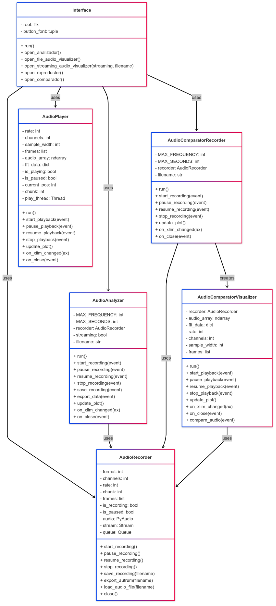
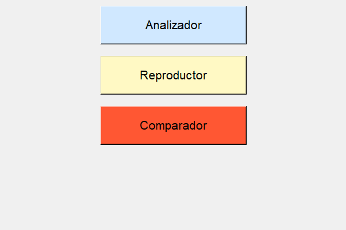
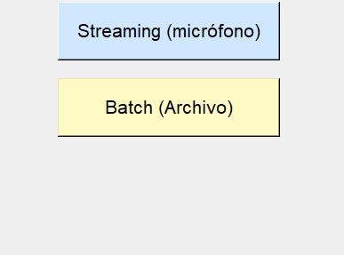
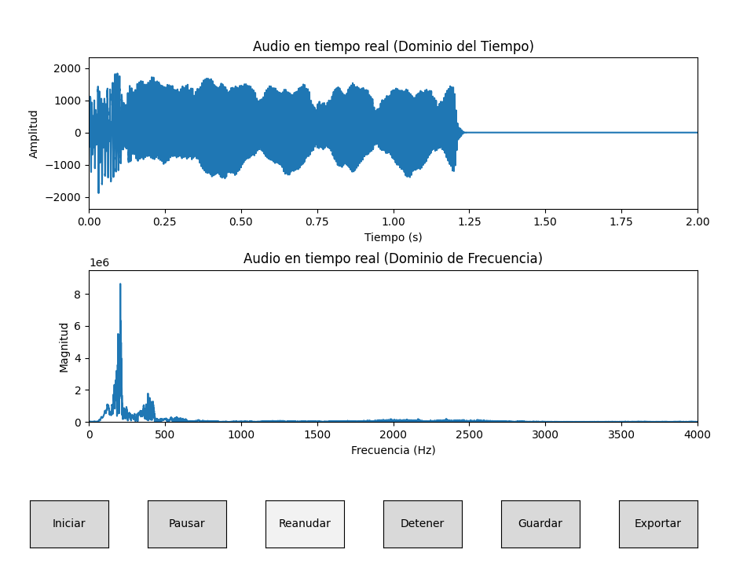
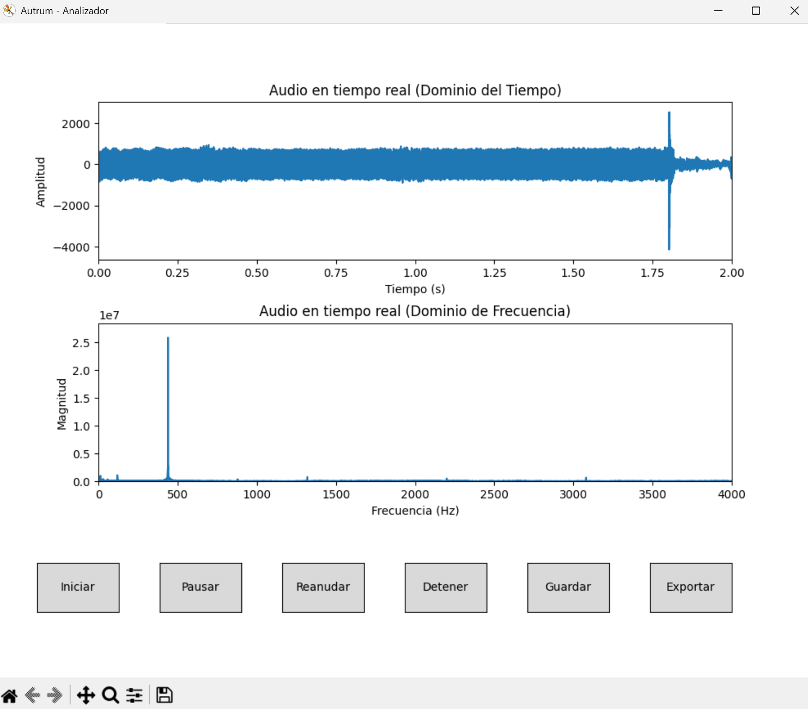
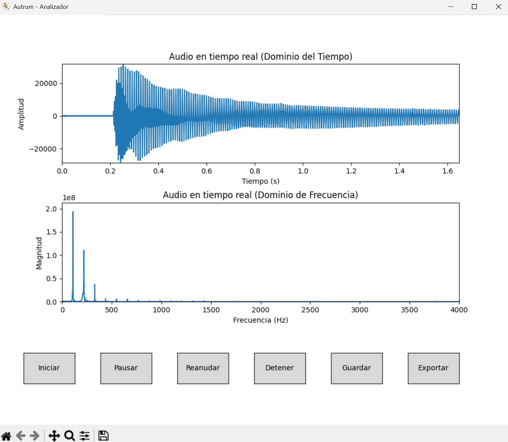
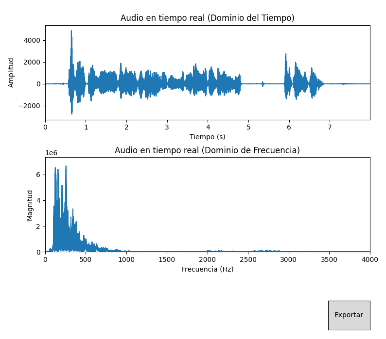
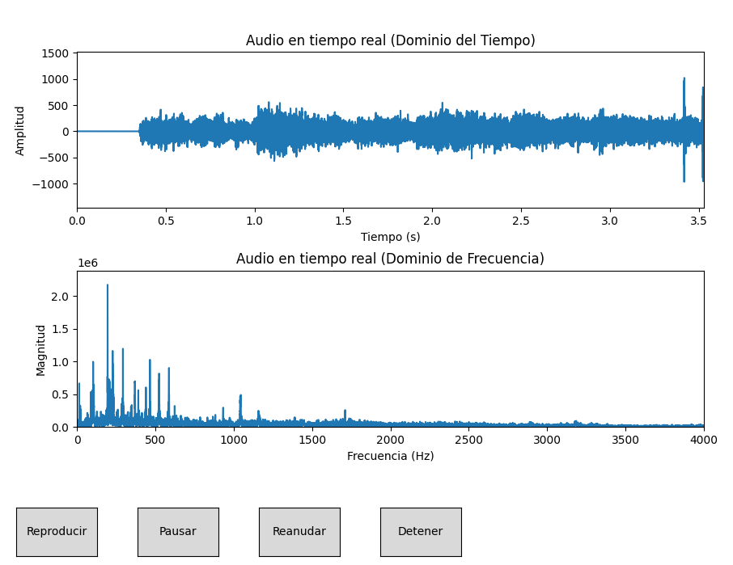
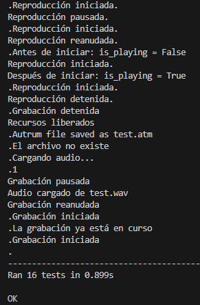

Instituto Tecnológico de Costa Rica

Campus Tecnológico Central Cartago

Escuela de Ingeniería en Computación

Proyecto Opcional Redes

Redes \- Grupo 2  
Prof. Gerardo Nereo Campos Araya

Daniel Granados Retana, carné 2022104692  
Diego Manuel Granados Retana, carné 2022158363  
David Fernández Salas, carné 2022045079  
Diego Mora Montes, carné 2022104866  
Eduardo Gutierrez Conejo, carné 2019073558

28 de Marzo del 2024  
IS 2025

- [1. Introducción](#1-introducción)
- [2. Guía de uso](#2-guía-de-uso)
- [3. Componentes principales](#3-componentes-principales)
	- [3.1. Instalación](#31-instalación)
	- [3.2. Analizador](#32-analizador)
		- [3.2.1. Streaming (Micrófono)](#321-streaming-micrófono)
		- [Implementación](#implementación)
	- [3.2.2. Batch](#322-batch)
		- [Implementación](#implementación-1)
	- [3.3. Reproductor](#33-reproductor)
		- [Implementación](#implementación-2)
	- [3.4. Comparador](#34-comparador)
	- [3.5. Pruebas unitarias](#35-pruebas-unitarias)
- [4. Recomendaciones](#4-recomendaciones)
- [5. Conclusiones](#5-conclusiones)
- [6. Referencias](#6-referencias)

# 1\. Introducción

Autrum es una aplicación diseñada para el análisis de señales de audio, permitiendo visualizar y manipular señales en el dominio del tiempo y la frecuencia mediante la Transformada de Fourier. Su propósito es facilitar el estudio de señales de audio mediante herramientas que permitan graficar, transformar y comparar datos en distintos dominios.

Inicialmente el sistema tiene que ser capaz de tomar señales de audio de distintas formas y deberá de realizar diversas acciones. Dentro de estas acciones está grabar audio en el formato .WAV, transformar audio en formato .ATM, reproducir audio en .ATM, gráfica las frecuencias y amplitudes en formato .ATM y finalmente comparar si en un audio surge otro.

# 2\. Guía de uso

El siguiente video incluye una demostración de cómo utilizar la aplicación Autrum:  
[https://youtu.be/8XeOOJAPuhY](https://youtu.be/8XeOOJAPuhY)

El sistema cuenta con tres modos principales de operación: Analizador, Reproductor y Comparador. Cada uno de estos módulos desempeña una función específica dentro del flujo de trabajo del análisis de audio:

- Analizador: Permite realizar grabaciones del micrófono en formato wav donde se busca minimizar el ruido exterior. Captura señales de audio, las procesa y las representa en el dominio del tiempo y la frecuencia.
- Reproductor: Permite la reproducción sincronizada de audio y gráficos.
- Comparador: Compara señales de audio para determinar similitudes y patrones dentro de una grabación.

# 3\. Componentes principales

En esta sección se muestran los componentes principales de la aplicación Autrum. El sistema queda representado en el siguiente diagrama de clases:  

## 3.1. Instalación

Para correr Autrum, es necesario instalar \[Python\](https://www.python.org/downloads/).

Después, es necesario instalar las siguientes dependencias:

- pip\>=23.0.0
- setuptools\>=68.0.0
- wheel\>=0.38.0
- numpy\>=1.22.4,\<1.29.0
- scipy==1.12.0
- matplotlib==3.10.1
- sounddevice==0.4.6
- pyaudio==0.2.14
- pytest\>=7.0.0
- pytest-mock\>=3.10.0

Para instalar todos los componentes necesarios de una manera sencilla, se ejecuta el comando:  
`pip install \-r requirements.txt`

Luego, hay que correr `main.py`. Esto nos lleva al siguiente menú, donde presionar los botones abren los 3 componentes:  

## 3.2. Analizador

Este componente tiene dos funcionalidades:

- Grabar audios
- Analizar audios

Al ingresar al componente, se nos muestra el siguiente menú:  

### 3.2.1. Streaming (Micrófono)

  
En esta pestaña puede grabar, guardar sus audios en WAV y exportarlos a Autrum en el formato .atm. La manipulación de la grabación se realiza con los botones de Iniciar, Pausar, Reanudar y Detener. Antes de guardar y exportar, se necesita haber detenido la grabación. Para guardar a formato WAV, se usa el botón de Guardar, y para formato ATM se usa Exportar.  
  
La imgn anterior muestra ejecutar un audio con la frecuencia de 440Hz en el analizador.  

La imagen anterior muestra tocar una nota La en una guitarra, la cual tiene una frecuencia de 110\. Las otras frecuencias representan los armónicos naturales de la guitarra.

### Implementación

Esta funcionalidad está dividida en dos archivos. El primero es el recorder.py. Este tiene las siguientes funciones:

- Grabar un audio: Con la función de start_recording, se inicia un hilo que corre la función privada de \_record(). Esta función utiliza la biblioteca PyAudio para abrir un canal que recibe el audio de un micrófono. Esta información la guarda en una arreglo de NumPy y la mete en una cola. En la función de update_plot en el analyzer, se verifica si la cola está vacía y si no, añade los arreglos del audio a un arreglo llamado frames. Con la función de save_recording(), se toman los frames y con una biblioteca llamada Wave guardamos el audio como .WAV.
- Representar el audio: Para mostrar las ondas del audio, se utiliza el arreglo de frames. En la función de update_plot() del analizador se utilizan las funcione rfft() y rfftreq() de la biblioteca scipy.fft para calcular la transformada de Fourier para los datos de audio de los últimos dos segundos. Para el gráfico de la amplitud en el dominio del tiempo, en el arreglo de Numpy que se obtiene al grabar el audio vienen las amplitudes que se obtuvieron en ese tiempo. Para el gráfico, se obtiene la mínima y la máxima.
- Exportar el audio a ATM: En la función de update_plot(), se calcula la transformada de Fourier para todos los datos hasta ese punto. Luego, en el recorder.py se usa esta información para almacenarla en el archivo .atm de Autrum. En este, se escribe la frecuencia del muestreo (44,100 Hz), los canales (1), los frames del audio, la información de las transformadas de Fourier, el formato que utiliza PyAudio y la cantidad de chunks de audio que se leen del a la vez.

Un elemento fundamental de esta implementación es el uso de la transformada rápida de Fourier. Para esto, se utilizó la implementación de la biblioteca de SciPy:

- \[rfft\](https://docs.scipy.org/doc/scipy/reference/generated/scipy.fft.rfft.html): Calcula la transformada discreta de Fourier en una dimensión usando el algoritmo rápido. Recibe un arreglo con la información de la onda. Esta retorna la parte real y positiva.
- \[rfftfreq\](https://docs.scipy.org/doc/scipy/reference/generated/scipy.fft.rfftfreq.html): Retorna las frecuencias en Hz que representan los números complejos de la transformada de Fourier. El espaciado se determina con base en la tasa de muestreo.

## 3.2.2. Batch

  
Luego de presionar el botón de Batch, se puede escoger un archivo WAV para analizar. Se despliega la información del audio en los dominios de tiempo y frecuencia. Con el botón de exportar se puede guardar el audio en .atm.

### Implementación

Para hacer la carga de archivos WAV, se utiliza la instancia de la clase AudioRecorder que tienen los objetos de la clase AudioAnalyzer. Si el analizador se inicializa con la bandera `streaming \= False`, el analizador va a user la función `load_audio_file()` del `recorder` para cargar el archivo .wav. Este método levanta un hilo que ejecuta la función `\_process_audio_file`. Esta es la encargada en sí misma de procesar el archivo de audio. Esto se realiza por medio de la \[biblioteca `wave` de Python\](https://docs.python.org/3/library/wave.html). Esta biblioteca tiene la función `wave.open()`, que permite abrir el archivo .wav, leerlo y extraer información como la frecuencia de muestreo, el número de canales, número de tramas de audio, etc. El procesamiento del audio se va realizando por chunks. Estos se van encolando en la cola y el objeto de AudioAnalyzer, por medio de la función de `update_plot()` va actualizando los gráficos.

## 3.3. Reproductor

Este componente es un reproductor especializado que carga archivos .atm y permite visualizar el audio en tiempo real mientras se reproduce.  

### Implementación

Las funciones principales de este componente son:

- Reproducir un audio: Mediante el uso de la función start_playback() se inicia la reproducción del audio seleccionado, este debe estar en formato .atm. Para la reproducción del audio en tiempo real se abre un hilo mediante la función \_playback_thread() que es una implementación interna que maneja el streaming.

- Visualización: Utilizando la función update_plot() se actualizan los gráficos durante la reproducción, es esta visualización se muestran dos vistas simultáneas, una en el dominio de tiempo que representa la forma de onda completa del audio y otra en el dominio de frecuencia que es el espectro actualizado de lo que está sonando.
- Análisis de Frecuencia: Se calcula la transformada de Fourier (FFT) del segmento actual, se muestra componentes de frecuencia hasta 4000 Hz y se utiliza datos de FFT pre-calculados del archivo .atm cuando están disponibles.

- Interacción Avanzada: Con la función on_xlim_changed() se le permite al usuario hacer zoom en una sección específica del audio, al hacer zoom, recalcula la FFT solo para la parte visible para luego actualizar la visualización de frecuencia correspondiente a la región seleccionada.

Para la reproducción del audio en sí, se utiliza la biblioteca de \[PyAudio\](https://people.csail.mit.edu/hubert/pyaudio/docs/\#id1). Esta permite abrir un canal para reproducir audio. A medida que va avanzando el tiempo, el objeto de AudioPlayer va escribiendo en este stream con el método `pyaudio.PyAudio.Stream.write()` en bloques. Así, se tiene el control del progreso de la reproducción y se puede pausar y reanudar en cualquier punto.

## 3.4. Comparador

Este componente permite grabar audio mientras se visualiza en tiempo real su representación en los dominios del tiempo y frecuencia, esto para prepararlo para ser comparado con un audio de referencia que el usuario elige cuando se selecciona esta opción en la interfaz, la idea es en el audio de referencia tener una frase o palabra que se sabe se encuentra ahí y mediante la grabación decir esta frase o palabra y mostrar al usuario en qué punto del audio de referencia se encuentra la mejor aproximación a esta frase o palabra.

Las funciones principales de este componente son:

- Grabar audio: Mediante la función de start_recording() se inicia la grabación de un audio, este se irá graficando conforme se detecte el sonido.

- Detener grabación: Mediante la función stop_recording() se finaliza la grabación del audio y se lanza el comparador visual, donde se podrá observar el punto que aproxima la posición de audio grabado en el audio de referencia.

- Visualización: Con el uso de la función de update_plot() se actualiza en tiempo real los gráficos del audio grabado, se muestra tanto en el dominio del tiempo como en el de frecuencia.

- Procesamiento de señal: Mediante la función compare_audio() se recorre el audio de referencia buscando la sección en la cual se asemeja al audio grabado. Se utiliza FFT, identificando los picos armónicos principales, y realiza el cálculo de métricas como la similitud de armónicos, correlación de amplitud y de potencia espectral.

- Reproducción sincronizada: Mediante la función start_playback(), se reproduce el audio de referencia desde el punto en donde se encontró el audio grabado. Esta reproducción se ejecuta en un thread independiente mediante la funcion \_playback_thread(), encargada de enviar el audio a la salida. Al igual que las funciones para pausar, continuar y detener completamente la reproducción siendo estas, pause_playback(), resume_playback() y stop_playback() respectivamente.

La funcionalidad de reconocer palabras dentro del texto se realizó por medio de la comparación de segmentos del audio de referencia y del audio grabado. Para hacer la comparación más precisa, se usaron varias técnicas. En primer lugar, para comparar los vectores en dominio de frecuencia, se utilizó la técnica de la similitud de cosenos. Esta técnica se utiliza para comparar el ángulo de dos vectores, sin importar la magnitud, lo cual puede encontrar patrones en el arreglo de tramas de los audios (Milvus, 2025\). Esta métrica se utiliza en conjunto con la transformada de Fourier para hacer análisis de la potencia espectral (Michael et al., 2024, p. 20). Esta técnica es la que más influye en la correcta identificación del audio dentro del texto.

En cuanto a la potencia, se utilizó la métrica del Root Mean Square (RMS). Esta describe cómo se expresa la amplitud de la onda en el espectro (Miraglia, 2024\). Permite evaluar qué tan “duro” es el sonido evaluando la energía de la onda. Se calcula como la raíz cuadrada del promedio de los cuadrados de las amplitudes de las señales. Se utilizaron operaciones de arreglos de numpy para realizar esta operación. Esta métrica fue útil, pero no tuvo tanto impacto. Al fin y al cabo, fue más efectivo el análisis por frecuencia.

Para la nota final, se hace un ponderado. Se le atribuye un 50% a la calificación del análisis en el dominio de frecuencia con similitud de cosenos, un 30% a la calificación de la amplitud, y un 20% a la potencia con RMS.

## 3.5. Pruebas unitarias

Se realizaron varias pruebas unitarias. Los resultados son:

# 4\. Recomendaciones

1. Se recomienda explorar otras metodologías diferentes a similitud de armónicos, potencia espectral y amplitud de onda para aproximar las ondas con el fin de optimizar la precisión de los resultados en diversos escenarios.

2. Para las pruebas de comparación de audio se recomienda utilizar tanto el mismo hardware para grabar el audio de referencia como el audio de prueba, ya que esto podría afectar los resultados debido a diferencias en la calidad de grabación, respuesta de frecuencia y niveles de ruido introducidos.

3. Para los gráficos, se recomienda utilizar una tasa de actualización relativamente baja porque si se intenta procesar demasiados datos, la aplicación se volverá muy lenta y si se está reproduciendo un audio, este empezará a tener cortes o picos de volumen que puede afectar la calidad del sonido.

4. Para comparar el dominio de frecuencia, se recomienda utilizar la técnica de similitud de cosenos.

# 5\. Conclusiones

1. En base a la pruebas realizadas con el comparador, si bien este es capaz de detectar el audio grabado dentro del audio de referencia, el uso exclusivo de similitud de armónicos, potencia espectral y la amplitud de la onda no garantizan una detección 100% precisa esto debido a que los cálculos realizados con estos datos tienen limitaciones que podrían implicar la búsqueda de técnicas complementarias o más avanzadas para mejorar la exactitud en la identificación y localización.
2. El uso de la biblioteca Matplotlib de Python fue de gran ayuda, ya que permitió no solo visualizar el audio en tiempo real cuando se estaba grabando, sino que también funcionó como una herramienta de depuración en la funcionalidad de comparación ya que facilitó la identificación del segmento del audio de referencia donde se encontró la similitud con el audio grabado, permitiendo así un análisis y una interpretación de los resultados más visual.
3. Las transformaciones de Fourier fue esencial en la implementación de Autrum, mediante esta se logró hacer el análisis del contenido de frecuencia de la señal del audio. Mediante esta técnica, se logró representar cada grabación en el dominio de la frecuencia, identificar su frecuencia fundamental y los armónicos que componen su estructura.
4. Resultó más efectivo comparar los audios por medio del dominio de frecuencia. Estos dieron encajes más altos. Esto resalta el poder de la transformación de Fourier. No obstante, es frecuente que dé falsos positivos con otras secciones del audio que utilizan frecuencias similares. Por lo tanto, también es importante evaluar el audio por otros aspectos, como la amplitud y potencia.
5. Durante el desarrollo del sistema, Autrum y la investigación para responder las preguntas propuestas, se llegó a evidenciar las capacidades limitadas que tienen los sistemas digitales. Aunque tecnologías y fórmulas como las transformadas de Fourier permiten analizar el contenido de señales, la reproducción exacta de una voz depende de múltiples factores técnicos. Aunque se pueda obtener una aproximación bastante cercana al sonido original, hay detalles que impiden una representación completamente fiel de nuestras voces a nivel digital.

# 6\. Referencias

En esta sección, se adjuntan las referencias utilizadas para la implementación de la aplicación Autrum:

DataStax. (2023, 30 de noviembre). _How to Implement Cosine Similarity in Python \- DataStax \- Medium_. Medium. [https://datastax.medium.com/how-to-implement-cosine-similarity-in-python-505e8ec1d823](https://datastax.medium.com/how-to-implement-cosine-similarity-in-python-505e8ec1d823)  
Garr, E. (2024, 24 de mayo). _3 Ways to Calculate the RMSE in Python \- Data Science Discovery_. Data Science Discovery. [https://discovery.cs.illinois.edu/guides/Statistics-with-Python/rmse/](https://discovery.cs.illinois.edu/guides/Statistics-with-Python/rmse/)  
LeMaster Tech. (2022, 16 de junio). _How to Record Audio and Graph wave .wav files using Python\!_ \[Video\]. YouTube. https://www.youtube.com/watch?v=3oA\_griyboI

‌Michael, A. A., Barathi, B. U. A., Abhinseh, L., & Yasaswini, K. (2024, febrero). Speaker Verification Using Cosine Similarity. _IOSR_, _26_(1), 19–26. [https://www.iosrjournals.org/iosr-jce/papers/Vol26-issue1/Ser-1/C2601011926.pdf](https://www.iosrjournals.org/iosr-jce/papers/Vol26-issue1/Ser-1/C2601011926.pdf)

Milvus. (2025). _How are cosine similarity and Euclidean distance applied to audio features?_ Milvus.io. https://milvus.io/ai-quick-reference/how-are-cosine-similarity-and-euclidean-distance-applied-to-audio-features  
Miraglia, D. (2024, 19 de enero). _What is RMS in Audio? The Absolute BEST Beginner’s Guide (2025)_. Unison. https://unison.audio/what-is-rms-in-audio/  
_PyAudio Documentation_. (2025). [https://people.csail.mit.edu/hubert/pyaudio/docs/\#id1](https://people.csail.mit.edu/hubert/pyaudio/docs/#id1)  
ScienceDirect. (s. f.). _Pulse Code Modulation_. Recuperado 28 de marzo de 2025, de https://www.sciencedirect.com/topics/engineering/pulse-code-modulation\#:\~:text=Pulse%20code%20modulation%20(PCM)%20is%20the%20most%20popular%20digital%20encoding,7.2:

‌
