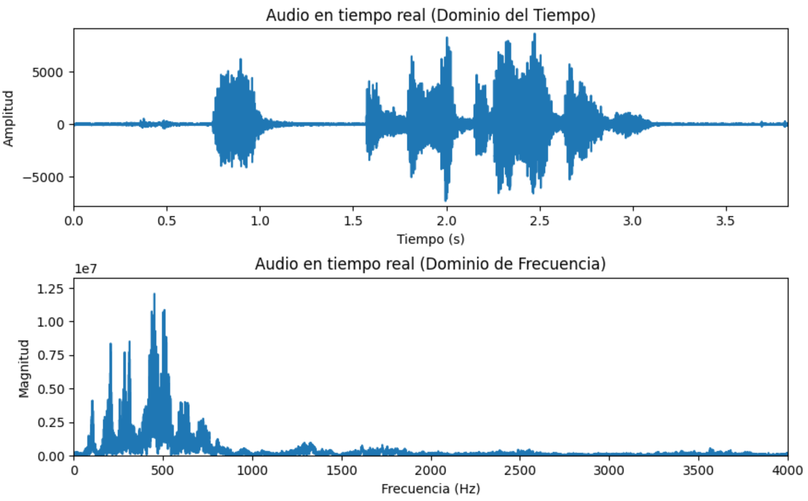
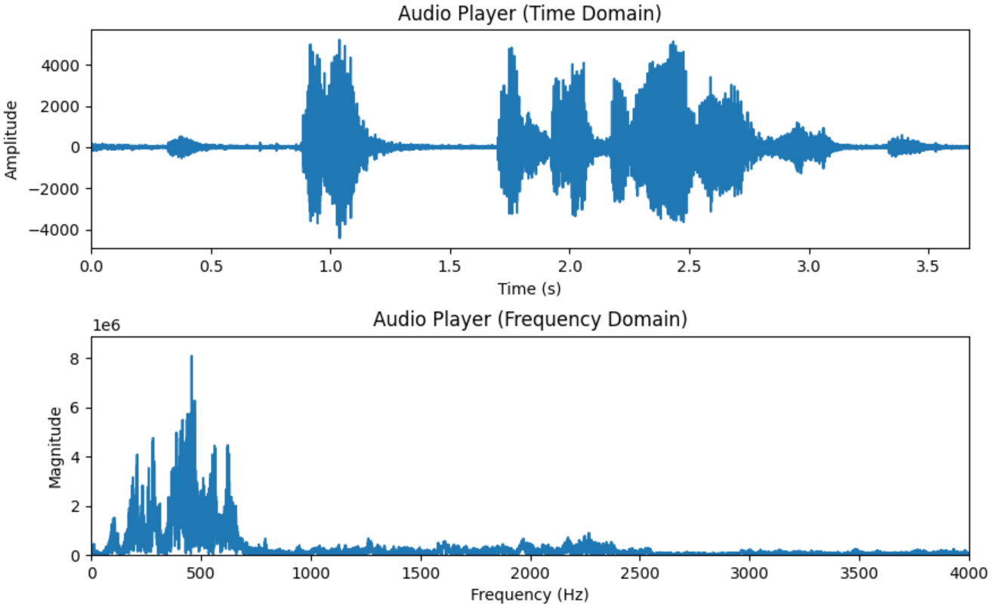
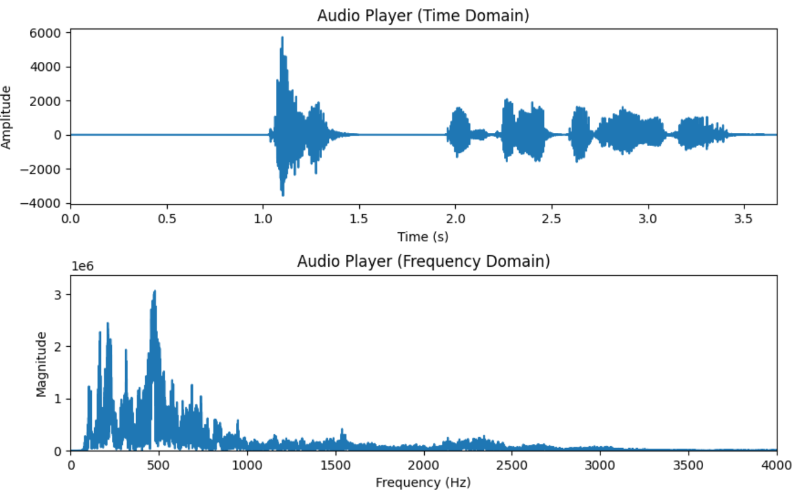
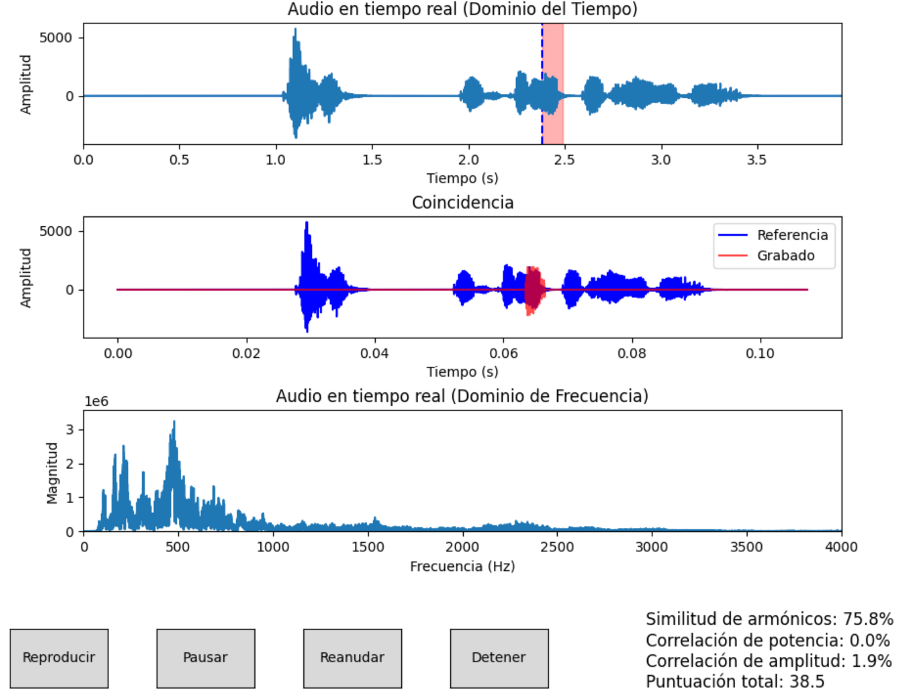

# Instituto Tecnológico de Costa Rica  
## Escuela de Ingeniería en Computación – Campus Central Cartago  

# Preguntas - Tarea de Computación 1 
### Redes - Grupo 2  
**Profesor:** Gerardo Nereo Campos Araya  
**Fecha:** 28 de marzo, 2025 – IS 2025  

**Integrantes:**  
Daniel Granados Retana – 2022104692; Diego Manuel Granados Retana – 2022158363; David Fernández Salas – 2022045079; Diego Mora Montes – 2022104866; Eduardo Gutiérrez Conejo – 2019073558

## 1. ¿Por qué las voces de los integrantes son diferentes?

### Resultados obtenidos
A continuación se analiza el resultado obtenido con la aplicación Autrum, donde tres integrantes grabaron la frase "hola esta es la tarea de redes". Usando el analizador y reproductor, se generaron gráficos en el dominio del tiempo y frecuencia que permiten visualizar y explicar las diferencias entre sus voces.

**1. Daniel Granados**  

Dominio del tiempo
- Se muestra una señal continua y estable, con ondas bien definidas y pocos silencios cortantes.
- Hay una gran variación en la amplitud con valores mayores a 6000, indicando una señal altamente energética.
- Lo anterior sugiere que la relación señal/ruido es alta, por lo que el contenido obtenido de la voz domina sobre el ruido térmico de fondo. 

Dominio de la frecuencia
- El espectro muestra un pico principal alrededor de los 500 Hz, dando indicaciones de la frecuencia fundamental de la voz. 
- En los rangos de 900-1000 Hz, se observan múltiples armónicos claramente definidos lo cual indica una señal con alto contenido armónico.
- A partir de los 1000 Hz los armónicos comienzan a atenuarse rápidamente, y después de los 3000 Hz son muy poco visibles por lo que se denota el filtro de corte. 

**2. Diego Granados**

Dominio del tiempo 
- Se muestra una señal más densa, con actividad más constante a lo largo del tiempo con pocas pausas entre palabras.
- Se tiene una menor amplitud alrededor de los 4000, aunque más sostenidas, lo que indica una señal menos intensa que la de Daniel, pero más estable.
- La articulación parece ser más suave, con transiciones que indican una frecuencia fundamental constante.

Dominio de la frecuencia
- Al igual que Daniel, tiene un pico claro alrededor de los 500 Hz.
- Más el espectro armónico es más abundante y continuo entre los 400 y 1000 Hz, con una menor caída en la magnitud.
- La señal conserva armónicas más densas, lo que indica una voz más grave y un menor riesgo de distorsión. 

**3. Diego Mora**

Dominio del tiempo 
- Se muestra una señal con múltiples segmentos de silencio, interrumpidos por picos bruscos de amplitud.
- Esto indica que es una emisión vocal más cortada, con pausas más pronunciadas entre palabras a diferencia de la fluidez de los otros dos.
- La amplitud máxima son altas, llegando hasta más de 6000, pero aparecen inconstantemente lo que indica un alta variabilidad y puede dificultar la descomposición de armónicos. 

Dominio de la frecuencia
- El pico fundamental igual aparece alrededor de los 500 Hz, pero el número de armónicos presentes es significativamente menor. 
- Los armónicos caen rápidamente a partir de los 600 Hz y se pierden casi por completo antes de los 1000 Hz.
- Sugiere que es una señal que por su irregularidad y menor energía en promedio, no conserva suficiente armónicos para reconstruirse facilmente.

### Interpretación de resultados

Basándose en la información obtenida de los gráficos generados por los integrantes del grupo y sus distintas características, se concluye que las diferencias en las voces se deben a que cada una tiene una composición armónica única, determinada por su frecuencia fundamental, la forma en la que cada persona articula las palabras y la energía con la cual emite su voz. 
Adicionalmente, otro factor importante que puede influir en los resultados obtenidos es la diferencia entre los micrófonos utilizados durante la grabación. Debido a que cada quien grabo con su propio dispositivos, la sensibilidad, el rango de frecuencias captadas y el nivel de ruido térmico varían entre ellos, lo que puede afectar la forma en la que las señales de audio son registradas. Esto provoca variaciones en la amplitud e incluso la pérdida de ciertos armónicos que sí están presentes en la voz original, pero que no son captados adecuadamente por el dispositivo utilizado.
De igual forma, la señal compuesta se ve afectada por las limitaciones del canal, como lo son la atenuación de las frecuencias altas y el ruido térmico del sistema. Las voces que tienen una emisión más estable y una mayor abundancia de armónicos, como lo es la de Diego Granados, van a ser las que se van a poder reconstruir digitalmente con una mayor fidelidad y ser más cercanas a su voz original, por otro lado las señales más irregulares o fragmentadas, como la de Diego Mora, pierden armónicos importantes, por lo que tiene un resultado más distorsionado y difícil de interpretar.

---

## 2. ¿Por qué la comparación de voces es tan poco exacta mediante armónicos?

Para responder esta pregunta se analiza el resultado obtenido con el comparador de la aplicación Autrum, utilizando el mismo archivo .atm de la frase "hola esta es la tarea de redes", comparado con la grabación de la palabra "tarea". A continuación, se presentan los resultados junto con su análisis.

### Análisis de resultados  
En la gráfica superior se observa que el sistema logra identificar de forma aproximada la ubicación de la palabra "tarea" dentro de la señal original. El fragmento rosado marca la región en que coinciden, aunque no corresponde exactamente al mismo punto de pronunciación, lo que indica una coincidencia parcial.

### Similitudes entre las señales  
Aunque ambas se ven visualmente alineadas, los desfases de milisegundos y pequeñas diferencias en la articulación afectan la forma exacta de la onda. En el análisis de Fourier, estas pequeñas diferencias implican una reorganización completa de los armónicos, debido a que el contenido de la frecuencia depende de la estructura periódica exacta de la señal.

### Dominio de la frecuencia  
En el espectro se ve una alta densidad de armónicos en frecuencias más bajas, desde 100 a 800 Hz, pero se atenúan rápidamente a partir de los 1000 Hz, debido al límite de ancho de banda definido a los 4000 Hz; por ende, muchos armónicos superiores no se conservan, reduciendo la capacidad del sistema de comparar patrones que caractericen la voz humana.

### Por qué los armónicos no son suficientes para la comparación  
Los armónicos son múltiplos de la frecuencia fundamental, y por esto, cualquier pequeño cambio en la entonación, ritmo o articulación puede alterar completamente su posición. De igual forma, los canales físicos nos limitan el paso de frecuencias altas, eliminando armónicos con información importante, reduciendo la fidelidad de la comparación. En los resultados obtenidos con Autrum, aunque se tiene una buena similitud de armónicos del 75.8 %, la correlación de potencia y de amplitud son sumamente bajas, indicando que las señales son distintas en relación a la energía, a pesar de compartir frecuencias. En conclusión, los armónicos no van a ser una buena métrica de comparación de voces, al ser sumamente sensibles e inestables ante cambios en la voz y no considerar aspectos como el tiempo ni la estructura completa de la señal.

## Referencias

- Tanenbaum, A. (2002). *Computer Networks* (4ta ed.). Chapter 2: The Physical Layer.

- Apuntes del curso de Redes.